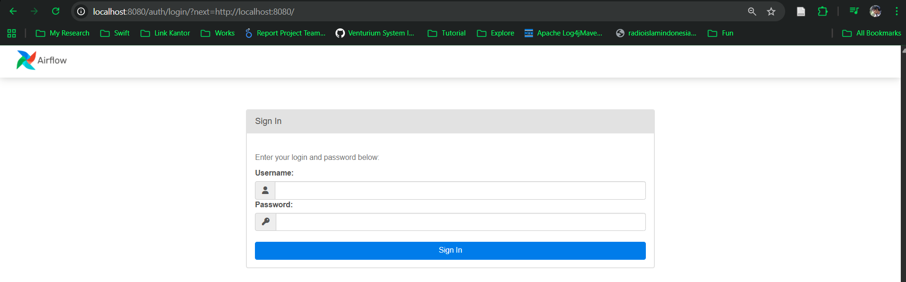
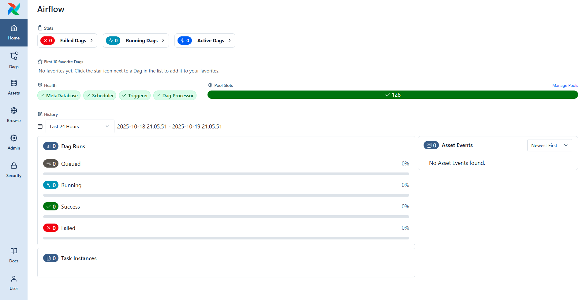

# Catatan tentang Apache Airflow

> Bogor, 19 Oktober 2025 (Anxiety attack, at DD10 no 5. Bismillah.......)

## Install Airflow pada docker

Download file `yml` untuk menjalankan `docker compose`

!!! notes "Prompt"

    ```
    curl -LfO https://airflow.apache.org/docs/apache-airflow/3.1.0/docker-compose.yaml
    ```

Setelah file _docker-compose.yml_ terdownload, kita perlu membuat 4 folder;

1. config
2. dags
3. logs
4. plugins

!!! notes "Code"

    ```cmd
    ├───config
    ├───dags
    ├───logst
    └───plugins
    ```

Selanjutnya buat foder `.env` lalu buatlah variable **AIRFLOW_UID** dengan value integer, saya pribadi mengisi dengan nilai berikut'

!!! notes ".env"

    ```.env
    AIRFLOW_UID=50000
    ```

## Inisiasi Database

!!! notes "prompt"

    ```cmd
    docker compose up airflow-init
    ```

Tepat setelah menginisiasi database, pada folder config akan muncul konfigurasi file `airflow.cfg`, dimana kita dapat mengatur konfigurasi pada file tersebut sebelum menjalankan airflow.

Juga tepat setelah kita menjalankan inisiasi database, secara otomatis docker compose membuat volumes untuk;

1. Database postgres
2. Redis (_Notes : karena pada docker-compose.yml saya menggunakan redis_)

!!! notes "prompt check volume docker"

    ```cmd
    docker volume ls

    DRIVER    VOLUME NAME
    local     4f8ce2fd5d60e24c4ed13b10fddb1d4dfbc15c6a8dc646f1aca19174191e0a4b
    local     learnapacheairflow_postgres-db-volume
    ```

## Running Airflow

Mari nyalakan airflow, setelah download docker-compose.yml, membuat 4 folder yg dibutuhakn, mengatur konfigurasi yang dibutuhkan, maka selanjutnya kita nyalakan airflow. Untuk itu kita dapat menggunakan perintah berikut;

!!! notes "Prompt run the airflow"

    ```cmd
    docker compose up
    ```

Perintah diatas akan menyalakan beberapa container berikut;

!!! notes "Container running airflow"

    ```
    CONTAINER ID   IMAGE                  COMMAND                  CREATED       STATUS                   PORTS                                         NAMES
    45562cd5af81   apache/airflow:3.1.0   "/usr/bin/dumb-init …"   3 hours ago   Up 3 hours (healthy)     8080/tcp                                      learnapacheairflow-airflow-worker-1
    4e3674440092   apache/airflow:3.1.0   "/usr/bin/dumb-init …"   3 hours ago   Up 3 hours (healthy)     8080/tcp                                      learnapacheairflow-airflow-dag-processor-1
    6a6d09c3c16a   apache/airflow:3.1.0   "/usr/bin/dumb-init …"   3 hours ago   Up 3 hours (healthy)     8080/tcp                                      learnapacheairflow-airflow-triggerer-1
    fcac278383db   apache/airflow:3.1.0   "/usr/bin/dumb-init …"   3 hours ago   Up 3 hours (healthy)     8080/tcp                                      learnapacheairflow-airflow-scheduler-1
    ada7224b88b9   apache/airflow:3.1.0   "/usr/bin/dumb-init …"   3 hours ago   Up 3 hours (healthy)     0.0.0.0:8080->8080/tcp, [::]:8080->8080/tcp   learnapacheairflow-airflow-apiserver-1
    0c6f5a93501b   apache/airflow:3.1.0   "/bin/bash -c 'if [[…"   3 hours ago   Exited (0) 3 hours ago                                                 learnapacheairflow-airflow-init-1
    9326130967ab   redis:7.2-bookworm     "docker-entrypoint.s…"   3 hours ago   Up 3 hours (healthy)     6379/tcp                                      learnapacheairflow-redis-1
    808f64bcf3be   postgres:16            "docker-entrypoint.s…"   3 hours ago   Up 3 hours (healthy)     5432/tcp                                      learnapacheairflow-postgres-1
    ```

Setelah semua container jalan, buka web browser dan menuju ke alamat `http://localhost:8080`. Maka akan muncul layar login seperti ini.

!!! notes "Image layar login airflow"

    

Username dan password default adalah `airflow` dan `airflow`. Taraaa, akan muncul dashboard airflow

!!! notes "layar depan airflow"

    

## Whats next ?

Selanjutnya catatan berisi siklus hidup airflow dan arsitektur, namun, namun, saya longkap dulu karena satu dan lain hal._karena mau langsung ngoprek aja_ :laughing::laughing::laughing::laughing: Got to the next cahpter Aaa.....:material-car-sports::material-car-sports::material-car-sports:

