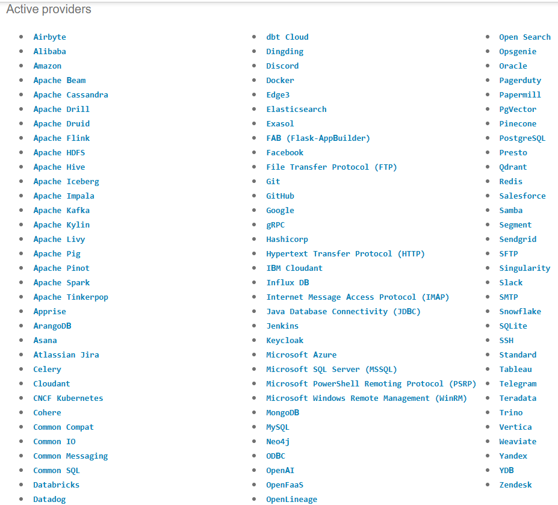

> Bogor, 05 Desember 2025, Jujur, sedikit banyaknya orang egois diluar sana, contoh divisi lain di kantor, yang gk mau diminta bantuan kalau gk sesuai jobdesknya.... bener sih, tapi bajingan yang gk perlu ditemenin. Tanda2 orang bodoh seperti itu, pelit ilmu, merasa benar padahal kosong!!!

`Sensor` adalah salah satu tipe operator yang dibangun untuk melakukan tugas `MENUNGGU` sesuatu terjadi. Kalau kita bisa katakan dengan mudah, menunggu kejadian atau trigger yang dapat berupa;

1. Waktu berjalan yg sesuai dengan waktu yang ditentukan
2. Menunggu file hadir pada sebuah file lokal ataupun diluar lokal sistem
3. Kejadian eksternal yang mentriger sensor.

Intinya nya adalah tugas sensor seperti kita, yaitu "`Menunggu calon ~istri yang tidak kunjung ketemu~ sesuatu terjadi`". Dan jika kejadian tersebut sudah terjadi selanjutnya tugas sensor adalah melanjutkan perintah atau arahan selanjutnya pada task dibawanya.

Karena tugasnya menunggu (_idle_), Seonsor memiliki 2 mode ketika berkerja, kita dapat memilih kedua mode tersebut yang mana yang paling cocok dengan kondisi kiat;

1. `Poke`, sensor selalu memperkerjaan dirinya selama proses berjalan
2. `Reschedule`, sensor hanya berkerja ketika waktu nya berkerja, ketika istirahat seleuruh dirinya tertidur.

Penggunaan mode tersebut dapat leluasa kita lakukan, seperti diatas, sesuai kebutuhan. Intinya, ketika kita mau sensor yang lebih presis mendeteksi dimana melakukan deteksi dalam hitungan detik pilihlah mode `poke` dan jika ingin sensor berjalan pada periode dalam satuan yang lebih lama misalkan menit pilihlah `reschedule`.

Sama seperti operator, airflow memliki built-in sensor yang dapat kita gunakan, termasuk juga yang disediakan oleh provider airflow.

!!! info "Available providers the day I wrote this notes"

    

## Source

* [Sensors](https://airflow.apache.org/docs/apache-airflow/stable/core-concepts/sensors.html)