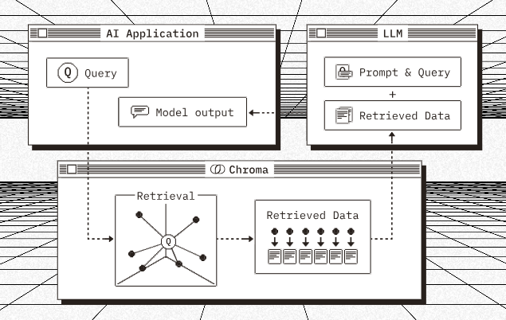

# Chroma

Chroma adalah aplikasi sumber terbuka (_open source_) untuk melakukan pencarian dan pengambilan (retrieval) database untuk _Artificial Intelegent Application_.

!!! info
     _Embeddings, Full-text search, Document Storage, vector search, metadata filterring and multimodal_

     Menggunakan Chroma kita mendapatkan paket lengkap seperti penyematan, pencarian text lengkap, penyimpanan dokumen, pencarian vektor, penyaringan metadata dan serta multi-modal.

     **Embeddings** adalah operasi untuk membentuk ulang berbagai macam data seperti text, foto, dan data jenis lainnya kedalam bentuk _numerical vector reprensentation_. Hasil dari embeddings berbentuk list of number dan jika semakin besar data maka semakin banyak pula demensi-nya. Tujuanya adalah membuat data tersebut cocok pada berbagai macal tolls AI dan algoritma.

Sumber pemebelajaran dan dokumentasi resmi `Chrome` dapat diakses di [https://www.trychroma.com/](https://www.trychroma.com/)

> Source code hands-on ada pada [https://github.com/muhammadfarras/Learn-Chroma](https://github.com/muhammadfarras/Learn-Chroma)

!!! status
    

Ketika kita meminta data ke _chrome collecntion_ kita hanya ingin mendapatkan bagian dari document yang relevan dengan pertanyaanya, Maka dari itu, saat memberikan data kepada chroma kita perlu memecahnya menjadi pecahan-pecahan yang relevan (tidak digabung), hal ini biasanya disebut dengan `chunking`.

Pertama kali yang perlu kita lakukan ada `import` depedencies yang diperlukan

!!! question "code"

    ```python
        import chromadb
        import os # To read path of the data train
        import uuid # To generate random id, itended to consumed collection as a id
    ```

Pada catatan kali ini saya menggunakan data dummy yang berisikan peraturan-peraturan yang dipecah dengan baris baru. Dari data tersebut kita akan membuatnya kedalam bentuk tipe data `#!python list()`.

!!! question "code"
    ```title="peraturan.txt"
    Peraturan ini diperuntukan Muhammad Faris Ma'ruf, Nu'man Noah Ma'ruf, dan Rumaisha Hilyah Maruf. Ketiga orang tersebut wajib patuh dan tunduk terhadap Peraturan yang dituangankan pada pernyataan ini.

    Setiap hari Senin sampai dengan Jum'at Muhammad Faris Ma'ruf berkewajiban untuk bangung pagi sebelum adzan subuh untuk melaksaksanakan shalat subuh berjamaah dimasjid sekaligus mempersiapkan diri untuk sekolah.

    Setiap hari Senin sampai dengan Jum'at Nu'man Noah Ma'ruf berkewajiban untuk bangung pagi sebelum adzan subuh untuk melaksaksanakan shalat subuh berjamaah dimasjid sekaligus mempersiapkan diri untuk sekolah.

    Setiap hari, Rumaisha Hilyah Maruf harus membantu bunda Tania mempersiapkan sarapn pagi untuk Abi Faras, Abang Faris (Muhammad Faris Ma'ruf), dan Nu'man Noah Ma'ruf.
    ```

    ```python
        path_peraturan = os.path.abspath("data/peraturan_rumah.txt")

        with open (path_peraturan, mode="r", encoding="utf-8") as f:
            kebijakan = f.read().splitlines()
    ```

## Membuat _Client_ Chroma

Untuk memulai menggunakan vectorize database Chroma, kita wajib membuat sebuah `client`. _Client chroma_ adalah titik awal untuk kita dapat berintersaksi dengan **Chrome**. Dibalikanya _client chrome_ berfungsi untuk menyimpan user/pengguna serta database-nya dan _proxy calls_ untuk mengakses API dari chrome. Selain chrome client menjadi sistem kesatuan (memori jangka pendek yang disimpan di ram, lokal) akan tetapi juga dapat berlaku sebagai server yang menyediakan API sehingga beberapa client dapat mengakses sumberdaya yang sama.

Untuk membuat client ada beberapa cara;

1. [Ephermal Client](https://docs.trychroma.com/docs/run-chroma/ephemeral-client)
2. [Persistant Client](https://docs.trychroma.com/docs/run-chroma/persistent-client)
3. [Http Client atau AsyncHttpCLient](https://docs.trychroma.com/docs/run-chroma/client-server)
4. [Cloud Client](https://docs.trychroma.com/docs/run-chroma/cloud-client)

### The different between CLient and Ephermal Client

Saat membuat client kita menggunakan method `Client` tanpa memberikan parameter apapun, sehingga kita menggunakan penyimpanan data sementara, tidak di simpan kedalam disk. Ada method lain seperti yang telah dipaparkan diatas, yaitu `Ephermal CLient` yang mana methode ini secara gamblang menyebnutkan _"Creates an in-memory instance of Chroma."_ artinya tidak menyimpan kedalam disk permanent. Lalu apa yg membedakan, menggunakan Client kita dapat men-setup disk persistant tanpa harus menggunakan method lainnya `Persistant Client`. Akan tetapi jika kita melihat pada constructor atau fungsi dari EphermalClient kita dapat melihat bahwa (baris 14-16 snippet code dibawah) property `is_persistant` dibuat statis dengan nilai `#!python false`.

!!! question "Code"

    ```python title="EphemeralClient" hl_lines="14-16"
    def EphemeralClient(
        settings: Optional[Settings] = None,
        tenant: str = DEFAULT_TENANT,
        database: str = DEFAULT_DATABASE,
    ) -> ClientAPI:
        """
        Creates an in-memory instance of Chroma. This is useful for testing and
        development, but not recommended for production use.

        Args:
            tenant: The tenant to use for this client. Defaults to the default tenant.
            database: The database to use for this client. Defaults to the default database.
        """
        if settings is None:
            settings = Settings()
        settings.is_persistent = False

        # Make sure paramaters are the correct types -- users can pass anything.
        tenant = str(tenant)
        database = str(database)

        return ClientCreator(settings=settings, tenant=tenant, database=database)
    ```

## Membuat Collection

`Collection` sangat berguna dan berfungsi untuk penyimpanan dan _query_. Untuk membuat sebuah collection kita dapat menggunakan beberapa 2 method yang tersedia

1. `create_collection`
2. `get_or_create_collection`

Sudah jelas dari nama method (Tidak perlu dijelaskan perbedaan keduanya). 

!!! question "Code"

    ```python
    @abstractmethod
    def create_collection(
        self,
        name: str,
        configuration: Optional[CreateCollectionConfiguration] = None,
        metadata: Optional[CollectionMetadata] = None,
        embedding_function: Optional[
            EmbeddingFunction[Embeddable]
        ] = ef.DefaultEmbeddingFunction(),  # type: ignore
        data_loader: Optional[DataLoader[Loadable]] = None,
        get_or_create: bool = False,
    ) -> Collection:
        """Create a new collection with the given name and metadata.
        Args:
            name: The name of the collection to create.
            metadata: Optional metadata to associate with the collection.
            embedding_function: Optional function to use to embed documents.
                                Uses the default embedding function if not provided.
            get_or_create: If True, return the existing collection if it exists.
            data_loader: Optional function to use to load records (documents, images, etc.)

        Returns:
            Collection: The newly created collection.

        Raises:
            ValueError: If the collection already exists and get_or_create is False.
            ValueError: If the collection name is invalid.

        Examples:
            ```python
            client.create_collection("my_collection")
            # collection(name="my_collection", metadata={})

            client.create_collection("my_collection", metadata={"foo": "bar"})
            # collection(name="my_collection", metadata={"foo": "bar"})
            ```
        """
        pass
    ```

Method ini membutuhkan parameter wajib berupa nama, karena nama collection ini digunakan pada URL (jika chorma berjalan sebagai server) maka dari itu penamaan nama collection ini harus mengikuti standard berikut;

1. Banyak karakter 3 - 512
2. Nama harus diawali dan diakhir dengan karakter kecil atau angka dan didalamnya dapat mengandung `.`, `-`, atau `_`, tapi tidak dapat diakhir dengan karakter tersebut.
3. Jika menggunakan `.` dilarang menggunakan `.` secara berurutan, seperti `..`.
4. Nama collection tidak boleh sama dengan IP Address yang valid pada network.

Pada kali ini kita menggunakan `peraturan_rumah` sebagai nama dari collection.

!!! question "Code"

    ```python
    # Membuat sebuah collection
    collection = client.create_collection("peraturan_rumah")
    ```

[Pelari lebih lanjut terkait collection dimari yah!!!](https://docs.trychroma.com/docs/collections/manage-collections)

### Menambah data pada Collection

Kita telah membuat collection untuk menampung data dan tempat untuk bertanya. Sebelum kita bertanya (_query_) kita perlu memasukan data ke collection. Untuk memasukan data kita dapat menggunakan method `add()`. 

Method ini memerlu dua parameter wajib, `ids` yang berisikan beberapa id unik sebanyak documents (_ **data** dalam istilah di chorma adalah dokumen, selanjutnya kita sebut dengan **documents**_) dan `documents` yang berisikan kalimat, berita atau semacamnya dalam betuk `#!python list`.

Selain itu, kita juga dapat memberikan sebuah `meta_data` pada documents dan ids, fungsinya untuk memberikan data tambahan dan dapat berguna jika kita sedang melakukan debugging.

!!! qestion "Code"

    ```python
    # To generate ID per chuking data
    idGenerate = [f"id{a}" for a in range (1, len(kebijakan)+1)]
    
    collection.add(
        ids=idGenerate,
        documents=kebijakan,
        metadatas=[{"kebijakan":a} for a in range(len(kebijakan))]
    )
    ```

{==Chroma akan menyisipkan (embbding) dokumen tersebut kedalam collection menggunakan==} `embeddings function`. _Kita belum melakukan setup fungsi penyisipan, karena kita tidak definisikan maka kali ini chroma akan menggunakan DefaultEmbeding function untuk kita. Yaitu menggunakan model `all-MiniLM-L6-v2`_.

Pada catatn ini kita tidak banyak menyentuh banyak konfigurasi, hanya sebatas pengenalan terhadap `Chroma`.

* You can read more abou adding collections [dimari](https://docs.trychroma.com/docs/collections/add-data)
* You can read more abou updateing collections [dimari](https://docs.trychroma.com/docs/collections/update-data)
* You can read more abou deleting collections [dimari](https://docs.trychroma.com/docs/collections/delete-data)

## Lest do the query

Kita dapat menggunakan method `#!python query` untuk melakukan pencarian documents. Dibelakang layar, Chroma memanfaatkan `fungsi embedding` dari collection untuk meng-embed pertanyaan dan menggunakan nilai keluaran tersebut untuk mencari kemiripan vektor dengan documents pada collection tersebut. Kita dapat memberikan pertanyaan lebih dari 1 query dalam bentuk tipe data `#!python list`.

!!! question "Code"

    ```python
    pertanyaan=[
            "Siapa yang tidak sekolah ?",
            "Apa tugas hilyah ?"
        ]

    query_response = collection.query(
        query_texts=pertanyaan,
        n_results=2
    )
    ```

Selain pencarian berdasarkan text, kita juga dapat menggunakan pencarian berdasarkan _embeddings_ (_query\_embeddings_) secara langsung tanpa menggunakan embedding function dari collecion. Akan tetapi, jika saat memasukan documents kedalam collection menggunakan embddings secara langsung, saat pencarian kita wajib menggunakan query by embdding alih-alih query by search.

!!! question "Code"

    ```python
    # This is sample, tidak ada di contoh latihan
    collection.query(
        query_embeddings=[[11.1, 12.1, 13.1],[1.1, 2.3, 3.2], ...]
    )
    ```

Secara bawaan, chroma akan mengambalikan 10 hasil dari setiap query. Namun kita juga dapat mengatur banyak nilai keluaran menggunakan parameter `n_results`. Untuk catatan pada bagian ini cukup konfigurasi standar agar lebih dapat dipahami secara bertahap.

!!! query "Code"

    ```python
    for number,a in enumerate(query_response["documents"]): # type: ignore
        pp(f"Pertanyaan ({number}) : {pertanyaan[number]}")
        pp(a)
    ```

    ```python title="result"
    ["Setiap hari Senin sampai dengan Jum'at Muhammad Faris Ma'ruf berkewajiban "
    'untuk bangung pagi sebelum adzan subuh untuk melaksaksanakan shalat subuh '
    'berjamaah dimasjid sekaligus mempersiapkan diri untuk sekolah.',
    "Setiap hari Senin sampai dengan Jum'at Nu'man Noah Ma'ruf berkewajiban untuk "
    'bangung pagi sebelum adzan subuh untuk melaksaksanakan shalat subuh '
    'berjamaah dimasjid sekaligus mempersiapkan diri untuk sekolah.']
    'Pertanyaan (1) : Apa tugas hilyah'
    ['Setiap hari, Rumaisha Hilyah Maruf harus membantu bunda Tania mempersiapkan '
    "sarapn pagi untuk Abi Faras, Abang Faris (Muhammad Faris Ma'ruf), dan Nu'man "
    "Noah Ma'ruf.",
    "Peraturan ini diperuntukan Muhammad Faris Ma'ruf, Nu'man Noah Ma'ruf, dan "
    'Rumaisha Hilyah Maruf. Ketiga orang tersebut wajib patuh dan tunduk terhadap '
    'Peraturan yang dituangankan pada pernyataan ini.']
    ```