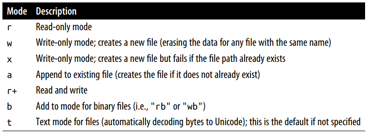

# Data Structure and Squances

!!! info
    Untuk catatan lebih lengkap entang kumpulan data terdapat di [comprehension and gengerators](../../Programming%20Language/Python/04.%20Comprehension%20and%20Generators.md)

**Tuple** adalah kumpulan data yang tidak dapat berubah (immutable).

**List** adalah kumpulan data yang dapat berubah (mutable).

Kita dapat menggabungkan dua list menjadi satu, ada dua cara, yaitu menggunakan fungsi extend atau menggunakan operator addition +. Tapi, setelah saya coba, ternyata menggunakan fungsi extend jauh lebih lambat


!!! quote "code"
    ```{.python}
    # the_diff_extend_and_plus_sign.py
    from time import time


    list_1 = [1,2,3,4,5]
    list_2 = [[a for a in range (1,100)] for a in range (1,1000000)]


    now = time()
    gabungan = []

    for chunk in list_2:
        #print(chunk)
        list_1+chunk

    # print(list_2)
    print("Estimasi : {:.4f} ".format(time() - now))
    now2 = time()

    for chunk in list_2:
        list_1.extend(chunk)

    print("Estimasi Extend : {:.4f}".format(time() - now2))

    # Estimasi : 0.4380 
    # Estimasi Extend : 2.7018
    ```


Standar library `itertool` memiliki kumpulan generator untuk algoritma data yang umum. Misalkan, fungsi `grouby` yang mengambil pengulangan dan sebuah fungsi, mengelompokan element yang berurutan dalam sebuah nilai urut.

!!! quote "code"
    ```{.python}
    # itertools.py
    import itertools

    def first_letter (name):
        # print (name[0])
        return name[0]

    names = ["Tania","Farras","Faris","Noah"]

    for letter , name_grouped in itertools.groupby(names, first_letter):
        print (letter, list(name_grouped))

    # T ['Tania']
    # F ['Farras', 'Faris']
    # N ['Noah']
    ```

untuk membuka file untuk dibaca atau di tulis, gunakan funsi bawaan dengan menuliskan alamat relatif ataupun absolut, dan opsional file encoding.

=== "code"
    !!! quote "code"
        ```{.python}
        # read_file.py
        filename="read_file_1.txt"
        f = open(filename, encoding="utf-8")

        for a in f:
            print (a)

        f.close()
        ```

=== "read_file_1.txt"
    ```
    Makna tauhid secara bahasa arab merupakan bentuk masdar dari fi’il wahhada-yuwahhidu (dengan huruf ha di tasydid), yang artinya menjadikan sesuatu satu saja.
    Syaikh Muhammad bin Shalih Al Utsaimin berkata: “Makna tauhid ini tidak tepat kecuali diikuti dengan penafian. Yaitu menafikan segala sesuatu selain sesuatu yang kita jadikan satu saja, kemudian baru menetapkannya” (Syarh Tsalatsatil Ushul, 39).
    Secara istilah syar’i, makna tauhid adalah menjadikan Allah sebagai satu-satunya sesembahan yang benar dengan segala kekhususannya (Syarh Tsalatsatil Ushul, 39).
    Dari makna tauhid ini sesungguhnya dapat dipahami bahwa banyak hal yang dijadikan sesembahan oleh manusia, bisa jadi berupa Malaikat, para Nabi, orang-orang shalih atau bahkan makhluk Allah yang lain, namun seorang yang bertauhid hanya menjadikan Allah sebagai satu-satunya sesembahan saja.
    ```

Kode diatas, kita membuat opsi econding dengan **utf-8** karena opsi itu adalah praktik yang terbaik, karena nilai bawaanya yaitu Unicode encoding digunakan untuk membaca file berbeda pada setiap platform.  Secara bawaan, file yang dibukan statusnya read-only. Serta sangat direkomendasi untuk menutup file setelah selesai digunakan.

Cara yang simple, gunakan with statement, sehingga python akan menutup file segera setelah selesai diproses

!!! quote "code"
    ```{.python}
    # read_file_2.py
    filename = "read_file_1.txt"

    with open(filename, encoding="utf-8") as f:
        line = [x.rstrip() for x in f]

    print(line)
    ```

> Python file mode

