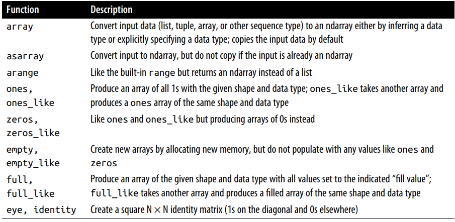
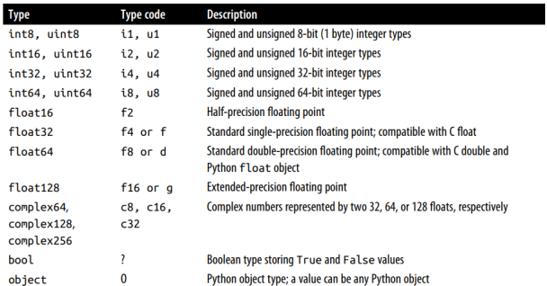

# Numpy Ndarray

!!! info
    Kode yang ada pada catatan ini terdapat pada file `jupyter-notes/Ch4-Numpy Basic 4.1 NdArrays.ipynb`

**Numpy**, adalah singkatan dari Numerical Python

Ini adalah beberap hal yang akan kita temukan didalam Numpy:
• `ndarray`, effecient multidementional array yang menyediakan operasi aritmatika pada array (yang cepat).
   
• Penggunaan fungsi matematika yang cepat pada seluruh element didalam array tanpa perlu menulis perulangan.
   
• Alat untuk membaca dan menulis data array kedalam disk dan berkerja pada memory-mapped files.
   
• Aljabar Linier, pengacak angka, dan kemampuan untuk perubahan bentuk
   
• C API untuk menhubungkan Numpy dengan pustak-pustaka yang ditulis oleh C, C++ atau FORTRAN

Numpy menyediakan dokumentasi C API yang bagus dan komprehensif, sehingga memudahkan untuk mengirim data ke pustaka luar yang ditulis dengan low-level language, dan pustaka luar untuk mengembalikan data ke python, sebagai Numpy Arrays. Fitur ini, membuat python menjadi pilihan untuk membungkus basis kode yang ditulis C, C++ dan FORTRAN dan memberikan mereka layar muka yang dinamis dan dapat diakses. 

Numpy tidak menyediakan modeling atau fungsi saintifik, namun, pemahaman yang mendalam tentang Numpy arrays dan array-oriented computing akan membantu anda dalam menggunakan alat-alat berupa array computing semantics, seperti pandas.

Salah satu alasa mengapa Numpy sangat penting untuk perhitungan numerik karena Numpy dibuat dengan tujuan mengefesiensi data array yang sangat besar. Ada beberapa alasan lainnya;

• Numpy menyimpan data didalam _contigous block of memory_. Pustaka Numpy ditulis dengan bahasa sehingga dapat beroperasi dalam sebuah memori tanpa pengecekan tipe atau semisalnya.
   
• Numpy array menggunakan memori yang lebih sedikit dibandingkan dengan data berurut bawaan dari pthon
   
• Operasi Numpy melakukan operasi yang kompleks pada seluruh element didalam array tanpa harus menggunakan perulangan didalam python.
   
• Numpy lebih cepat dibandingkan dengan Kode python karena Numpy, C-based algorithms.

Mari kita coba gambarkan perbedaan performa Numpy dengan bawaan python:

```python

import numpy as np
my_arr = np.arange(1_000_000)
my_list = list(range(1_000_000))

%timeit my_arr * 2
# 2.23 ms ± 153 µs per loop (mean ± std. dev. of 7 runs, 1,000 loops each)


%timeit [a * 2 for a in my_list]
# 80 ms ± 4.15 ms per loop (mean ± std. dev. of 7 runs, 10 loops each)
```

NumPy-based algorithms secara umum lebih cepat 10 atau 100 bahkan lebih cepat dibandingkan dengan pure python dan menggunakan memori yang jauh lebih sedikit.


## Creating Ndarray
Cara yang paling mudah membuat array dalam numpy menggunakan `#!python array` function. Fungsi ini menerima data berurut seperi object (termasuk array) dan menghasilkan Numpy Array yang berisikan data yang diterima oleh fungsi.

```python
# membuat list dan tuple
py_list = [1,2,3,4,5]
py_tuple = (1.0,0,3.1,2.9,5)

type(py_list), type(py_tuple)
'''
(list, tuple)
'''

# membuat numpy array dengan parameter list dan tuple
data1 = np.array(py_list)
data2 = np.array(py_tuple)
type(data1), type(data2)
'''
(numpy.ndarray, numpy.ndarray)
'''
```

vData berderet yang bersarang akan dirubah menjadi multi-dimensional array


```python
# list bersarang
py_nested_list = [[1,2,4,5],[8,0,1,4]]
data3 = np.array(py_nested_list)
data3

'''
array([[1, 2, 4, 5],
       [8, 0, 1, 4]])
'''
```


Data3 menjadi multidimensional array, kita dapat melihat menggunakna fungsi ndim (banyak dimensi) dan shape (bentuk dimensi array)


```python
# melihat dimensi dan bentuk dimensi array
print(data3.ndim)
print(data3.shape)
'''
2
(2, 4)
'''
```

Jika tidak spesifikasi tipe data dari sebuah array, numpy.array akan menetapkan tipe data yang paling tepat.


```python
# check tipe data
data1.dtype, data2.dtype
'''
(dtype('int32'), dtype('float64'))
'''
```

Ada beberap fungsi lain untuk membuat sebuah array. Diantaranya, `np.zeros`, `np.ones`, fungsi tersebut membuat array dengan nilai 0 atau 1 dengan parameter yang diberikan berupa panjang array atau bentuk, shape. Sedangkan `np.empty` membuat sebuah array tanpa menginisialisasi nilai tertentu. Untuk membuat array berdimensi tidak tunggal gunakan tupel, misalkan (2,2).


```python
data4 = np.ones(5)
data4
'''
array([1., 1., 1., 1., 1.])
'''

data5 = np.zeros((3,3))
data5
'''
array([[0., 0., 0.],
       [0., 0., 0.],
       [0., 0., 0.]])
'''

data6 = np.empty((4,4,2))
data6
'''
array([[[1.15915394e-311, 1.06224114e-321],
        [0.00000000e+000, 0.00000000e+000],
        [1.15860970e-311, 5.02034658e+175],
        [3.92676484e-061, 3.62878562e+179]],

       [[2.80366263e-032, 7.72153905e-043],
        [6.44362165e-067, 5.82631780e-144],
        [3.59751658e+252, 1.46901661e+179],
        [8.37404147e+242, 2.59027926e-144]],

       [[3.80985069e+180, 1.14428494e+243],
        [2.59027907e-144, 7.79952704e-143],
        [4.71378235e-062, 9.60465736e-071],
        [1.43665979e-071, 2.03789056e+160]],

       [[2.59027865e-144, 2.59903818e-144],
        [5.58166869e-091, 1.69421373e-052],
        [8.61834943e-043, 1.11475752e+261],
        [1.16318408e-028, 2.97707521e+296]]])
'''
```


`np.arange` mirip dengan fungsi bawaan python range


```python
np.arange(10)
'''
array([0, 1, 2, 3, 4, 5, 6, 7, 8, 9])
'''
```

### Daftar method untuk membuat array


## Data types for ndarrays
Data type atau dtype adalah objek spesial yang berisikan informasi (metadata, data tentang data) yang ndarray butuhkan untuk menginterpret secuil memori sebaga tipe data tertentu.


```python
arr1 = np.array([1,2,3], dtype=np.int32)
arr2 = np.array([4,5,6], dtype=np.float32)
arr1.dtype , arr2.dtype
'''
(dtype('int32'), dtype('float32'))
'''
```

Tipe data adalah sebuah sumber flexsibelitas numpy untuk berinteraksi dengan data yang berasal dari sistem lain. Kebanyakan kasus, tipe data ini menyediakan pemetaan langsung kedalam disk atau memory representation yang mana membuat numpy dapat membaca atua menulis binary streams of data ke disk atau untuk terhubung ke code yang ditulis denga bahasa tingkat rendah seperti C atau FORTRA.

Pemahaman tentang tipe data ini sangat dibutuhkan jika diperlukan pengkontrolan tentang bagiamana data disimpan didalam memori atau disk, terutama data data yang besar.

### Numpy Data type



Anda dapat mengganti tipe data dari numpy array secara terpisah menggunakan fungsi `#!python ndarray.astype`


```python
# crate numpy array dengan tipe float64
arr = np.array([1, 2, 3, 4, 5])
arr.dtype
'''
dtype('float64')
'''

# convert tipe data arr menjadi int32
int_arr = arr.astype(np.int32)
int_arr.dtype
'''
dtype('int32')
'''
```


Jika anda mengganti tipe data float, floating-point kedalam tipe integer, maka nilai desimal dari array tersebut akan terpotong

```python
# Create float_arry
float_arr = np.array((27.12, 11.6, 5.7, 13.10))
float_arr.dtype, float_arr
'''
(dtype('float64'), array([27.12, 11.6 ,  5.7 , 13.1 ]))
'''

# Conver tipe data ke int32
int_arr = float_arr.astype(np.int32)
int_arr.dtype, int_arr
'''
(dtype('int32'), array([27, 11,  5, 13]))
'''
```


Jika anda memliki array dalam bentuk string, anda dapat mengkonversi nya kedalam bentuk numerik.

```python
# Create array
str_arr = np.array (("2.7","0.6","0.6","10.0"), dtype=np.string_)
str_arr.dtype
'''
dtype('S4')
'''

# Conver tipe data string to float32
float_arr = str_arr.astype(np.float32)
float_arr
'''
array([ 2.7,  0.6,  0.6, 10. ], dtype=float32)
'''
```

## Aritmetic with Numpy Arrays
Arrays pada numpy dapat melakukan kumpulan operasi yang sangat cepat pada data tanpa harus membuat perulangan. Hal itu disebut dengan {==**vectorization**==}. Apapun operasi aritmatik yang digunakan pada array yang memliki ukuran dan bentuk yang sama akan dikenakan kesemua element pada array-array tersebut.


```python
# Create numpys array
arr1 = np.array(((1,2,3),(4,5,6)))
arr2 = np.array(((1,2,3),(4,5,6)))

arr1 * arr2, arr1-arr2
'''
(array([[ 1,  4,  9],
        [16, 25, 36]]),
 array([[0, 0, 0],
        [0, 0, 0]]))
'''
```


```python
# operasi aritmatika terhadpa scalar dan vector array (2nd array)
1/arr1
'''
array([[1.        , 0.5       , 0.33333333],
       [0.25      , 0.2       , 0.16666667]])
'''
```


Membandingkan logic antara dua array yang sama ukurannya akan menghasilkan array berelemen tipe boolean yang ukurannya sama persis.


```python
# membadingkan dua arry berukuran sama
arr3 = np.array ([[1,4],[6,8]])
arr4 = np.array ([[9,8],[3,1]])
arr3 > arr4
'''
array([[False, False],
       [ True,  True]])
'''
```


!!! info "Notes"
    Evaluasi operasi pada array yang memliki ukuran dan bentuk yang berbeda disebut dengan broadcasting, sedangkan untuk operasi pada array yang memiliki ukuran dan bentuk yang sama disebut dengan vectorization.


## Basic Indexing and Slicing

```python
arr = np.arange(start=1, stop=16)
arr
'''
array([ 1,  2,  3,  4,  5,  6,  7,  8,  9, 10, 11, 12, 13, 14, 15])
'''

arr[5]
'''
6
'''

arr[5:8]
'''
array([6, 7, 8])
'''
```


Berbedaan pertama dari Python's built-in lists adalah array slices melihat dari array aslinya. Artinya data tidak di salin, dan modifikasi yang terjadi pada view akan mempengaruhi array aslinya.


```python
# array slices adalah views atau tampilan pada original file
arr[5:8] = 12
arr
'''
array([ 1,  2,  3,  4,  5, 12, 12, 12,  9, 10, 11, 12, 13, 14, 15])
'''
```


Dapat kitalihat diatas, array\[5:8\] yang diinisialisasi dengan nilai 12 merefleksi array asilnya. Mari kota coba telaah lagi prilaku array slice ini. Saya akan membuat variable dengan nama `bag_array` yang mengambil array pada posisi 5 - 9. Lalu saya merubah elemen pertama darai `bag_array` menjadi 99. Behavior dari numpy array akan menggati elemen original array pada posisi ke 5 dengan nilai 99.


```python
# contoh lain
bag_arr = arr[5:8]
bag_arr[1] = 99
arr
'''
array([ 1,  2,  3,  4,  5, 12, 99, 12,  9, 10, 11, 12, 13, 14, 15])
'''
```


Untuk mengambil semua elemet dari array dapat menggunakan operator collon didalam square bracket `[:]`


```python
# Mengganti semua element pada array
arr[:] = 99
arr
'''
array([99, 99, 99, 99, 99, 99, 99, 99, 99, 99, 99, 99, 99, 99, 99])
'''
```


Numpy mendesign prilaku (view pada original array) dengan tujuan dapat dilakukan dengan performa yang tinggi pada array yang sangat besar, anda bisa bayangkan performa dan masalah memori jika Numpy selalu menyalin data dari sebuah array.

Namun, jika anda ingin menyalin element dari array dari padanya hanya merujuk (view), anda dapat menggunakan fungsi `ndarray.copy()`, misalkan `arr[5:8].copy()`


### Slicing higher dimetional array

```python
# array slices hihger dimentional array
arr2d = np.array([[8,9,0],[2,7,2],[1,5,3]])
arr2d, arr2d.ndim

'''
(array([[8, 9, 0],
        [2, 7, 2],
        [1, 5, 3]]),
 2)
'''
```


variabel arr2d adalah array yang memilki dua dimensi. Misalkan kita ingin mengambil subset 2 elemen terkahir dari setiap set pada dimensi pertama, (9,0) (7,2) dan (5,3)


```python
arr2d[:,1:]
'''
array([[9, 0],
       [7, 2],
       [5, 3]])
'''
```


### Boolean Indexing
Mari kita get our hand dirty untuk mengetahu indexing menggunakan boolean. Kita akan membuat satu buah array yang berisikan daftar nama dan satu buah dua demensi array dengan elemen tahun lahir dan bula lahir.


```python
name = np.array(["Farid","Yayah","Farras","Tania","Faris","Noah"])
birth_year = np.array([[1964,10],[1966,12],[1995,12],[1998,6],[2020,6],[2021,10]])
```


Jika kita menggunakan condition operator seperti == maka, condition tersebut akane merefleksi kesemua elemen pada array tersebut.


```python
name == "Farras"
'''
array([False, False,  True, False, False, False])
'''
```


Array yang berisikan tipe boolean dapat digunakan untuk menampikan array pada parameternya dengan syarat jumlah element-nya sama. Nilai yang akan terambil hanya elemen yang bernilai true


```python
birth_year[name == "Farras"]
array([[1995,   12]])
'''
array([[1995,   12]])
'''
```


Misalkan anda disuruh untuk menampilkan nama bagi mereka yang memliki bulan kelahiran 12 atau 6. Anda dapat menggunakan `|` (or) atau `&` (and). Sedangkan tidak bisa menggunakan or, ||, and, && pada numpy condition.


```python
# Tampilkan nama yang bulan lahirnya 12 atau 6
name[(birth_year[:,1] == 12) | (birth_year[:,1] == 6)]
'''
array(['Yayah', 'Farras', 'Tania', 'Faris'], dtype='<U6')
'''
```


Anda juga dapat menggunakan operator `!=` atau negate `~`. Operator tersebut dapat berguna, misalkan anda disuruh untuk menampilkan nama selain Farras.


```python
name[name != "Farras"]
'''
array(['Farid', 'Yayah', 'Tania', 'Faris', 'Noah'], dtype='<U6')
'''

# Equal tp
name[~(name=="Farras")]
'''
array(['Farid', 'Yayah', 'Tania', 'Faris', 'Noah'], dtype='<U6')
'''
```


Yang penting diingat, mengambil data dari array menggunakan Boolean indexing serta mengisi  hasil tersebut kedalam variabel, maka numpy akan membuat data salinan, walaupun hasil dari array sama dengan array aslinya.


```python
# Membuat variabel baru untuk menampung cucu-cucu dari farid dan yayah, yang umurnya kurang dari 5 tahun
kasta = name[2022 - birth_year[:,0] < 5]
kasta
'''
array(['Faris', 'Noah'], dtype='<U6')
'''

# menggati elemnt variable kasta menjadi cucu
kasta[:] = "cucu"

# Menampilkan variabel kasta dan array original
kasta, name
'''
(array(['cucu', 'cucu'], dtype='<U6'),
 array(['Farid', 'Yayah', 'Farras', 'Tania', 'Faris', 'Noah'], dtype='<U6'))
 '''
```


Dari code diatas, elemen dari array asli tetap, tidak berubah. Coba kita test slicing dengan tidak menggunakan boolean


```python
# Meng-view nama faris dan noah
kasta_view = name[-2:]
kasta_view[:] = "Cucu"
kasta_view, name
'''
(array(['Cucu', 'Cucu'], dtype='<U6'),
 array(['Farid', 'Yayah', 'Farras', 'Tania', 'Cucu', 'Cucu'], dtype='<U6'))
 '''
```


Yup, merubah elemen dari variable kasta_view akan mempengaruhi elemen dari array aslinya.

### Fancy Indexing
Fancy indexing adalah sebuah pola yang diadopsi oleh Numpy untuk meng-index menggunakan array berisikan angka.

```python
# Array contoh
arr = np.zeros((8,4))
for a in range(8):
    arr[a] = a
arr
'''
array([[0., 0., 0., 0.],
       [1., 1., 1., 1.],
       [2., 2., 2., 2.],
       [3., 3., 3., 3.],
       [4., 4., 4., 4.],
       [5., 5., 5., 5.],
       [6., 6., 6., 6.],
       [7., 7., 7., 7.]])
'''
```


Untuk memilih subset dari baris-baris dalam urutan tertentu, anda1 dapat dengan mudah menggunakan list atau ndarray berisikan integer untuk mensepesifikasi urutan yang diinginkan.


```python
# Example-1
arr[[0,4,2,3]]
'''
array([[0., 0., 0., 0.],
       [4., 4., 4., 4.],
       [2., 2., 2., 2.],
       [3., 3., 3., 3.]])
'''

# Example-1
arr[[-1,-8,-4,-2]]
'''
array([[7., 7., 7., 7.],
       [0., 0., 0., 0.],
       [4., 4., 4., 4.],
       [6., 6., 6., 6.]])
'''
```


Menggunakan multipple index arrays


```python
# Array contoh
arr = np.arange(32).reshape((8,4))
arr
'''
array([[ 0,  1,  2,  3],
       [ 4,  5,  6,  7],
       [ 8,  9, 10, 11],
       [12, 13, 14, 15],
       [16, 17, 18, 19],
       [20, 21, 22, 23],
       [24, 25, 26, 27],
       [28, 29, 30, 31]])
'''
```


```python
arr[[1,0,5,4],[3,3,3,3]]
'''
array([ 7,  3, 23, 19])
'''
```


Code diatas mengambil (1, 3), (0, 3), (5, 3), and (4, 3) were selected. Code diatas adalah shurcut dengan kode dibawah ini.


```python
# prove
np.array([arr[1,3],arr[0,3],arr[5,3], arr[4,3]])
'''
array([ 7,  3, 23, 19])
'''
```


The behavior of fancy indexing in this case is a bit different from what some users might have expected (myself included), which is the rectangular region formed by selecting a subset of the matrix’s rows and columns. Here is one way to get that: 


```python
arr[[1,0,5,4]][:,[0, 3, 1, 2]]
'''
array([[ 4,  7,  5,  6],
       [ 0,  3,  1,  2],
       [20, 23, 21, 22],
       [16, 19, 17, 18]])
'''
```


Perlu diingat bahwa fancy indexing adalah view, tidak seperti slicing, copy. Jika anda memasukan nilai dengan fancy index, nilai index tersebut akan termodifikasi 


```python
# Faincy indexing is view
arr[[1,0,5,4],[0,1,2,3]] = 0
arr
'''
array([[ 0,  0,  2,  3],
       [ 0,  5,  6,  7],
       [ 8,  9, 10, 11],
       [12, 13, 14, 15],
       [16, 17, 18,  0],
       [20, 21,  0, 23],
       [24, 25, 26, 27],
       [28, 29, 30, 31]])
'''
```


### Transposing Arrays and Swapping Axes
Transpose adalah bentuk spesial dari merubah bentuk sebuah index dan menampilkan tanpa menyalin data-nya. Gunakan fungsi T untuk mentranspose sebuah array index.


```python
arr = np.arange(15).reshape(3,5)
arr
'''
array([[ 0,  1,  2,  3,  4],
       [ 5,  6,  7,  8,  9],
       [10, 11, 12, 13, 14]])
'''

arr.T
'''
array([[ 0,  5, 10],
       [ 1,  6, 11],
       [ 2,  7, 12],
       [ 3,  8, 13],
       [ 4,  9, 14]])
'''
```


Saat melakukan perhitungan matrix, anda akan sering men-tranpose sebuah matrix, misalkan perkalian matrix, dot matrix.


```python
arr = np.array([[0, 1, 0], [1, 2, -2], [6, 3, 2], [-1, 0, -1], [1, 0, 1
]])
arr.shape, arr.T.shape
'''
((5, 3), (3, 5))
'''
```


Error karena inner dimention tidak sama dengan outer dimention

```python
try:
    arr @ arr
except Exception as E :
    print (E)
'''
matmul: Input operand 1 has a mismatch in its core dimension 0, with gufunc
signature (n?,k),(k,m?)->(n?,m?) (size 5 is different from 3)
'''
```


```python
arr.T @ arr
'''
array([[39, 20, 12],
       [20, 14,  2],
       [12,  2, 10]])
'''
```


#### Swapping Axes
Fungsi ini berguna untuk menukar index dari array. Fungsi ini membutuhkan dua buah parameter, axis pertama dan exis kedua yang ditukar.


```python
x = np.array([[[1,2,-1,-2],[3,4,-3,-4]],[[5,6,-5,-6],[7,8,-7,-8]]])
'''
[[[ 1  2 -1 -2]
  [ 3  4 -3 -4]]

 [[ 5  6 -5 -6]
  [ 7  8 -7 -8]]]
'''
```


array diatas memliki bentuk (2,2,4), memliki 3 dimensi, Misalkan, coba ambil angka -7 dari array diayas. Maka index yang dapat digunakan


```python
# mengambil coba amil angka  -7
x[1,1,2]
'''
-7
'''
```


Sekarang kita swap axis pertama dengan axis ke-dua.


```python
x.swapaxes(0,2)
'''
array([[[ 1,  5],
        [ 3,  7]],

       [[ 2,  6],
        [ 4,  8]],

       [[-1, -5],
        [-3, -7]],

       [[-2, -6],
        [-4, -8]]])
'''
```


Mudahnya coba ambil lagi element dengan nilai -7


```python
x.swapaxes(0,2)[2,1,1]
'''
-7
'''
```


\[1,1,2\] → \[2,1,1\] index pertama ditukar dengan index kedua, More clear explenation about swapping axe is here [https://stackoverflow.com/a/49550933/11021522](https://stackoverflow.com/a/49550933/11021522)
