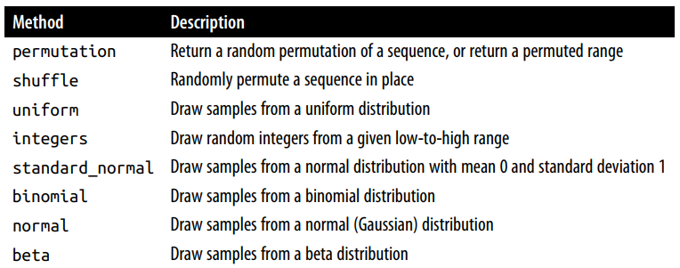
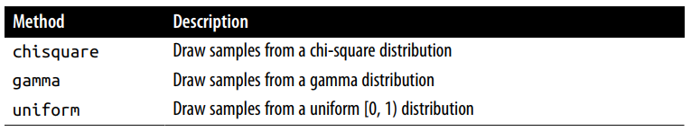

# Pseudorandom Number Generation
Modul `numpy.random` melengkapi modul random bawaan dari python dengan fungsi untuk menghasilkan sebuah array secara efesien dari berbagai jenis distribusi probabilitas. Contoh, anda dapat membuat 4 x 4 array yang berisikan sampe dari distribusi normal menggunakan `numpy.random.standard_normal`


```python
# Create 4 x 4 random numpy array
samples = np.random.standard_normal((4,4))
samples
'''
array([[-1.8473918 ,  0.20827432,  1.03385197, -0.22193113],
       [-0.08305714,  0.59257033, -1.20084053,  0.27694895],
       [-0.22315066, -1.0487875 , -1.65879409,  0.89752777],
       [ 0.63761711, -0.23913807,  1.53302134, -0.04749161]])
'''
```


Modul random bawaan dari python, hanya mengambil satu buah nilai, sehingga untuk membuat sebuah array, anda harus menulis perulangan.


```python
from random import normalvariate

normalvariate(0,1)
'''
0.3024286568264026
'''
```


Berbeda dengan `np.random` yang tidak perlu membuat perulangan menggunakan python. Dengan demkian, penggunaan `np.random` akan lebih efesiensi waktu proses dibandingkan menggunakan bawaan dari python. 


```python
from random import normalvariate
%timeit samples = [normalvariate for _ in range(1_000_000)]
'''
82 ms ± 9.47 ms per loop (mean ± std. dev. of 7 runs, 10 loops each)
'''
```


```python
%timeit np.random.standard_normal(1_000_000)
'''
29.1 ms ± 274 µs per loop (mean ± std. dev. of 7 runs, 10 loops each)
'''
```


Namun, elemen pada array tidak semurninya acak (lebih ke, pseudorandom) namun dihasilkan oleh random number generator yang dapat dikonfigurasi, itulah yang menentukan nilai apa yang akan dibuat. Fungsi seperti `np.random.standard_normal` menggunakan nilai bawaan random number generator, namun kita dapat mengatur konfigurasi tersebut secara terpisah. 


```python
random_seed = np.random.default_rng(seed=42)
sample = random_seed.standard_normal((4,4))
sample
random_seed = np.random.default_rng(seed=42)sample = random_seed.standard_normal((4,4))sample
'''
array([[ 0.30471708, -1.03998411,  0.7504512 ,  0.94056472],
       [-1.95103519, -1.30217951,  0.1278404 , -0.31624259],
       [-0.01680116, -0.85304393,  0.87939797,  0.77779194],
       [ 0.0660307 ,  1.12724121,  0.46750934, -0.85929246]])
'''
```


Argumen dengan nama seed adalah yang menentukan penentuan awal dari generator dan menetapkan perubahan dari setiap objek random number generator digunakan untuk menghasilkan data. Objek `random_seed` diatas terisolasi dari kode yang lain yang menggunakan modul, `numpy.random`. Artinya inisialisasi tersebut tidak membuat perubahan global.

Dibawah ini adalah daftar methode Numpy Random Number Generator

