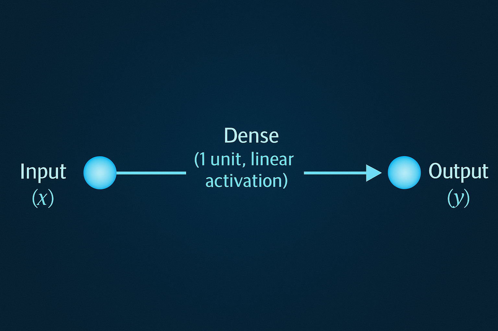

# Dasar ilmu LLM

LLM atau _Large Language Model_ adalah algoritma yang terlatih untuk membaca atau menerima nilai masukan lalu memprediksi dan menghasilkan nilai keluaran dalam bentuk jawaban atas pertanyaan, dimana jawaban tersebut mirip dengan jawaban yang dikeluarkan oleh manusia.

**_Large_**, kata tersebut merujuk pada besarnya sebuah model dalam bentuk data pelatihan dan parameter yang digunakan saat proses belajar (pembuatan) model. Sebagai contoh, OpenAI's GPT-3 model beris 175 miliyar parameter yang dilatih lebih dari 45 _terrabytes_ data teks.

**_Language Model_**, sedangkan untuk LM, adalah sebuah algoritma komputer yang dilatih untuk menerima nilai masukan dalam bentuk text (bahasa manusia, umumnya menggunakan bahasa Inggris) dan menghasilkan serta memberikan jawaban dalam bentuk text.

Karena pada umumnya Model dilatih dengan data text yang menggunakan bahasa Inggris, sehingga input yang menggunakan bahasa Inggris menghasilkan jawaban yang lebih baik. Akan tetapi, perbedaan performa terhadap bahasa lain bahkan pada model yang dilatih dengan dominan menggunakan text bahasa Inggris tidak terlalu jauh. {==Peneliti menemukan bahwa LLM dapat merubah pengatahuan semantiknya kedalam bahasa lain.==}

Mari kita coba berikan input kedalam LLM.

!!! example

    ```cmd
    >>> The capital of Indonesia is _______
    ...Jakarta.
    ```

LLM (_saya menggunakan `llama3.2`_) menjawab pertanyaan sederhana dengan benar. Dibelakang layar, LLM mengestimasi probabilitas dari urutan kata atau kalimat yang sebelumnya diberikan pada saat pelatihan model.

Secara teknis, LLM memprediksi `token`, bukan kata ataupun kalimat. `Token` merepresentasikan nilai atomik dari kata, sub suku kata, atau bahkan kalimat tergantung dengan pendekatan tokenisasi yang digunakan. Sebagai contoh, kata **istiklal** memiliki token id sebagai berikut;

<small>Berbicara tentang tokenisasi lihat lab yg berjudul [Encode dari text kedalam token menggunakan tokenisasi LLama3.2 v Tiktoken](./lab/1_preface_tokenizer.ipynb)</small>

1. `I` token id 40
2. `st` token id 267
3. `ik` token id 1609
4. `lal` token id 122591

Didalam tubuh LLM terdapat "_transformer neural network architectur_", adalah sebuah arsiktetur yang dapat membuat sebuah model  menangani kumpulan data, baris=baris kode, dan membuat prediksi kata selanjutnya yang paling sesuai. Transformer di desain untuk memahami konteks dari setiap kata pada sebuah kalimat dengan mepertimbangkan hubungan antar setiap kata. Sehingga model dapat membangun pehaman yang komprehensif dari setiap kalimat, kata, paragraf dan sejenisnya. 

!!! notes
    Saya pernah belajar membuat model menggunakan tensor flow, dimana model tersebut dibuat menggunakan Neural Network untuk memprediksi nilai dari sebuah fungsi matematika sederhana. [Google Collab](https://colab.research.google.com/drive/19vs6gIyG8NgheqkA1pVtT2tMebMEkvB0?usp=sharing)

    ```python
    # set random seed
    tf.random.set_seed(42)

    #1. create model using the Sequential API
    model = tf.keras.Sequential(
        [tf.keras.layers.Dense(1, input_shape=[1])]
        [tf.keras.layers.Dense(1, input_shape=[1])]
        # Karena kita ingin buat model dengan input satu angka dan output satu angka
    )

    #2. compile the model
    model.compile(
        loss=tf.keras.losses.mae, # mae is short of mean absolute error
        optimizer = tf.keras.optimizers.SGD(), # Stochastic gradient descent
        metrics=["mae"])

    # print (X,y)

    #3. fit the model
    model.fit(X,y, epochs=5)
    ```

    Dibawah ini adalah representasi neural network dari kode diatas

    