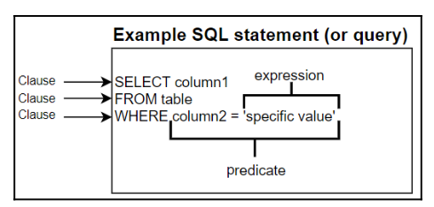
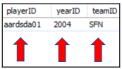
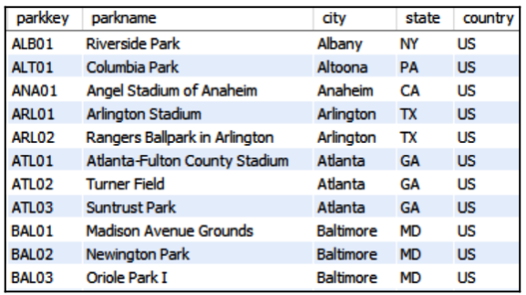
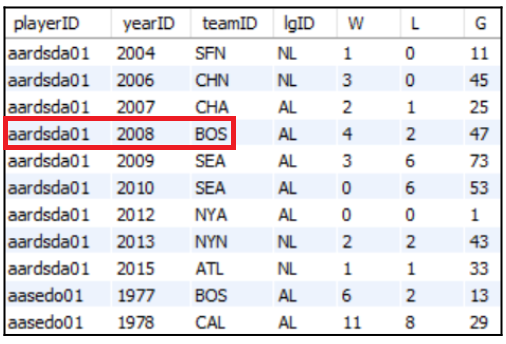
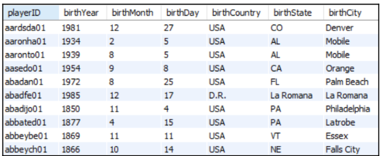

# Understanding RDBMS
## Element of SQL


## Understanding Database
Database (basis data) adalah sekumpulan data. Kita menyimpan basis data dalam bentuk *Relational Database Management System* (RDBMS). RDBMS adalah basis utama untuk database system terkini seperti MySQL, SQL Server, Oracle, PostgreSQL dan lain-lain.

### Table
Table adalah kumpulan dari data yang terikat yang disimpan dalam bentuk kolom-kolom dan baris-baris. Contoh gambar dibawah ini adalah gambaran dari tabel yang mengandung data tentang penampilan para pemain bintang pada olahraga baseball


Nilai **NULL** pada table adalah sebuah nilai yang kosong atau blank. Nilai tersebut tidak merepresentasikan sebuah string dari sebuah spasi kosong. 

### Fields
Fields adalah sebuah persimpangan atau titik temu dari baris dan kolom. Field ini bisa berbentuk dari berbagai mancam tipe data, termasuk `yearID`, `teamID` atau `playerID` field.



### Record or Rows
Row mengandung nilai pada sebuah data horizontal.
```
+-----------+--------+--------+------+----------+------+------+------+------+---------+
| playerID  | yearID | teamID | lgID | inseason | G    | W    | L    | rank | plyrMgr |
+-----------+--------+--------+------+----------+------+------+------+------+---------+
| wrighha01 |   1871 | BS1    | NA   |        1 |   31 |   20 |   10 |    3 | Y       |
+-----------+--------+--------+------+----------+------+------+------+------+---------+
```

## Memahami Data Integrity
**Data integrity** membentuk konsistensi dan keakuratan dari data. Data Integirity biasanya disusun saat proses mendisain prosedur dan petunjuk. Dalam RDBMS, Penggunaan keys membentuk data integrity. Key tersebut ditetapkan dan memaksa nilai pada sebuah tabel untuk menyesuaikan terhadap standar yang telah dispesifikasi. Standard ini membatasi beberapa jenis nilai yang dapat disimpan didalam database.

### Tipe Data Integrity
Ada tige tipe Data Integrity

| Entity Integrity | Referential Integrity | Domain Integrity |
| :--------------- | :-------------------- | :--------------- |
| Unique Constraint | Foreign Key | Check Constraint |
| Not Null Constraint ||Default Constraint |
| Primari Key |


#### Entity Integrity
Untuk memastikan setiap baris dari sbeuah tabel unik secara identitas, anda harus menggunakan *entity integirty* (EI). EI dicapai dengan menggunakan beberapa *types of keys* atau constraints, termasuk `unique`, `not null` dan `primary key` constraints

##### Unique Constraint
Untuk memastikan semua nilai pada sebuah colom atau beberapa kolom berbeda pada setiap barisnya, anda dapa menggunakan *Unique Constraint*. Tipe key ini dapat diaplikasikan keberbagai maca tipe data, dan dapat digunakan untuk menghindari terjadinya duplikasi data. Unique Constraint ini juga dapat diaplikasikan lebih dari satu kolom. dan, unique constraint dapat menerima nilai null.

Pada gambar tabel dibawah, kolom parkkey dipaksa untuk unique (Constraint Unique), sehingga nilai pada setiap barisnya tidak boleh sama. Namun untuk kolom parkname, city, state, dan country tidak, sehingga diperbolehkan nilai barisnya ada yang sama.



Nah, ini fitur yang baru saya tahu, hehehe. Jika anda membuat sebuah unique constraint pada sebuah kombinasi kolom dalam sebuah tabel (kombinasi kolom, gabungan n kolom yang dianggap menjadi satu kolom), pengapalikasian tersebut akan memaksa table untuk memliki nilai yang unik pada kombinasi kolom tersebut. Jika tidak, maka baris tidak akan dapat di - *inserted or updated*.



Contoh table diatas adalah kolom gabungan yang dipaksa untuk unik. gabungan nilai dari kolom palyerID, yearID, dan teamID harus unik setiap nilainya.

##### Not Null Constraint
Untuk memastikan semua nilai pada sebuah kolom tidak null, anda dapat menggunakan *Not Null Constraint*. Tipe key ini dapat diterapkan pada tipe data apapun dan digunakan untuk menghindari data yang tidak ada (wajib ada). Jika anda membuat not null constraint pada sebuah kolom, penerapan tersebut akan memaksa tabel untuk memiliki sebuah nilai pada kolom tertentu, jika nilainya null, maka row tersebut tidak dapat di- inserted or updated.

Lihat tabel dibawah ini, untuk kolom birthYear dipaksa untuk tidak memliki nilai null (not null) sedangkan deathYear tidak, karena belum tentu semua orang memliki nilai tahun kematiannya.



##### Primary Key
Primary key digunakan untuk memastikan semua data pada sebuah kolom unik dan tidak mengandung null. PK dapat dikatakan gabungan dari Not Null Contraint dan Unique Constraints. Namun anda hanya dapat menggunakan satu PK pada satu table.
Anda juga dapat membuat PK pada beberapa kolom gabungan. Pengimplementasian PK pada kolom gabungan disebut dengan **composite key**.

Pada tabel dibawah ini, playerID dipaksa menjadi Primary Key, maka dari itu kolom tersebut harus unik dan tidak dapat menerima  null.


Sedangkan pada tabel dibawah ini, gabungan kolom dari playerID, yearID, dan teamID dibuat menjadi composite key, maka dari itu, nilai gabungan dari kolom-kolom tersebut tidak boleh bernilai null dan harus unik


#### Referential Integrity
Referential integrity merujuk pada konsistensi dan keakuratan antara tabel - tabel yang saling terhubung. ==Dengan mengimplementasi primary key pada parent table dan foreign key pada child table, maka anda akan mendapatkan refrential integrity==. Foreign Key pada child table akan membuat penghubung antara satu atau lebih kolom pada child tabel dan primary key pada parent table atau dengan kata lain, jika foreign key tersedia, maka foregin tersebut harus valid, dan primary key harus tersedia pada parent table.

Jika anda tidak memasang referential integrity, anda akan berakhir dengan **orphaned records**, data atau beberapa data pada baris yang tidak memliki pasangan pada parent table. Contohnya, katakan anda menghapus data seorang player dari tabel dibawah ini (parent table).


Namun anda tidak menghapus data (child table) pada tabel dibawah ini, maka records pada tabel tersebut akan menjadi orphaned records


Jika foreign key diimplementasikan pada kolom salary, maka data player tidak dapat dihapus dari parent table tanpa harus menghapus baris salary pada table salary. Dengan adanya foreign key, kita juga dapat menghindari orang untuk menambahkan baris pada child table yang tidak memiliki data yang terhubung pada data di parent table yang menyebabkan data pada baris tersebut menjadi orphaned records.

Dalam membuat foreign key, foreign key harus memiliki refrensi pada sebuah kolom primary key tabel lain. Foreign key dapat di implemen pada tipe data apapun dan dapat menerima duplicate dan null values secara bawaan. Foreign key constraint dapat berupa tiga tipe hubungan antar tabel.

1.  **One-to-One**: Tipe terjadi ketika hanya ada satu tabel hanya berhubungan dengan satu baris pada tabel yang lainnya. Sebuah contoh, tabel empolyess dan computers, stiap empolyee hanya memliki satu computer

2. **One-to-Many**: Tipe ini terjadi ketika satu tabel tidak memiliki hubungan dengan satu atau lebih baris pada tabel yang lainnya. Sebagai contoh, adults tabel mungkin memiliki hubungan dengan satu atau lebih baris pada child tabel.

3. **Many-to-Many**: Tipe hubungan ini terjadi ketika banyak baris pada sebuah tabel berhubungan dengan banyak baris dari tabel yang lainnya. Sebagai contoh, costumers table dengan products table, dimana costurmers dapat membeli banyak products dan product tertentu dapat dibeli oleh lebih dari satu costumers.


Pada contoh dibawah ini, primary key ada pada tabel pertama di kolom playerID. Tabel kedua terdapat foreign key yang memliki refrensi pada kolom playerID di tabel pertama. Dalam contoh ini, terdapat hubungan one-to-many antara tabel pertama dan kedua karena ada pemain pada tabel pertama yang tidak memliki, atau memliki satu atau banyak data (baris) pada tabel ke dua yang saling berhubungan.


Jika anda memliki foreign key pada playerID di tabel kedua, makan anda tidak dapat menghapus nilai playerID pada table pertama sebelum anda men-delete playerID tersebut pada tabel kedua. Pengaturan ini disebut dengan referential integrity yang berguna untuk memastikan tidak ada data yang yatim pada tabel anak (child table).

!!! note "Referential Actions"
    Ketika melakukan operasi `UPDATE` atau `DELETE` pada parent table yang memliki hubungan dengan kolom pada childlre table hasil operasi tersebut bergantung pada *referential action*. Aksi tersebut diantaranya

    * CASCADE
    * SET NULL
    * RESTRICT
    * NO ACTION
    * SET DEFAULT
    
    [Source](https://dev.mysql.com/doc/refman/8.0/en/create-table-foreign-keys.html)

#### Domain Integrity
Untuk memastikan semua data mengikuti aturan yang terlah terdefinisi seperti format nilai, aturan besaran nilai maka gunakan check constraint dan atau default constraint, secara garis besarnya menggunakna domain integrity.

##### Check Constraint
Check Constraint digunakan untuk memastikan semua nilai pada sebuah kolom berada dalam rentang nilai tertentu. Tipe key ini dapat diimplementasikan pada tipe data apapun dan digunakan untuk memastikan nilai tersebut valid atau tidak. Tipe constraint ini menggunakan aturan kondisi yang didefinisikan oleh pengguna dan mengevaluasi nilai tersebut yang menghasilan benar atau salah. Anda dapat mendefinisikan check constraint (membuat aturan) pada satu kolom atau kombinasi dari kolom pada sebuah tabel.

!!! warning
    Penting untuk diingat, karena null tidak dianggap sebagai false, maka nilai tersebut akan tetap dapat di inserted atau di updated kedalam sebuah field dengan check constraint. Hal itu karena null akan dikenali sebagai unknown (bukan false atau true), nilai tersebut akan dilewati oleh check constraint. Jika anda ingin sebuah kolom tidak boleh bernilai null maka gunakan Not Null Constarint juga pada kolom tersebut.

Contoh dibawah ini adalah tabel dimana check constraint akan melakukan evaluasi dimana kolom inducted hanya dapat di isi dengan nilai **Y** atau **N**. Jika nilai diluar dari dua pilihan tersebut maka baris tidak akan di updated atau di inserted.


Sedangkan tabel dibawah ini adalah contoh dimana check constraint dapat diimplementasi pada kombinasi kolom, kasus dibawha ini anda ingin tahun kelahiran tidak boleh lebih besar dari pada angka kematian, maka dari itu, anda dapat menyetel check constraint yang mana hanya menerima add atau update jika birthYear <= deathYear.


##### Default Constraints
Tipe ini digunakan untuk memastikan semua baris pada sebuah kolom memliki nilai. Tipe key ini dapat digunakan untuk semua tipe data. Default Constraint akan mengisi dengan nilai bawaan pada sebuah field. Constraint ini dapat menghindari sebuah filed terisi dengan nilai null jika nilai tersebut tidak didefinisikan oleh pengguna.
1[Table Default Constraint](aset/1.14%20table_default_constraint.png)

Contoh diatas, table ab memilki default value 0 yang disetel menggunakan default constraint. Karena tidak semua pemain memliki nilai ab dari setiap pertandingan.


