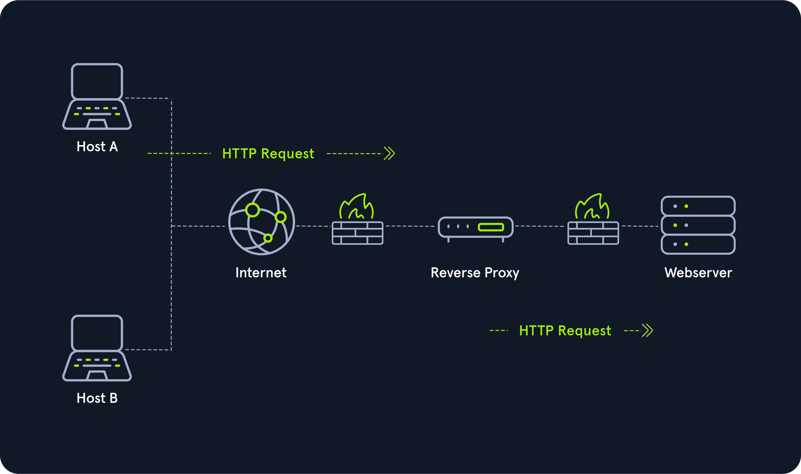

# Networking Structure

## Network Type
Beberapa terminologi pada tipe-tipe dari jaringan.

| Network Type | Definition |
| :----- | :--------- |
| Wide Area Network | Internet |
| Local Area Network | Home atau office network (Internal Network) |
| Wireless Local Area Network | Internal Network yang diakses melalui WiFi|
| Virtual Private Network | Menghubungkan beberapa jaringan pada satu LAN |

### Wide Area Network
Wan adalah salah satu alamat yang secara umum digunakan untuk mengakses internet. WAN adalah kumpulan dari LAN yang saling terhubung bersamaan.

### Local Area Network & Wireless Local Area Network
LAN biasanya diisi dengan alamat IP yang debentuk untuk penggunaan local (10.10.10/8, 172.16.0.0/12, 192.168.0.0/16). Tidak ada yang membedakan antara LAN dan WLAN hanya saja dengan WLAN tapat terhubung tanpa menggunakan kabel.

### Virtual Private Network
Ada tiga tipe utama dari Virtual Private Network, semuanya memliki tujuan yang sama yaitu membuat pengguna seperti terhubung dengan jaringan yang berbeda.

*   **Site To Site VPN**
    Keduanya, antara client dan server adalah Network Divice, biasanya **router** atau **firewalls**. Kedua device tersebut berbagi jangkauan jaringan (network range). Biasanya VPN digunakan untuk menggabungkan beberapa jaringan perusahaan melalui internet, membuat beberapa lokasi dapat terhubung seperti mereka dalam satu lokasi, local network.

*   **Remote Acces VPN**
    Jenis VPN ini melibatkan komputer pada sisi client membuat sebuah virtual interface yang berprilaku seperti didalam client network. Dalam menganalisa VPN ini yang harus di perhatikan adalah **routing table** yang terbuat ketika masuk kedalam VPN ini. Jika VPN hanya membuat route pada jaringan yang spesifik saja (misalkan: 10.10.10.0/24), maka disebut dengan **Split-Tunnel VPN**, artinya koneksi internet tidak keluar dari jaringan VPN.

    !!! info
        Untuk mengetahui perbedaan  antara Split-Tunnel VPN dengan Full-Tunnel VPN baca lebih lanjut [additional notes](99.%20Additional%20notes.md#apa-itu-vpn-split-tunneling)

*   **SSL VPN**
    Tipe VPN ini akan stream aplikasi atau seluruh sesi dekstop di webbrowser. Seperti Pwnbox pada HackTheBox

## Proxies
Banyak orang memliki opini yang berbeda tentang apa itu proxy:

*   Security professional menggunaakn HTTP Proxies (BurpSuite) atau pivoting dengan SOCKS/SSH Proxy (Chisel, ptunnel, sshuttle) 
*   Web Developers menggunakan proxies seperit Cloudflare atau ModSecurity untuk menghadang lalulintas yang mencurigakan.
*   Orang umum menganggap proxy digunakan untuk mengaburkan lokasi mereka dan mengakases jaringan menggunakan negara lain.
*   Orang hukum sering mengaggap penggunakan proxy selalu terkait dengan aktifitas ilegal

Namun semuanya tidak benar,jadi proxy adalah mesin atau service yang duduk di tengan jaringan (middle of connection) dan berprilaku sebagai **mendiator**.  Mediator ini dapat menginspect konten dari lalu lintas. Tanpa adanya kemampuan mediator tersebut, device secara teknik hanya sebuah gateway, bukan proxy. Dan perlu diingat, proxy duduk dilayer 7, _application_.

### Tipe dari proxy
`Dedicated Proxy / Forward Proxy`
:   Forward proxy (bisa disebut dengan porxy apa adanya) adalah ketika client membuat request ke komputer, dan komputer tersebut membawa request ke tujuannya. Sebagai contoh, pada sebuah jaringan perusahaan, komputer yang memliki data sensitif tidak dapat akses langsung ke internet. Untuk mengakases website, mereka harus melalui proxy (atau web filter). Hal ini menjadi garis pertahanan yang kuat untuk melawan malware, karena tidak hanya malware tersebuts harus melewati web filter, namun dia juga harus menjadi {==proxy aware==} [^2] atau menggunakan non-traditional C2 (sebuah cara agar malware mendapatkan informasi tugas). Jika organisasi hanya memanfaatkan FireFox, kemungkinan proxy-aware malware hampir tidak mungkin.

:   Web Browsers seperti Internet Explorer,Edget atau Chrome bawaanya semua web browser tersebut mengikuti aturan System Proxy. Jadi, jika malware memanfaatkan **WinSock** (Native Windows API), maka memunkinkan bagi malware menjadi proxy aware tanpa ada kode tambahan. Firefox tidak menggunakan WinSocks, namun **libcurl** yang membuat FireFox menggunakan kode yang sama pada OS apapun. Artinya malware harus menarik proxy setting pada firefox, yang mana malware jarang melakukannya. (Lebih aman FireFox dibandingkan web browser yang disebutkan diatas)

:   Jika cara tersebut tidak bisa, malware akan memanfaatkan DNS sebagai mekanisme {==C2==} [^3], namun jika organisasi yang diserang menggunakan System Monitoring ({==Sysmon==} [^4]) dengan memonitor DNS maka traffic mencurigakan tersebut akan cepat tertangkap.

:   Contoh lain forward proxy adalah Burp Suite, yang sering digunakan oleh para security untuk melakukan forward HTTP request.

:   

`Reverse Proxy`
:   Reverse Proxy adalah kebalikan dari forward proxy. Jadi forward proxy didesain untuk menyaring outgoing request sedangkan reverse proxy didesain untuk menyaring incoming request.

:   Banyak oragnaisi menggunakan CloudFlare untuk menahan sertangan DDOS. Dengan menggunakan CloudFlare, organisasi memliki sesuatu untuk menyaring traffice yang dikirim ke webserver mereka.

:   Pentester akan mengkonfigurasi reserver proxy pada infected endpoint. Endpoint tersebut akan mendengar setiap request dari port dan mengirim client yang terhubung ke port tersebut ke attacker melalui infected endpoint. Ini berguna untuk mem-bypass firewalls dan menghindari logging.

:   Reverse proxy lainnya adalah ModSecurity, sebuah Web Application Firewall (WAF). WAF ini akan menginspect setiap request dan jika request berbahaya makan akan mem-block request tersebut. Sebenarnya CloudFlare bisa melalukukan demikian, namun CloudFlare harus disetting agar men-decrypt HTTPS trafic yang mana banyak organisasi tidak ingingkan.

:   

[^1]:   Baca tentang [VPN split tunneling](99.%20Additional%20notes.md#apa-itu-vpn-split-tunneling)
[^2]:   Baca tentang [proxy aware](99.%20Additional%20notes.md#proxy-aware)
[^3]:   Baca tentang [mekanisme C2](99.%20Additional%20notes.md#command-and-control)
[^4]:   Baca tentang [Sysmon](99.%20Additional%20notes.md#sysmon)
