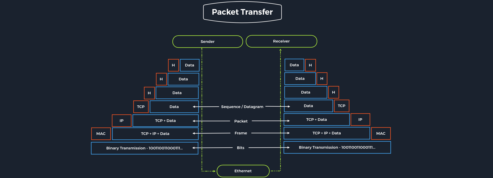

# Networking Workflow

## Networking Model
Networking model menjabarkan komunikasi dan transfer data antar host, diantaranya adalah OSI model dan TCP/IP model.

{==Osi model adalah sebuah model refrensei==} yang digunakan untuk menjabarkan dan mendifinisikan komunikasi antar sistem. Model refrensi ini memiliki 7 layer yang terpisah, dan setiap layer memliki tugas yang terpisah pula.

{==TCP/IP adalah sebuah istilah generik  untuk protokol jaringan==}. Protokol tersebut bertanggung jawab untuk melakukan switching dan meng-traposrt packet of data pada internet. Seluruh internet bersandar pada protocl familiy. Jadi TCP/IP bukan hanya merujuk pada TCP atau  IP namun menyeluruh ke seluruh protocol familiy. Seperti ICMP (Internet Control Message Protocol), UDP (User Datagrame Protocol). Protocol family menyediakan fungsi yang dibutuhkan untuk melakukan transport dan switching paket data di jaringan private atau public.

### OSI vs TCP/IP
TCP/IP adalah protokol komunikasi yang membuat setiap host terhubung ke internet. Protokol tersebut merujuk pada Transmission Control Protocol yang digunakan didalam atau oleh aplikasi di internet. Dilain sisi, OSI adalah aturan yang harus diikuti yang menyajikan arahan umum bagaimana setiap mesin saling dapat berkomunikasi walaupun beda manufaktur. Dan OSI lebih ke komunikasi gateway.

### Packet Transfers
Pada sistem yang berlayar, {==setiap device didalam sebuah layer bertukar data dalam sebuah format yang disebut dengan **Protocol Data Unit (PDU)**==}. Contohnya, ketika kita ingin berselancar pada sebuah website di komputer, remote server software pertama kali akan me-request data ke application layer. Selanjutnya di proses dari lapis ke lapis, setiap lapis melakukan fungsinya masing-masing. Selanjutnya data ditrasnfer melalui networks physical layer hingga sampaike server atau mesin lainnya yang menerima request tersebut. Data di alirkan melalui setip lapisanlagi, dengan setiap lapis melakukan operasi tersebut hingga software yang melakukan request menerima respon data.

Saat transmisi, data khusus yang disebut dengan **header** selalu ditambahkan ke PDU pada layer diatasnya yang berguna untuk mengatur dan mengidentifikasi packet. Proses tersebut disebut dengan {==encapsulation==}. Header dan data PDU menjadi satu dan diteruskan ke layer selanjutnya. Proses encasuplation tersebut berlanjut hingga ke physical layer atau network layer dimana data dikirim (transmitted) ke penerima (receiver). 

Lalu penerima (receiver) melalukan sebaliknya, yaitu dengan membongkar data dalam setiap layer dengan dengan _header information_ hingga akhirnya application layer menggunakan data yang telah dibongkat tersebut. Proses ini terus berlanjut hingga data dikirim dan diterima.

Untuk penetration tester,  kedua refrensi model ini, OSI dan TCP/IP sangat berguna, dengan TCP/IP kita dapat dengan mudah memahami seluruh koneksi. Dan dengan OSI layer kita dapat memecah setiap layer dan menganlisa setiap layer tersebut. INi sering terjadi ketika kita dapat listen dan men intercept traffic jaringan.

## OSI Model
Tujuan mendefinisikan standard OSI untuk membuat refrensi model yang membuat komunikasi antar sistem, mesin dan teknologi yang berbeda dapat dilakukan.

| Layer | Function |
| :---- | :------- |
| 7.Application | Among other things, this layer controls the input and output of data and provides the application functions.|
| 6.Presentation | The presentation layer's task is to transfer the system-dependent presentation of data into a form independent of the application.|
| 5.Session | The session layer controls the logical connection between two systems and prevents, for example, connection breakdowns or other problems.|
| 4.Transport | Layer 4 is used for end-to-end control of the transferred data. The Transport Layer can detect and avoid congestion situations and segment data streams.|
| 3.Network | On the networking layer, connections are established in circuit-switched networks, and data packets are forwarded in packet-switched networks. Data is transmitted over the entire network from the sender to the receiver.|
| 2.Data Link | The central task of layer 2 is to enable reliable and error-free transmissions on the respective medium. For this purpose, the bitstreams from layer 1 are divided into blocks or frames.|
| 1.Physical | The transmission techniques used are, for example, electrical signals, optical signals, or electromagnetic waves. Through layer 1, the transmission takes place on wired or wireless transmission lines.|

Layer 2-4 adalah transport oriented dan layer 5-7 application oriented. Jika dus sistem berkomunikasi, semua 7 layer dari OSI model setidaknya berjalan 2 kali. Ketika sebuah aplikasi mengirim sebuah pake ke sistem lain, sistem berkerja dari layer 7 ke satu sedangkan sistem yang menerima akan membongkar packet yang diterima dari layer 1 ke layer 7.

## TCP/IP Model
The TCP/IP model is also a layered reference model, often referred to as the Internet Protocol Suite.

|Layer | Function |
| :---- | :------- |
| 4.Application | The Application Layer allows applications to access the other layers' services and defines the protocols applications use to exchange data.|
| 3.Transport | The Transport Layer is responsible for providing (TCP) session and (UDP) datagram services for the Application Layer.|
| 2.Internet | The Internet Layer is responsible for host addressing, packaging, and routing functions.|
| 1.Link | The Link layer is responsible for placing the TCP/IP packets on the network medium and receiving corresponding packets from the network medium. TCP/IP is designed to work independently of the network access method, frame format, and medium.|

Dengnan TCP/IP, setiap aplikasi dapat mengirim dan bertukar data melalui jaringan dan aplikasi tidak perlu tahu dimama receiver berlokasi. IP memastikan data packet sampai ke tujuannya dan TCP mengatur pengiriman data dan memastikan koneksi antara data dan aplikasi.

Dibawah ini adalah tabel yang menjelaskan tugas penting dari TCP/IP

|Task | Protocol | Description|
| :---- | :------ | :------- |
|Logical Addressing | IP | Banyaknya host yang berada dalam jaringan berbeda, maka diperlukannya network topology dan logical addressing. Menggunakan TCP/IP, IP bertanggung jawab pada logical addressing networks dan nodes. {==Data packets hanya sampai ke tempat yang seharusnya==}. Method yang digunakan adalah `network classes`, `subnetting`, dan `CIDR` (Classless Inter-Domain Routing)|
| Routing | IP | Setiap data packet, node selanjutnya ditentuka pada setiap node saat berjalan dari sender ke receiver. Dengan cara ini, sebuah data packet di routed (jalurkan) ke receiver walaupun lokasi receiver tidak diketahui oleh sender |
| Error & Control Flow | TCP | Sender dan receiver secara rutin saling berkomunikasi melalui **virtual connection**. Karena itu control message dikirim secara terus menerus untuk menguji apakah koneksi masih tersedia atau tidak.|
| Application Support | TCP | TCP and UDP ports form a software abstraction to distinguish specific applications and their communication links.|
| Name Resolution | DNS | DNS provides name resolution through Fully Qualified Domain Names (FQDN) in IP addresses, enabling us to reach the desired host with the specified name on the internet.|