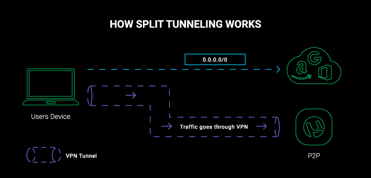

---
hide:
    - navigation
---

# Additional Notes

*   [Split tunneling](#apa-itu-vpn-split-tunneling)
*   [Proxy aware](#proxy-aware)
*   [Command & Control](#command-and-control)

## Apa itu VPN split tunneling
!!! info
    Resource : [https://cybernews.com/what-is-vpn/split-tunneling/](https://cybernews.com/what-is-vpn/split-tunneling/)

Split tunneling adalah fitur dari VPN yang membagi internet traffic dan mengirim sebagian traffic tersebut melalui encrypted virtual private network tunnel, dan memnagi sisanya pada tunnel yang terpisah dalam open network. Biasanya, split tunnling membuat kita dapat memilih aplikasi mana yang diamankan lalu lintasnya melalui VPN dan aplikasi mana yang terhubung dengan cara yang normal.

### Bagaimana cara kerja VPN-Split tunneling
Bawaanya, mesin kita mungkin hanya memliki satu koneksi tunggal ke internet (WAN) dimana data tersebut dikirim dan diterima. Namun, ketika menggunakan VPN, makan VPN akan membuat sebuah jaringan yang aman (secure connection) antara mesin dan VPN server. Selanjutnya VPN server yang akan mengakses keinternet. Sehingga setuap bit data yang dikirim dan diterima akan melalui VPN server dahulu.

Dilain sisi membuat lalulintas data menjadi lebih aman namun juga membuat lebih lambat karena semuanya harus melalui VPN server terlebih dahulu.

Split tunelling berkerja dengan membuat dua koneksi pada waktu yang bersamaan (two connections at the same time), koneksi aman VPN dan koneksi terbuka ke internet. Sehingga data terenkripsi dengan aman tanpa harus memperlambat internet.

### Macam-macam split tunneling
1.  URL-based split tunneling
    Tipe ini membuat kita dapat memilih URL mana yang kita ingin buat aman dengan cara mengencrypt melalui VPN. Biasanya menggunakan VPN pada ekstention browser.

2.  App-based split tunneling
    Sama dengan URL, bedanya kita dapat memliki aplikasi mana yang lalulintasnya ingin diarahkan ke VPN server sedangkan yang lainnya melalui jaringan yang terbuka.

3.  Inverse split tunneling
    Berbeda dengan dua tipe diatas, tipe ini berkerja kebalikannya. Dua tipe diatas bawaanya semua URL dan aplikasi melalui jaringan terbuka dan kita memilikih URL dan applikasi mana yang ingin diarahkan ke VPN server. Tipe ini justru bawaanya melalui VPN server dan kita memiliki URL dan applikasi mana yang ingin melalui jaringan terbuka.

### Pros dan Cons penggunaan split tunneling

`Pros`
:   1.  Meningkatkan kecepatan internet jika dibandingkan dengan full tunneling
    2.  Membuat anda dapat mengakses dua jaringan dalam waktu yang bersamaan, jadi anda dapat mengakses corporate network atau foreign network namun juga tetap bisa mengakses local network. Jadi anda tidak perlu mematikan dan menyalakan VPN untuk melakukan, download dengan kecepatan tinggi, stream foreign films dan masih mendapatkan pencarian lokal dari google search (tidak mengikuti daerah vpn), dan tetap dapat mengakses lokal kenoksi seperti printer bersamaan dengan tetap menjaga prifacy pada jaringan internet.

`Cons`
:   1.  Split tunneling melewatin pengukuran keamanan oleh VPN pada sebagian koneksi yang terbuka sehingga memberi sebagian aktifitas online anda rentan terhadap hacker.
    2.  Membutuhkan waktu untuk mengatur split tunneling, karena harus memliki URL dan aplikasi mana yang ingin diarahkan ke VPN server.
    3.  Tidak semua VPN menyediakan fitur split tunnel VPN dan tidak semua fitur ini dapat berjalan disemua operating system.

### Apakah VPN split tunneling aman ?
Split tunneling lebih aman daripada tidak menggunakan sama sekali. Namun mengarahkan semua lalu lintas jaringan ke VPN server jelas lebih aman dari pada hanya sebagian saja.

### Resiko split tunneling
*   Melewati pengukuran keamanan, termasuk porxy server yang dibentuk untuk membuat lalulintas aman.
*   Jika tidak diatur dengan benar maka akan memberikan ruang untuk hacker mengambil informasi berharga yangmana juga tidak disembunyikan oleh ISP yang kita gunakan.
*   Membahayakan keamanan sistem perushaan jika pegawai didalamnya menggunakan less secure network (jaringan yang kurang aman)
*   Pegawai dapat mem-bypass ijin pada jaringan perusahaan, artinya mereka dapat mengakses situs yang diblock atau mengunduh hal yang berbahaya.
*   Pegawai IT dapat kehilangan monitor atas apa yang dilakukan pegawai lainya terhadap aktivatis mereka pada internet.

### Kapan harus menggunakan split tunneling
Anda dapat menggunakan split tunneling jika anda ingin mengamamkan sebagian trafik jaringan dan dilain sisi tidak ingin kehilangkan kecepatan internet.

---

## Proxy Aware
Proxy aware secara umum artinya sebuah sistem atau aplikasi yang didesain untuk bekerja dengan atau melewati proxy server

Proxy server adalah penengah antara client (seperti web browser) dan sebuah server (seperti website). Ketika client mengirim request ke server, request tersebut pertama kali akan masuk kedalam proxy server, yang mana akan dilanjutkan request tersebut ke server. Server akan memberikan responds ke proxy server, yang mana juga akan dikirim respone tersebut ke client.

Sistem atau aplikasi dikatakan proxy aware jika dibentuk dan dapat berkerja dengan benar ketika diakses melalui proxy server. Artinya, sistem dan aplikasi tersebut dapat dengan benar menangani request dan respone yang dikirim melauai proxy server dan juga dapat dikonfigurasi untuk menggunakan spesifik pengaturan yang dibutuhkan.

Sebagai contoh, sebuah web browser dikatakan proxy aware jika dapat dikonfigurasi untuk menggunakan proxy server dan port tertentu untuk semua lalu lintas internet, yang membuat aplikasi tersebut dapat mengakases website yang mungkin di block oleh firewall.

!!! info "Kesimpulan"
    Jadi kesimpulannya adalah proxy aware adalah sebauh sistem atau aplikasi yang dapat berkerjasama dengan proxy server.

---

## Command and Control

### Sumber 1
!!! info "resource"
    Learning Malware Analysis oleh Monnappa KA publisher Packt Publishing

_Command and Control_ atau disebut dengan C2 merujuk pada bagaimana attacker berkomunikasi dan mengontrol sistem yang telah terinfeksi. Setelah sistem terinfeksi, banyak malware yang tertanam berkomunikasi dengan C2 server miliki attacker agar dapat mengirim sebuah command, mengdonwload komponen tertentu atau mengambil informasi berharaga dari sistem yang telah terinfeksi.

Untuk mendapatkan C2, musuh menggunakan berbagaimana macam teknik dan protokol, dahulu banyak yang menggunakan Internet Relay Chat (IRC). Namun untuk saat ini kebanyakan menggunakan HTTP/htTPS. karena dengan menggunakan protokol tersebtu, penyerang dapat mem-bypass filrewalls/network-based detection system dan menggabungkan command dengan traffic web yang sah. Terkadang malware juga menggunakan P2P untuk komunikasi C2. Bahkan ada beberapa malware menggunakan DNS tunneling untuk komunikasi C2. 

### Sumber 2
!!! info
    Sumber : [https://www.varonis.com/blog/what-is-c2](https://www.varonis.com/blog/what-is-c2)

Seranga siber tidak hanya sebatas berhasil masuk kedalam dan menginfkesi sistem, namun tetap mengikat sistem yang telah terinfeksi sehingga pelaku serangan tetap mampu berkomunikasi dengan sistem tersebut, dan memiliki potensi mengambil data yang sensitive. Untuk mencapai itu, attacker menggunakan mekanis C2, command and control.

C2 adalah sekumpulkan alat yang digunakan oleh attacker untuk memaintain komunikasi terhadap device yang terinfeksi atas tindak lanjut eksploitasi awal. Mekanisme yang digunakan sangat bervariasi, namun secara umum C2 terdiri dari satu atau saluran komunkasi tersembuyi (channel communication) antara device yang ada pada organisasi dan platform yang digunakan oleh attacker. {==channel communication==} digunakan oleh attacker untuk mengirimkan command, mendonwload payload lainnya dan mencuru data sensitif.

C2 memiliki berbagai macam bentuk. MITTRE ATT&CK framework membuat [16 daftar command and control teknik](https://attack.mitre.org/tactics/TA0011/). Teknik yang paling umum digunakan adalah mencampurkan C2 dengan traffic yang legal yang mungkin sering digunakan oleh organisasi seperit, HTTP/HTTPS, DNS. Attacker juga dapat menggunakan aksi lain untuk menyamarkan C&C callbacks seperti menggunakan encryption atau data encoding yang tidak biasa.

Platform C2 yang paling sering digunakan oleh kriminal dan pentester adalah `CobaltStrike`, `Convenant`, `PowerShell Empire` dan `Armitge`. 

