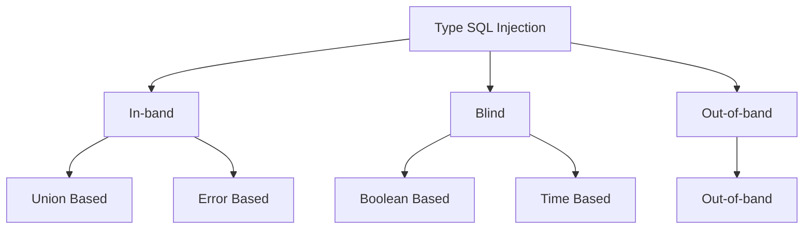

!!! info
    Dibawah ini adalah catatan dari platform Hack The Box pada module **SQL Injection Fundamentals**

Sebelum masuk ke bagian catatan ini setidaknya pahami salah satu database yang paling banyak digunakan, yaitu [Mysql](../../Technology/Catatan%20MySql/01.%20Rangkuman%20Muka.md)

Catatan selanjutnya esensial dari SQL Injection.


## What is an Injection?

> Sanitasi merujuk kepada menghilangkan karakter spesial nilai masukan dengan maksud mematahkan percobaan injeksi. 

Injeksi terjadi ketika sebuah aplikasi salah menafsirkan nilai masukan dari user sebagai sebuah kode dari pada sebuah string, dan mengubah flow code serta mengeksekusi kode tersebut. Injeks bisa terjadi ketika menggunakan escape karakter seperti ++'++ diikut dengan kode yang akan dieksekusi, seperti kode JavaScript atau SQL. Jika nilai masukan tersebut tidak disanitasi makan sangat mungkin terjadi kode injek tersebut diekskusi dan berjalan,

## SQL Injection
SQL Injeksi terjadi jika nilai masukan dari user tidak difilter dan disanitasi dengan baik sehingga diekesekusi oleh SQL.

```{.php .no-copy title="PHP"}
$searchInput =  $_POST['findUser'];
$query = "select * from logins where username like '%$searchInput'";
$result = $conn->query($query);
```

Kode php diatas menerima nilai masukan dari user melalui method POST yang mana niai tersebut digunakan untuk mencari data pata tabel `logins` dengan nama `username` mirip atau sama dengan nilai masukan dari user. Katakan nila masukan dari user adalah `farras`. Sehingga query yang akan dijalankan oleh SQL seperti dibawah ini.


```{.no-copy .sql title="SQL Query"}
SELECT * FROM logins WHERE username LIKE '$farras';
```

Karena tidak ada sanitasi pada kode PHP kita dapat menggunakan escape karakter dan menginjeksi kode. katakan kita membuat sebuah perintah untuk meng-drop tabel user menggunakan nilai masukan user `farras'; DROP TABLE users;-- ` sehingga SQL query yang akan dijalankan seperti dibawah ini.

```{.no-copy .sql title="SQL Query"}
SELECT * FROM logins WHERE username LIKE '$farras'; DRIOP TABLE users;-- ' 
```

Query diatas saya menambahkan `-- ` seagain komen agar karakter `'` tidak menyebabkan error pada SQL. Nanti juga akan dibahas tentang komen pada SQL

!!! warning
    Query tepat diatas saya menuliskan query lain setelah semi collon `;`. Query tersebut tidak akan dijalankan oleh MysQl, namun dijalankan oleh PostgreSql dan MSSQL. InsyaAllah di catatan selanjutnya akan dipaparkan injeksi pada MySql.


## Types of SQL Injections


**In-band** SQL Injection, nilai keluaran dari injeksi terpampang pada _front end_ dan kita dapat langsung membaca hasil dari injeksi. Tipe ini ada dua tipe lagi;

1.  `Unin Based`
    Kita dapat mengeksekusi lokasi tepat seperti `column` yang mana kitadapat baca, sehingga query akan langsung ditampilkan di lokasi tersebut.

2.  `Error Based`
    Hasil error dari PHP atau SQL yang didapatkan ketika meng-injeksi dapat digunakan untuk payload selanjutnya atau menguji sql injeksi lain melalui hasil dari error tersebut.

**Blind**, berbeda dengan In-band, SQL injection _blind_ ini tidak tampil pada fron end. Maka dari itu injeksi ini memanfaatkan logic untuk mendapatkan karakter demi karakter. Tipe ini ada dua, yaitu `Boolean Based` dan `Time Based`.

**Out-of-band** injection, pada kasus tersebut nilai keluara tidak ditampilkan, akan tetapi kita bisa mengarahkan hasil output tersebut ke remote location seperti, DNS misalnya, dan mencoba mengakses lokasi tersebut.


> Pada catatan selanjutnya pada HTB hanya dipelajarin tentang **In-band injection**