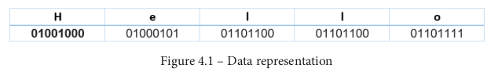
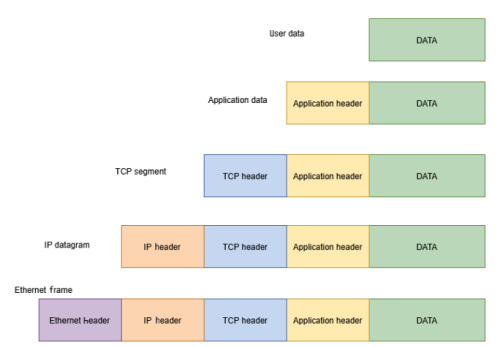
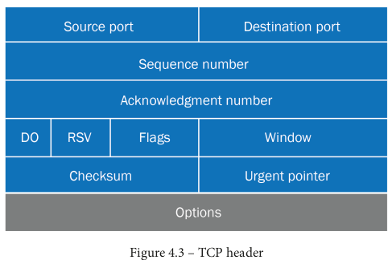
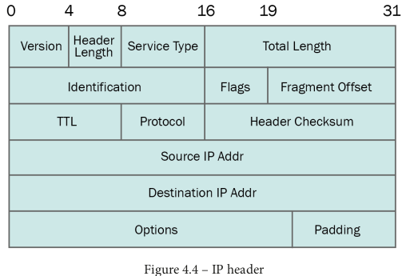
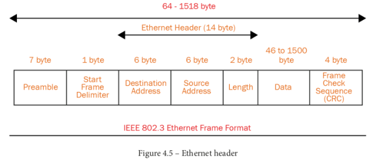

# Network Scanning

## Introduction to networking
Lihat sini untuk catatan;

*   [HTB networking](../../Hack%20The%20Box/Introduction%20to%20Networking/01.%20Network%20Structure.md)

## Data representation in digital system
Pertama, kita harus memahami bagaimana sebuah sistem saling mengirim dan menerima data pada jaringan. Setiap bagian dari data pada sebuah sistem disimpan dalam bentuk bilangan biner, sehingga didenfinisikan dengan {==binary logic level==}. Bilangan biner terdiri dari 0 atau satu (bisa juga disebut dengan `high` atau `low`). Bukan hanya text yang didefinisikan dengan binary logc level, namun poto, video, rekaman suara atau apapun yang disimpan pada kompter juga menggunakan logic level tersebut.

Mungkin anda bingung bagaimana tipe data yang berbeda direpresentasikan menggunakan logic levels. Mari kita lihat bagaimana logic level tersebut berkerja. Katakan anda ingin mengirim pesan text "Hello" keteman anda. Untuk mengirim pesan tersebut, kita harus mengubahnya kedalam pesan yang dipahami oleh komputer (komputer hanya mengetahui bilangan biner). Maka dari itu, kita harus meng-ecode pesan tersebut kedalam binary logic level. 

!!! info
    High dan low sama dengan 1 dan 0. Penggunaan istilah tersebut juga digunakan pada eletronika, seperti [arduino](../../Technology/Catatan%20Arduino/01.%20What%20is%20arduino.md)

Sekarag mari kita lihat pesan kita, kalimat `hello` terdiri dari 5 kata sedangkan komputer hanya mengetahui dua logic level (0 atau 1). Maka, untuk meng-ecoding pesan tersebut, sebuah sistem dibuat dengan nama ASCII (America Standad Code for Information Interchange). Menggunaan skema kode tersebut, kita dapat merepresentasikan huruf romawi termasuk beberapa simbol atau angka.

Setiap huruf setara dengan 8 bits, atau 1 byte. Dibawah ini adalah encoding dari huruf kedalam bilangan biner.

*   H = 01001000 => 64+8 = 72 => According to ASCII table, 72 is H
*   E = 01000101
*   L = 01101100
*   L = 01101100
*   O = 01101111

Sekarang kita memliki {==stream of data==} yang dapat kita kirim mengunakan sistem digital apapun itu bentuknya.

!!! info
    Real systems also use other encodings, such as Unicode and byte representation, to send complex data.

## Data Encapsulation
In the preceding section, we said that we want to send a Hello message to someone in our local network. Let's call this message our data:

Now, in order for it to successfully reach the other computer, {==the packet must know its exact destination==}, similar to how a postal delivery system works.

In digital systems, you have IP addresses, MAC addresses, and source and destination ports.

Let's say you write your message in your browser application and your friend is also waiting for your message in their browser. In order to successfully send the message to the exact same process in the destination computer, the **IP protocol** will add a new header to your message.

From the topmost layer, the application header is added. Picture above shows how data is encapsulated in the TCP/IP stack before it is sent over the network.

## The packet delivery process
The packet delivery process depends on whether the destination device is located in the same local network or not. If the device is located in the same subnet, we can directly use the Ethernet addresses to send the data.

## TCP header
The TCP header has the fields shown in the following diagram:

In this header, we are only concerned with the source and destination ports. 

*   The sourceport relates to the process in your local machine associated with the message you want to send. It is usually
randomly generated from the sending side

*   The destination port is where the packet should go. It defined by the message.

For example : when you request an HTTPS website, your PC generates request packets with the destination port number set to 443 . In our case, if we are sending the Hello message to a browser application working on HTTPS, the source port field in the sending packet will be randomly selected and the destination would be 443 . Once the TCP header is added to the data, it is called the TCP segment.

## IP header

Here, the fields that we are interested in are the source IP and destination IP. This defines where your packet will go and where it is originating from. Once the IP header is added, it is called an IP datagram.

## Ethernet Header
The Ethernet header helps the data to navigate in the local network. The most important fields here are the source and destination MAC addresses. As the name implies, the source MAC address will be your MAC address and the destination will be the MAC address of the recipient in the local network:

Once an Ethernet header is added, it is now called an Ethernet frame.