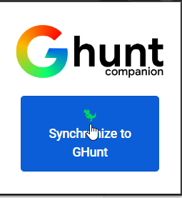
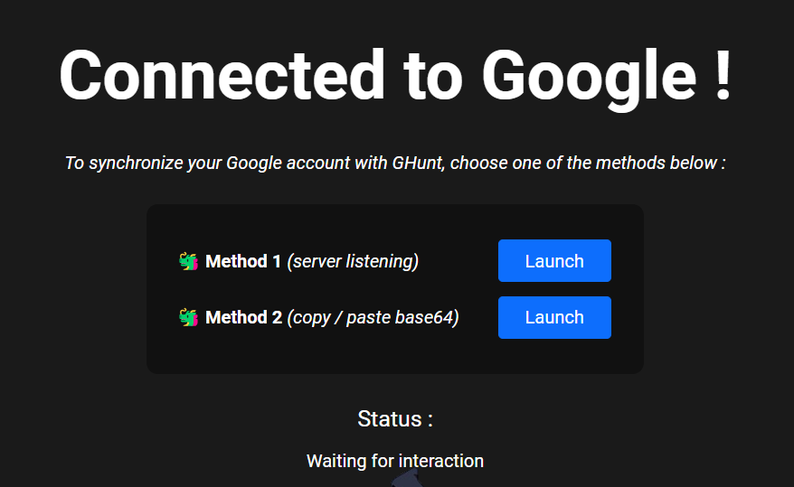
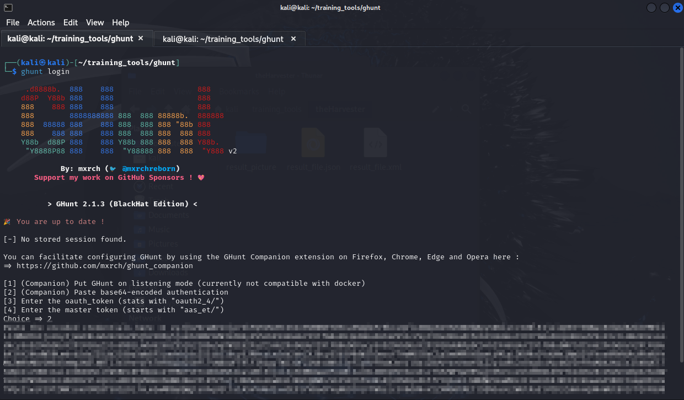

# Apa itu `Ghunt`
Berdasarkan dari sumber resminya [Ghunt](https://github.com/mxrch/GHunt), _GHunt (v2) is an offensive Google framework, designed to evolve efficiently_. **It's currently focused on OSINT**

## How it works and how to use it
Pada dasarnya, Ghunt ini web scrapper, tugasnya adalah mengumpulkan data melalui website, untuk Ghunt tentunya paltform google. Diantaranya Google Calender, Game dari Google Play, dan Maps. Untuk cara installasi kunjungi github diatas, disana tertera bagaimana cara meng-installnya.

### Step 1, Login
Untuk bisa menggunakan _Ghunt_ kita harus login menggunakan akun google. Untuk mulai menggunakan ghunt kita jalankan perintah berikut. 

```bash
ghunt login
```


!!! Example

    ```bash

    ghunt login

     .d8888b.  888    888                   888    
    d88P  Y88b 888    888                   888    
    888    888 888    888                   888    
    888        8888888888 888  888 88888b.  888888 
    888  88888 888    888 888  888 888 "88b 888    
    888    888 888    888 888  888 888  888 888    
    Y88b  d88P 888    888 Y88b 888 888  888 Y88b.  
     "Y8888P88 888    888  "Y88888 888  888  "Y888 v2

             By: mxrch (🐦 @mxrchreborn)
       Support my work on GitHub Sponsors ! 💖
    

          > GHunt 2.1.3 (BlackHat Edition) <         

    🎉 You are up to date !

    [-] No stored session found.

    You can facilitate configuring GHunt by using the GHunt Companion extension on Firefox, Chrome, Edge and Opera here :
    => https://github.com/mxrch/ghunt_companion

    [1] (Companion) Put GHunt on listening mode (currently not compatible with docker)
    [2] (Companion) Paste base64-encoded authentication
    [3] Enter the oauth_token (stats with "oauth2_4/")
    [4] Enter the master token (starts with "aas_et/")

    ```

Ada beberapa method yang bisa kita gunakan, namun pada catatan ini saya menggunakan nomor :two:, menggunakan _base64-encode authentication_. Untuk itu kita akan menggunakan plugin Google Companion, pada plugin tersebut kita dapat memasukan credential yang jika valid dan terautentikasi akan tampil base64-encode authentication value tersebut.

<div class="grid" markdown>





</div>

Setelah itu kita dapat memasukan base64-encode kedalam terminal



Jika base64 tersebut valid, maka ghunt akan menyimpan key tersebut dialamat `~/.malfrats/ghunt/creds.m !`


### Next Step, read the help or manual and play with ghunt

Jelas, pertama kali argumen yang akan kita gunakan adalah `-h`, untuk melihat mengetahui bagaimana cara menggunakan ghunt dan opsi argumen apa saja yang tersedia. Untuk itu kita dapat menajalankan perintah `ghunt -h`, selanjutnya akan tampil informasi yang kita butuhkan.

Syntax sederhana untuk mencari informasi melalui email dan menyimpan hasilnya adalah sebagai berikut

```bash
hunt email maruffarras@gmail.com --json ghunt_result.json
```
