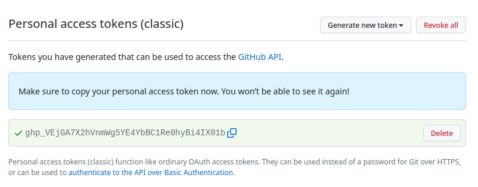
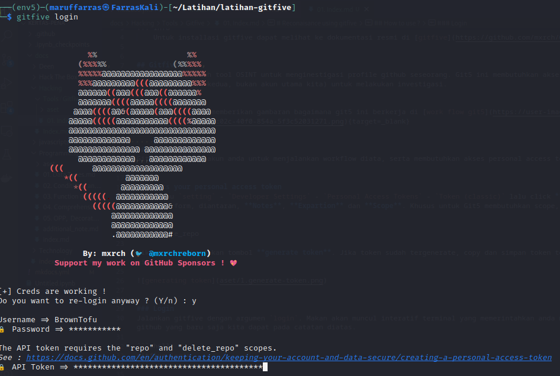

# Reconaisance using gitfive

!!! info
    Untuk installasi gitfive dapat melihat ke dokumentasi resmi di [gitfive](https://github.com/mxrch/GitFive){target=_blank}


## Gitfive ?
Git5 adalah sebuah tool OSINT untuk menginestigasi profile github seseorang. Git5 ini membutuhkan akses login ke github kita (baiknya menggunakan akun kedua, bukan akun utama kita) untuk melakukan investigasi.

## Workflow ?
Hmmm pembuat git5 memberikan gambaran bagaimana git5 ini berkerja di [work flow git5](https://user-images.githubusercontent.com/17338428/194182901-b062b2cf-c02c-40f0-854a-5f3c52031271.png){target=_blank}


## How to use ?
Git5 membutuhkan akun anda untuk menjalankan workflow diata, serta membutuhkan akses personal access tokens (classic)[^1].


### gets your personal access token
Buka menu `setting` - `Developer Settings` - `Personal Access Tokens` - `Token (classic)` lalu click **generate access token**. Lalu muncul beberapa form, diantaran, **Notes**, **Expartion** dan **Scope**. Khusus untuk Git5 membutuhkan scope, diantaranya;

1.  repo
2.  delete_repo

Jika sudah maka tekan tombol **generate token**. Jika token sudah tergenerate, copy dan simpan token tersebut untuk kita gunakan saat login git5.




### Login
Jalankan gitfive dengan argumen `login`. Makan akan muncul interatif terminal yang memerintahkan anda mengisi username, password dan token github yang baru saja kita dapat pada catatan diatas.

```shell
gitfive login
```



JIka sudah berhasil masuk, credential dan session akan disimpan di `~/.malfrats/gitfive/creds.m` dan `~/.malfrats/gitfive/session.m`

### Start investigation ?
Untuk menginvestigasi, gitfive menyedia argumen user, email dan emails. Kita bisa menggunaka username dari github account atau menggunakan email serta daftar email yang kita berikan.

```shell
gitfive user [github-user] --json hasil-investigasi.json
```

parameter `--json` digunakan untuk menyimpan hasil investigas dalam file json. 


[^1]:   Personal access tokens (classic) function like ordinary OAuth access tokens. They can be used instead of a password for Git over HTTPS, or can be used to authenticate to the API over Basic Authentication. 