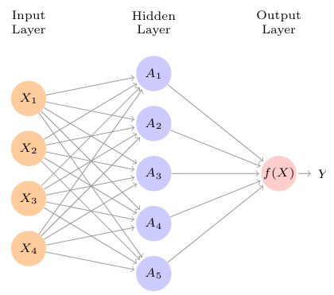
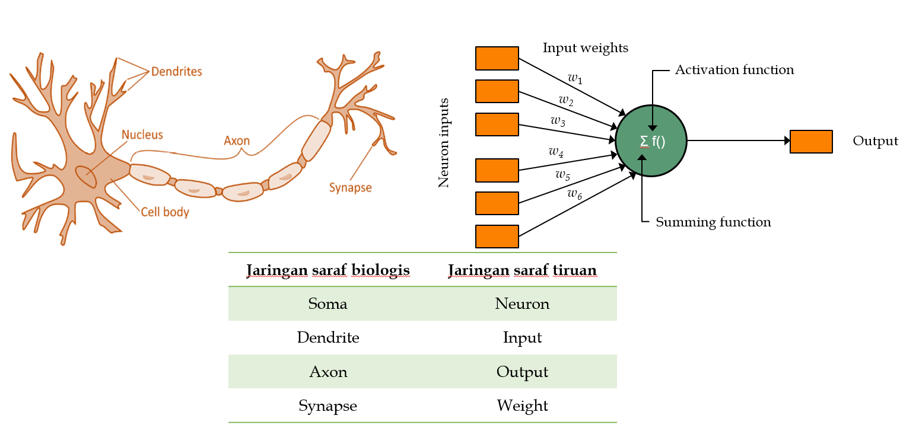

# Arificial Neural Network (Part of Deep Learning)

Bogor, 27 September 2025 (Kelas gerah ehh)

!!! abstract "Sumber"

    - Pengantar Statistika dan Analisis Data PPT, Universitas Pamulang, DR. Tukiyat, M.SI.
    - Descriptive Statistics - Muhammed Shayib

??? info "pretest"

    on Develope

Neural network pertama kali muncul pada tahun 1980, pada tahun 2010 kembali tenar dengan nama baru _Deep Learning_, dengan aritektur baru dan keberhasilan dalam pemecahan masalah klasifikasi foto dan video, pemodelan _speech and text_. Banyak yg percaya bahwa keberhasilan dicapai karena ketersediaan data training yang lebih banyak dibandingan dengan pada tahun 1980.

InsyaAllah pada pertemuan ini akan membahas dasar `Neural Network` dan `Deep Learning`. Lalu mendalam ke pemecahan masalah yang lebih spesifik, misalkana untuk klasifikasi gambar menggunakan `Convulutional Neural Network (CNNs)` dan `Recurrent Neural Networks (RNNs)` untuk deret waktu dan semisalnya.

## Single Layer Neural Network

Neural Network menerima parameter dalam bentuk vektor (deret angka dengan satu lapis) $ X = (X_1, X_2, X_3, ..., X_p) $ dan menghasilkan sebuah _non linear function_ yang mana fungsi tersebut mengeluarkan hasil prediksi dari, $Y$.

Pada pelajaran data mining kita telah membuat model prediksi nonlinear menggunakan KNN,Decission Tree dan lainnya. Yang {==membedakan Neural Network dengan dengan metode-metede tersebut adalah struktur dari model neural network==}.

!!! info "Single layer Neuran Network dan Sandingan saraf alami dan buatan"

    === "Single Layer Neural Network"

        

    === "Jaring Neural buatan dengan Alami"

        

Gambar diatas adalah _feed forward Neural Network_ untuk pemodelan kuantitatif menggunakan 4 prediktor (variabel independen). Terminologi Neural Network $X_1, X_2, X_3, X_4$ disebut dengan `input layer`. Garis yang terhubung mengindikasi bahwa setiap input layer diberikan ke setiap `hidden layer` $K$. Bentuk matematikn Neural Network adalah sebagai berikut;

$$
f(X) = 
$$

