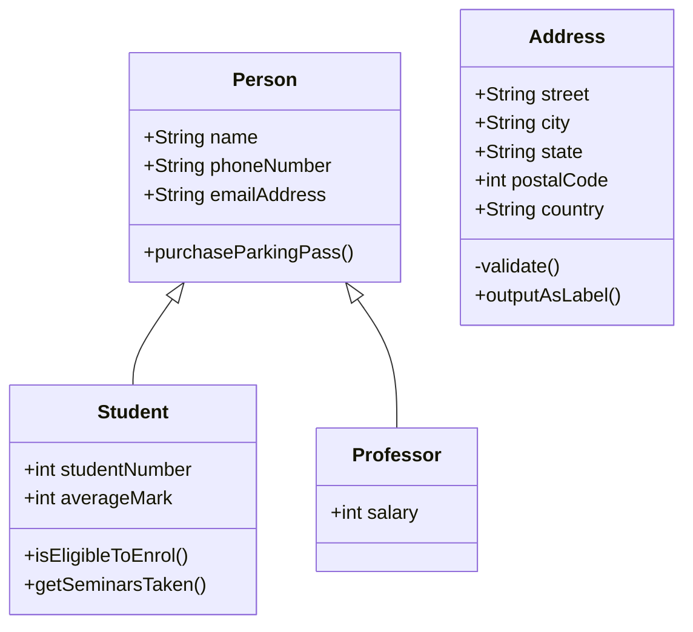

# Introduction to Statistics

Bogor, 08 September 2025 (Bogor dengan hawa gerahnya)

!!! abstract "Sumber"

    - Pengantar Statistika dan Analisis Data PPT, Universitas Pamulang, DR. Tukiyat, M.SI.
    - Introduction to Modern Statistics


??? info "pretest"

    **Satu**
    
    > Apa yang dimaksud dengan statistik deskriptif?


    * (A) Metode yang digunakan untuk menggambarkan dan meringkas data secara visual atau numerik.
    * (B) Cabang statistik yang digunakan untuk membuat inferensi tentang populasi berdasarkan sampel.
    * (C) Teknik yang digunakan untuk membuat inferensi atau kesimpulan dari data sampel ke populasi.
    * (D) Teknik yang digunakan untuk menguji hipotesis statistik.
    * (E) Metode untuk menentukan hubungan sebab-akibat antara variabel.

    ??? question "Jawaban"

        > Metode yang digunakan untuk menggambarkan dan meringkas data secara visual atau numerik

        Karena statistik deskriptif hanya berfokus pada pengolahan, penyajian, dan peringkasan data dalam bentuk tabel, grafik, diagram, rata-rata, median, modus, varians, standar deviasi, dll. Statistik ini tidak membuat inferensi atau generalisasi ke populasi, hanya mendeskripsikan data yang ada.

    **Dua**

    > Berikut ini yang bukan merupakan ukuran pemusatan dalam statistik adalah

    * (A) Ganjil
    * (B) Mean
    * (C) Modus
    * (D) Varians
    * (E) Median

    !!! question "Jawaban"

        Mean, Median, dan Modus → termasuk ukuran pemusatan (measures of central tendency), yang menggambarkan titik tengah atau nilai yang mewakili data.

        Varians → termasuk ukuran penyebaran (measures of dispersion), yang menunjukkan seberapa jauh data tersebar dari rata-rata.


    **Tiga**

    Apa tujuan utama dari analisa regresi dalam statistik ?

    * (A) Menentukan apakah suatu variabel memiliki hubungan kausal dengan variabel lain
    * (B) Memprediksi nilai suatu variabel berdasarkan variabel lain
    * (C) Menyajikan data dalam bentuk grafik
    * (D) Mengelompokkan data ke dalam kategori tertentu
    * (E) Menguji hipotesis tentang perbedaan antara kelompok.

    ??? question "Jawaban"

        analisis regresi digunakan untuk, Mengetahui hubungan antara variabel independen (X) dan variabel dependen (Y) dab Membuat model prediksi nilai Y berdasarkan X.

    **Empat**

    > Dalam distribusi normal, sekitar berapa persen data berada dalam rentang ±1 standar deviasi dari mean?

    * (A) 68%
    * (B) 95%
    * (C) 50%
    * (D) 40%
    * (E) 99%

    ??? question "Jawaban"

        Dalam distribusi normal berlaku Empirical Rule (Aturan 68-95-99,7):

        * standar deviasi dari mean → sekitar 68% data
        * standar deviasi dari mean → sekitar 95% data
        * standar deviasi dari mean → sekitar 99,7% data

    **Lima**

    Apa yang dimaksud dengan data kuantitatif?

    * (A) Data yang berbentuk kategori atau label
    * (B) Data yang berasal dari wawancara dan observasi kualitatif
    * (C) Data yang hanya dapat dikategorikan tetapi tidak memiliki urutan
    * (D) Data yang berbentuk angka dan dapat dihitung atau diukur
    * (E) Data yang berbentuk narasi, teks, atau gambar.

    ??? question "Jawaban"

        Data kuantitatif → berupa angka, bisa diukur, dihitung, dan dianalisis dengan operasi matematika/statistik (contoh: tinggi badan, umur, pendapatan).
        
        Data kualitatif → berupa kategori, label, atau deskripsi (contoh: jenis kelamin, warna mata, pekerjaan).


## Pengantar Statistika dan Data Analisis

Pada catatan ini insyaAllah akan dibahas beberapa pokok bahasan;

1. Data
2. Terminologi statistik
3. Statistika vs Statistik
4. Pengolahan Data
5. Penyajian Data

### Data

`Data` adalah sekumpulan fakta, kejadian atau peristiwa yang terjadi didalam atau diluar organisasi dalam bentuk angka, huruf,simbol, ataupun kombinasinya.

### Tipe-tipe data

!!! info "Berdasarkan sumber pengumpulan"

    `Data primer`, data yang diperoleh atau dikumpulkan oleh orang yang melakukan penelitian atau yang bersangkutan yang memerlukannya.

    `Data Sekunder`, data yang diperolah dari sumber-sumber yang telah ada.

!!! info "Berdasarkan pengumpulan"

    `Data Observasi` data atau informasi yang dihasilkan dengan cara {==mengamati secara langsung subjek==} atau fenomena yang diteliti baik melalui partisipasi peneliti dalam kegiatan atau hanya sebagai pengamat luar.

    `Studi literatur` adalah data sekunder yang diambil dari berbagai pustaka, seperti jurnal ilmiah, makalah seminar, buku, dan karya ilmiah yang relevan dengan penelitian. 

    `Kuisoner` adalah data yang dihasilkan secara langsung dari subjek penelitian melalui daftar  pertanyaan yang telah disusun sesuai tujuan penelitian. 

    `Wawancara` adalah data yang dihasilan secara langsung dari subjek penelitian dengan memberikan pertanyaan yang relevan dengan penelitian dan secara langsung didapatkan dari hasil wawancara.

!!! info "Berdasarkan banyak data"

    `Sensus` data yang dikumpulkan dari setiap unit dalam suatu populasi, bukan hanya sebagian (sampel) yang bertujuan untuk mendapatkan hasil yang lengkap mengenai krakteristik populasi tersebut dalam waktu tertentu.

    `sample` data yang diharapkan menggambarkan karakteristik dari sebuah populasi.

!!! info "Skala Pengukuran"

    `Data Nominal` data yang diberikan kepada objek tapi tidak menggambarkan kedudukan objek tersebut, hanya sebagai label.

    `Data Ordinal` data yang disusun menurut besarannya.

    `Data interval` data yang kategorinya diberikan berdasarkan jarak tertentu.

    `Data rasio` data yang memliki sifat nominal, ordinal dan interval. Angka yang pada data ini menggambarkan ukuran sebenarnya.

!!! info "Berdasarkan sifat"

    `Data kualitatif` data yang tidak berbentuk bilangan, namun dalam pengelolaanya akan dirubah kedalam bentuk bilangan yang diberikan label.

    `Data kuantitatif` data yang berbentuk bilangan.

### Terminologi dasar

Statistik adalah cabang dari Matematika yang mengubah data kedalam informasi yang berguna bagi pengambil keputusan. Statistik secara garis besar terbagi menjadi 2 bagian;

!!! note "Statistik Deskriptif"

    bagian ilmu statistik yang mengdeskripsikan data kedalam bentuk informasi yang mudah dicerna, seperti menghitung median, modus, rata2, variand, dsb. Pada statistik ini kita juga akan serin menjumpai berbagai macam bagan dan diagram.

    ``` mermaid
    graph LR
        A[Statistik Deskriptif] --> B[Frekuensi Distribusi];
        A --> C[Pemusatan central tedency];
        A --> D[Penyebaran Dispertion];
        C --> E[Mean, Median, Mode];
        D --> F[Range, Variance, Standard Deviation];
    ```

!!! note "Statistik Inferensial"

    Ilmu statistik yang membuat sebuah kesimpulan pada populasi berdasarkan hasil penghitungan statistik pada sample.

    


### Prosedure pengujian Hipotesa


