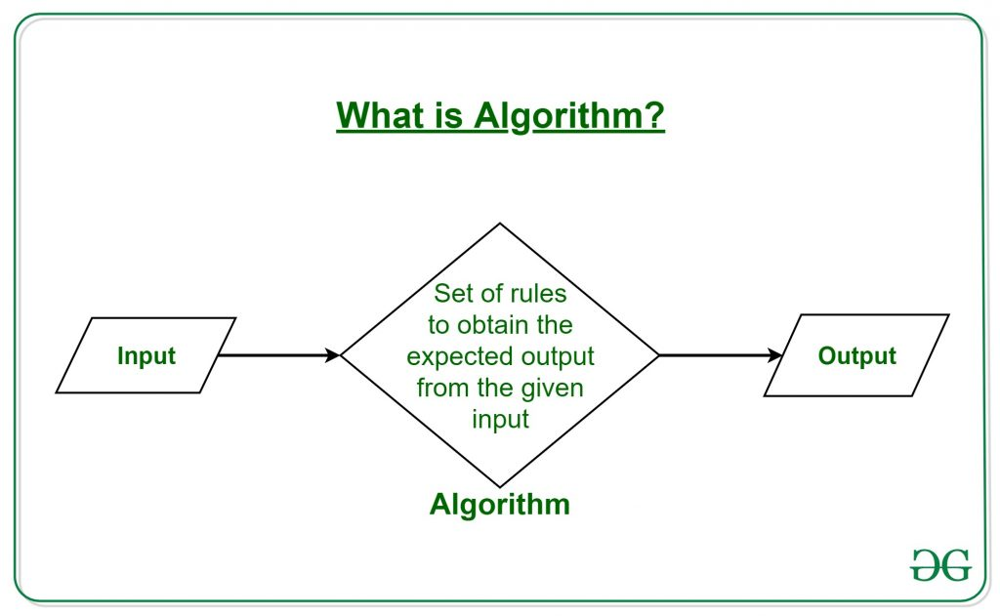

# Kompleksitas Algoritma

## Apa itu Algoritma

Kumpulan dari aturan atau sebuah instruksi yang diikuti sata proses kalkulias atau operasi pemecahan masalah  atau sebuah prosedur pemecahan masalah matematika dengan beberapa langkah yang terbatas yang seringkali melibatkan operasi berulang (rekursif).



Pemecahan sebuah masalah dapat diselesaikan dengan banyak algoritma, sebagai contoh, pengurutan bilangan terbesar memliki puluhan cara dalam penyelesaiannya. Hal yang lebih sederhana lagi, dalam membuat mie instan, ada beberapa cara membuatnya, yg membedakan adalah banyak langkah dan waktu yang dimakan hingga mie instan tersebut siap disajikan.

Selain hasil yang harus benar, sifat efisien pada algoritma juga sangat penting. Efesiensi sebuah algortima pemprograman lebih spesifiknya biasanya diukur dengan 2 hal, **waktu (_times_)** dan **ruang**. Waktu disini adalah jumlah yang dibutuhkan sebuah algoritma untuk menyelesaikan operasinya dan **Ruang (_space_)** memori penyimpanan yg berguna untuk menyimpan banyak langkah-langkah dalam pemecahan masalah.

Kebutuhan _times_ dan _space_ suatu algoritma bergantung pada jumlah input masukan, bisanya kita simbolkan inputan masukan dengan {==(n)==}. Semakin baik algoritma ditandakan dengan meningkatnya `n` namun tidak diikut dengan peningkatakan yg tajam pada _time_ dan _space_ yang dibutuhkan.

!!! note
    Lihat udemy tentang algortima


!!! info "Kurva nilai input terhadap waktu pada sebuah algoritma"

    

Pada gambar diatas, dapat kita lihat kurva dengan tanda panah warna biru menggambarkan algoritma yang paling baik, karena penambahan nilai masukan tidak meningkatkan waktu yang dibutuhkan secara signifikan. Yang mana berbanding terbalik dengan kurva dengan tanda panah warna merah.

## Diskusi

!!! question 
    Berikan contoh algoritma perbandingan algoritma yang baik dan yang kurang baik dalam pencarian data dalam database

    !!! answer
        
        Berikut adalah kode python 

        ```python
        import random
        from time import time

        # Set random seed
        random.seed(42)

        randomDataRange = 100_000_000
        nDataList = 10_000_000

        arrayRandom = []
        print("Prepare random sorted list")
        for a in range(randomDataRange):
            if len(arrayRandom) > 0:

                # print("Value randomg {:d} value Before {:d}".format(random.randint(arrayRandom[-1],nDataList),arrayRandom[-1]))
                # print()
                # # check wheter data is equi or not,
                value = random.randint(arrayRandom[-1],nDataList) if arrayRandom[-1] > random.randint(arrayRandom[-1],nDataList) else random.randint(arrayRandom[-1],(nDataList:=nDataList+100))
                arrayRandom.append(value)
            else:

                arrayRandom.append(random.randint(0,nDataList))


        randomValueExistInList = arrayRandom[random.randint(0, len(arrayRandom)-1)]
        print("Banyak Data {:,}".format(len(arrayRandom)))
        print("Nilai dicari {:d}".format(randomValueExistInList))
        print("-"*5)

        def linearSarch(array, value):
            for a in array:
                if a == value:
                    return a
                
            return -1


        def binary_search(arr, target):
            left, right = 0, len(arr) - 1
            
            while left <= right:
                mid = (left + right) // 2
                if arr[mid] == target:
                    return mid  # Target found, return index
                elif arr[mid] < target:
                    left = mid + 1  # Search in the right half
                else:
                    right = mid - 1  # Search in the left half
                    
            return -1  # Target not found


        # Waktu sekarang
        print("Linear Search")
        now = time()
        print("Hasil ",linearSarch(arrayRandom, randomValueExistInList))
        print("Estimasi Waktu : {:.10f} ".format(time() - now))

        print("")
        print("Binary Search")
        now2 = time()
        print("Hasil ",arrayRandom[binary_search(arrayRandom, randomValueExistInList)])
        print("Estimasi Waktu : {:.10f} ".format(time() - now2))
        ```