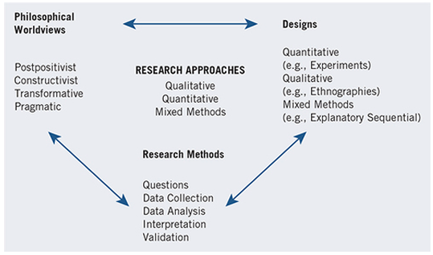

# Pendekatan Penelitian

Pendekatan penelitian atau biasa disebut dengan _metodelogi penelitin_ adalah serangkaian prosedur yang mencangkup langkah-langkah dari sebuah asumsi ke metode pengumpulan data, analisa dan interpretasi.

## Tiga tipe pendekatan penelitain

Secara garis besar ada 3 pendekatan penelitian, `penelitian kualitatif`, `penelitian kuantitatif`, dan `campuran`. Seringkali kita mendengar bahwa penelitian kualitatif menghasilkan kalimat yang menggambarkan kualitas, misalkan; baik, lebih baik atau tidak baik. Sedangkan penelitian kuantitatif menghasil angka dibandingkan kalimat.

Cara yang lebih lengkap untuk mengetahui perbedaan dari keduanya adalah dengan melihat asumsi filosofi dasar yang dibawa peneliti dalam penelitian, misalkan;

* _Strategi penelitian_ yang digunakan, cnth : eksperimen kuantitatif atau studi kasus kualitatif.
* _Metode yang digunakan_ contoh, mengumpulkan data kuantitatif dari instrumen yang ada atau mengumpulkan data kualitatif melalui observasi.

### Penelitian Kualitatif

Adalah sebuah pendekatan yang mengeksplorasi dan memahami apa yang menjadi penyebab masalah yang terjadi pada objek yang dimaksud. Data yang digunakan pada penelitian ini biasanya didapatkan dari jawaban banyak partisipan (pengisian angket, wawancara, dsb), selanjutnya peneliti membuat gambaran arti dari data tersebut. Hasil penelitian kualiatif dibuat dalam bentuk laporan penelitian, namun dengan strukturnya yang lebih fleksibel.

### Penelitian Kauntitatif

Adalah sebuah pedekatan untuk menguji teoi dengan membandingkan hubungan antara beberapa variabel atau membandingkan antar kelompok. Variable tersebut dapat diukur sehingga data dapat dianalisa menggunakan prosedur statistik.

## Tiga komponen utama dalam pendekatan penelitian

Pendakatan penelitian yang luas adalah rencana atau usulan melakukan penelitian yang melibatkan persimpangan dari filosofi, desain penelitian dan metode yang spesifik.

### Filosofi filsafat penelitain (worldview)

Sangat disarankan bagi individu yang sedang menyiapkan perencanaan atau usulan penelitian menjelaskan gagasan filosofi yang lebih luas berdasarkan yang mereka anut. Karena informasi tersebut (gagasan filosofi) akan membantu dalam menerangkan mengapa mereka memilih pendekatan kuantitatf, kualitatif atau campuran pada penelitian mereka.

!!! info

    **worldview** = pondasi filosofis yang menjelaskan cara melihat pengetahuan, alasan memilihnya, dan dampaknya pada desain penelitian. (_a basic set of beliefs that guide action_)

Saat menulis `cara pandang`, `kerangka keyakinan`, atau `filsafat penelitian` harus memasukan bagian yang mengarah pada isi berikut;

* Cara pandang, kerangka keyakinan atau filsafat penelitian yang digunakan oleh peneliti.
* Definisi ide dasar dari cara pandang tersebut.
* Kerangka keyakinan digambarkan pada pengalaman penelitian, pelatihaan atau budaya lingkungan.
* Bagimana cara pandang membentuk pendekatan penelitian mereka.

!!! info

    Kata _wordview_ sebagaimana yang saya tulis diatas disebut dengan `podansi filosofi`, `cara pandang`, `kerangkan keyakinan`, atau `filsafat penelitian`, penulis buku ini menyebutkan bahasa lain yang diambil dari penulis buku yang lain sepert `metlit`, `paradigma`. Namun penulis buku ini lebih condong pada penggunakan _worldview_ karena mebawa perspektif global.

{==Seorang peneliti mengembangkan cara pandang berdasarkan orientasi disiplin ilmu mereka, komunitas penelitian, pengarah atau mentor, pengalaman penelitian sebelumnya, dan pengalaman budaya.==}, Faktor tersebutlah yang mendorong kuat pendekatan penelitian yang digunakan pada penelitian mereka. Jadi sangat penting untuk memasukan pandangan penelitian. Karena dengan demikian, pembaca dapat memahami dengan baik terhadap penelitian untuk mengetahui bias (penyajian bahan yang dipenuhi dengan prasangka) dan pendirian yang digunakan oleh peneliti.

### Empat pandangan penelitian

??? info "Rangkuman empat pandangan penelitian"

    | **Worldview**      | **Pandangan Utama**                                                         | **Fokus Penelitian (Generative AI)**                                                                                                                   | **Metode yang Umum Dipakai**                                                   | **Contoh Penulisan dalam Proposal**                                                                                                                                                             |
    | ------------------ | --------------------------------------------------------------------------- | ------------------------------------------------------------------------------------------------------------------------------------------------------ | ------------------------------------------------------------------------------ | ----------------------------------------------------------------------------------------------------------------------------------------------------------------------------------------------- |
    | **Postpositivist** | Realitas dianggap objektif dan bisa diukur                                  | Menguji performa generative AI secara kuantitatif, misalnya akurasi, kualitas output, atau efisiensi model                                             | Eksperimen, survei kuantitatif, uji statistik (misalnya BLEU score, FID, dsb.) | *“Penelitian ini menggunakan worldview postpositivist, dengan eksperimen terkontrol untuk mengukur akurasi dan kualitas teks yang dihasilkan oleh model generative AI.”*                        |
    | **Constructivist** | Realitas bersifat subjektif, dipengaruhi oleh konteks sosial dan pengalaman | Memahami bagaimana pengguna memaknai dan merasakan penggunaan generative AI dalam kehidupan sehari-hari (misalnya di pendidikan, seni, atau pekerjaan) | Wawancara, observasi, analisis kualitatif                                      | *“Penelitian ini menggunakan worldview konstruktivis, dengan wawancara mendalam untuk menggali pengalaman guru dalam memanfaatkan generative AI sebagai alat bantu pembelajaran.”*              |
    | **Pragmatic**      | Metode dipilih sesuai kebutuhan, fokus pada solusi praktis                  | Menggabungkan evaluasi performa teknis dan dampak sosial penggunaan generative AI                                                                      | *Mixed methods*: uji kuantitatif + wawancara/observasi                         | *“Penelitian ini menggunakan worldview pragmatis, dengan kombinasi uji performa teknis model AI dan survei pengguna untuk memahami manfaat dan tantangan penerapannya.”*                        |
    | **Transformative** | Penelitian untuk perubahan sosial, keberpihakan pada kelompok tertentu      | Meneliti bagaimana generative AI dapat memberdayakan atau justru merugikan kelompok marjinal (misalnya bias gender/ras dalam output AI)                | Pendekatan kritis, partisipatoris, studi kasus komunitas                       | *“Penelitian ini menggunakan worldview transformative, dengan fokus pada analisis bias dalam generative AI dan bagaimana teknologi ini dapat didesain lebih inklusif bagi kelompok minoritas.”* |

