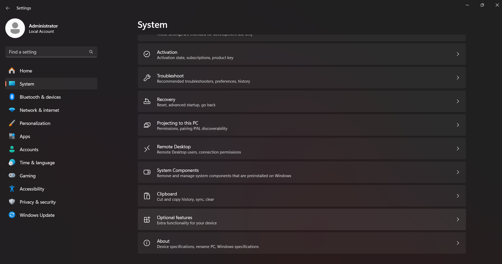
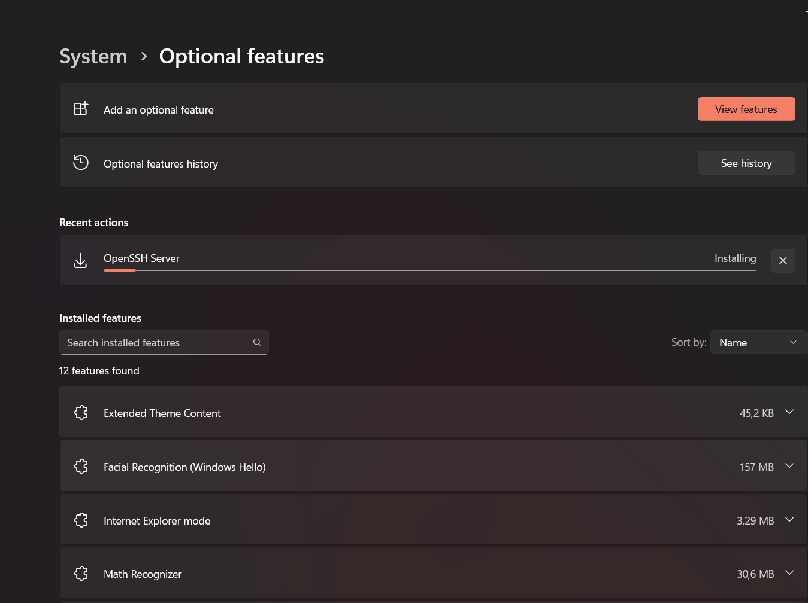

Sumber :

* [winscp](https://winscp.net/eng/docs/guide_windows_openssh_server)
* [microsoft](https://learn.microsoft.com/en-us/windows-server/administration/openssh/openssh_install_firstuse?tabs=powershell)


Petunjuk kali ini saya menggunakan Windows 11
---

### Using Command Line

1. Informasi instalasi Open SSH client dan server
    
    !!! info "Syntax"

        ```PowerShell
        Get-WindowsCapability -Online | Where-Object Name -like 'OpenSSH*'

        # Output belum terinstall
        # Name  : OpenSSH.Client~~~~0.0.1.0
        # State : NotPresent
        # Name  : OpenSSH.Server~~~~0.0.1.0
        # State : NotPresent

        # Output jika sudah terinstall
        # Name  : OpenSSH.Client~~~~0.0.1.0
        # State : Installed
        # Name  : OpenSSH.Server~~~~0.0.1.0
        # State : Installed
        ```

2. Instal client dan server open ssh

    !!! info "Syntax"

        ```PowerShell
        # Install the OpenSSH Client
        Add-WindowsCapability -Online -Name OpenSSH.Client~~~~0.0.1.0

        # Install the OpenSSH Server
        Add-WindowsCapability -Online -Name OpenSSH.Server~~~~0.0.1.0
        ```

3. Memulai service SSH

    !!! info "syntax"

        ```PowerShell
        # Start the sshd service
        Start-Service sshd

        # OPTIONAL but recommended:
        Set-Service -Name sshd -StartupType 'Automatic'

        # Confirm the Firewall rule is configured. It should be created automatically by setup. Run the following to verify
        if (!(Get-NetFirewallRule -Name "OpenSSH-Server-In-TCP" -ErrorAction SilentlyContinue | Select-Object Name, Enabled)) {
            Write-Output "Firewall Rule 'OpenSSH-Server-In-TCP' does not exist, creating it..."
            New-NetFirewallRule -Name 'OpenSSH-Server-In-TCP' -DisplayName 'OpenSSH Server (sshd)' -Enabled True -Direction Inbound -Protocol TCP -Action Allow -LocalPort 22
        } else {
            Write-Output "Firewall rule 'OpenSSH-Server-In-TCP' has been created and exists."
        }

        # Untuk menguji apakah service sudah running 
        Get-Service sshd
        ```

4. Mematikan service
    !!! info "Syntax"

        ```PowerShell
        Stop-Service sshd
        ```

### Using GUI

 1. Untuk menginstall _OpenSSH_. Buka _settings/system/Optional System_.

    !!! info "Picture"
        

2. Selanjutnya pilih _view Optionals_, lalu cari keyword _OpenSSH_, lalau tekan install.

    !!! info "Picture"
        

### Installed folder dan konfigurasi
Binary data terinnstall di `%WINDIR%\System32\OpenSSH`. Sedangkan untuk konfigurasi file (_sshd_config_) dan hosts-keys terinstall di `%ProgramData%\ssh`


### Setup chroot direktori
Buka `%ProgramData%\ssh\sshd_config`. Lalu uncomment dan berikan nilai sebagai berikut `#!properties ChrootDirectory "D:\Demo\SFTP-Interface"`