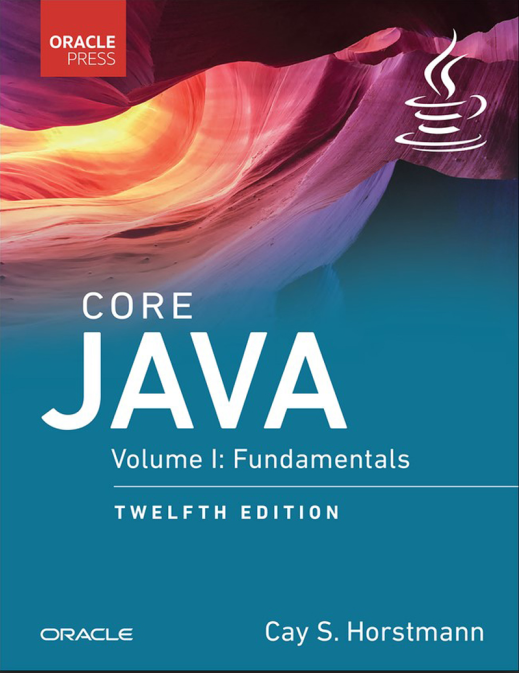

## Books

Sumber buku berjudul **Learn SQL Database Programming** yang ditulis oleh *Josephine Bush* dan dipublish oleh Packt Publishing.

## Why this books ?
Dari beberapa buku java yang saya pernah baca, menurut hemat saya buku ini yang paling lengkap menyajikan java untuk para pemula dengan contoh yang berfokus pada apa java itu sendiri.