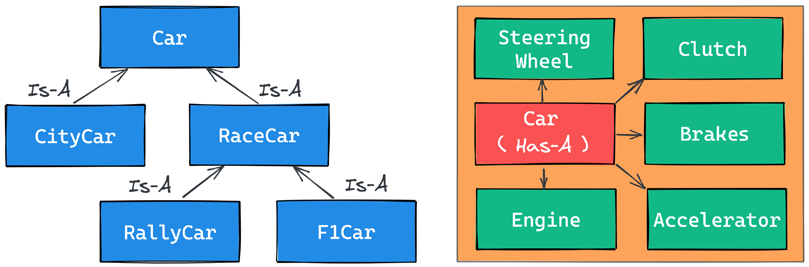
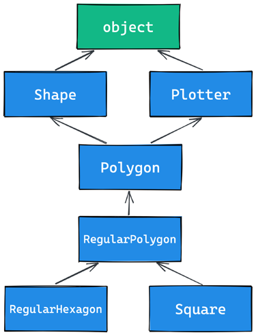

## Decorators
Sebelumnya kita membuat sebuah kode untuk mengukur waktu yang digunakan oleh interpreter dalam menjalankan kode python yang kita buat. Kita selelau menulis ulang kode tersebut ketika ingin mengukur waktunya. Jika penggunaan kode tersebut diguakan berulang kali kita dapat membungkus kode tersebu kedalam sebuah fungsi.

!!! quote "Code"

    ``` {.python}
    from time import sleep, time
    def f():
        sleep(0.5)

    def g():
        sleep(1)

    def measure(func):
    t = time()
    func()
    print(f'took : {time()-t}')    
        
    measure(f)
    measure(g)
    ```

    ``` {.python .no-copy title="Print output"}
    took : 0.5009582042694092
    took : 1.0015130043029785
    ```

Mekanisme penghitungan waktu yang dibutuhkan telah dibungkus kedalam sebuah fungsi. Namun bagaimana jika kita ingin membuat sebuah fungsi (bukan fungsi untuk `#!python measure`-nya) agar menerima sebuah argumen.

!!! quote "Code"

    ``` {.python}
    from time import sleep, time
    def f(time=0):
        sleep(time)
        
    def measure(func,*args,**kwargs):
        t = time()
        # print(args)
        # print(kwargs)
        func(*args,**kwargs)
        print(f'took : {time()-t}')

    measure(f,time=1)
    ```

    ``` {.python .no-copy title="Print output"}
    took : 1.0011773109436035
    ```

!!! info
    Kode diatas menggunakan [dictionary unpacking](03.%20Function%20Building%20and%20Block%20of%20Code.md), [iterable unpacking](03.%20Function%20Building%20and%20Block%20of%20Code.md#iterable-unpacking#dictionary-unpacking), [variabel positional parameter](03.%20Function%20Building%20and%20Block%20of%20Code.md#variable-positional-parameter), dan [variable keyword parameter](03.%20Function%20Building%20and%20Block%20of%20Code.md#variable-keyword-parameters)

Oke, namun bagaimana jika kita ingin pengukuran waktu tersebut berada didalam fungsi `#!python f()` bukan dengan memanggil fungsi `#!python measure()`?

!!! quote "Code"

    ``` {.python}
    from time import sleep, time
    def f(time=1):
        """This is doc of function f"""
        sleep(time)
        
    def measure(func):
        """This is doc of function measure"""
        def wraper(*args, **kwargs):
            """This is doc of function wrapper"""
            t = time()
            func(*args,**kwargs)
            print(f'took : {time()-t}')
        return wraper

    f = measure(f) #(1)!
    f(1)
    f(time=1.5)
    f.__doc__
    ```

    1.  Decorator point


    ``` {.python .no-copy title="Print output"}
    took : 1.0011024475097656
    took : 1.5006706714630127

    'This is doc of function wrapper'
    ```

Mari kita jabarkan kode diatas. Yang terpenting dari kode diatas adalah **decorator point**. Kita me-reassign name `#!python f` dengan apapun yang dikembalikan oleh fungsi `#!python measure()` dengan argumen fungsi `#!python f()` itu sendiri. Didalam fungsi `!#python measeure()` kita membuat sebuah fungsi dengan nama `#!python wrapper()` dan mengembalikan fungsi tersebut. Sehingga terjadilah **the net effec** setelah decorator point, ketika kita memanggil fungsi `#!python f()` sebenarnya kita memanggil fungsi `#!python wrapper()`, dapat kita buktikan dengan memanggi attribut `#!python __doc__` interpreter mengeluarkan dokumentasi dari fungsi `#!python wrapper()`. Karena didalam fungsi `#!python wrapper()` memanggil fungsi `#!python func()`, yaitu fungsi `#!python f()` maka perulangan ditutup.

Fungsi `#!python wrapper()` adalah sebuah pembungkus, fungsi tersebut menerima _variabel positional_ dan _keyword arguments_ serta menjalankan fungsi `#!python f()` dan juga melakukan pengukuran waktu didalamnya.

Teknik tersebut disebut dengan **decoration** dan fungsi `#!python measure()` adalah **decorator**-nya. Paradigma ini menjadi sangat terkenal dan akhirnya pada versi 2.4 python menambahkan special syntax untuk mendapatkan hasil yang sama dengan decoration itu.

Dibawah ini adalah beberapa syntax cara menggunakan decorator, satu decorator, dua decorator dan satu decorator yang dapat menerima sebuah argumen.

=== "Satu decorator"

    ```{.python .no-copy}
    def func(arg1, arg2, ...):
        pass

    func = decorator(func)

    # Setara dengan
    @decorator
    def func(arg1, arg2, ...):
        pass
    ```

=== "Dua decorator"

    ```{.python .no-copy}
    def func(arg1, arg2, ...):
        pass

    func = decorator1(decorator2(func))

    # Setara dengan
    @decorator1
    @decorator2
    def func(arg1, arg2, ...):
        pass
    ```

=== "Satu decorator yang menerima sebuah argumen"

    ```{.python .no-copy}
    def func(arg1, arg2, ...):
        pass

    func = decorator(arg_1,arg_2,...)(func)

    # Setara dengan
    @decorator(arg_1, arg_2, ...)
    def func(arg1, arg2, ...):
        pass
    ```

Oke, mari kita gunakan spesial syntax tersebut kepada kode sebelumnya.

!!! quote "Code"

    ``` {.python }
    from time import sleep, time
    def measure(func):
        """This is doc of function measure"""
        def wraper(*args, **kwargs):
            """This is doc of function wrapper"""
            t = time()
            func(*args,**kwargs)
            print(f'took : {time()-t}')
        return wraper

    @measure
    def f(time=1):
        """This is doc of function f"""
        sleep(time)
    ```

    ``` {.python .no-copy title="Print output"}
    f(1.7)
    print(f.__name__)
    ```

Oke, lebih simple menggunakan spesial synrax, Namun kita ingin membetulkan sedikit kode. kode diatas dan sebelumnya ketika kita memanggil attribute `#!python __name__` dan `#!python __doc__` fungsi yang didekor mengembalikan fungsi wrappernya. Kita dapat betulkan dengan mengimport `#!python from functools import wraps` dan menggunakan spesial syntax `#!python @wraps` pada wrapper.

!!! quote "Code"

    ``` {.python }
    from functools import wraps
    def measure(func):
        """This is doc of function measure"""
        @wraps(func)
        def wraper(*args, **kwargs):
            """This is doc of function wrapper"""
            t = time()
            func(*args,**kwargs)
            print(f'took : {time()-t}')
        return wraper

    @measure
    def f(time=1):
        """This is doc of function f"""
        sleep(time)
        
    f(1)
    print(f'function name : {f.__name__},', f'docs : {f.__doc__}')
    ```

    ``` {.python .no-copy title="Print output"}
    took : 1.0004987716674805
    function name : f, docs : This is doc of function f
    ```

Alhamdulillah, sekaramg kita tidak kehilangan attribute dari fungsi `#!python f()`.

Oke, sekarang mari kita buat contoh lain, katakan kita ingin membuat sebuah fungsi yang mengembalikan luas sebuah kotak dari nilai sisi yang diberikan pada sebuah parameter. Dan kita juga ingin tetap ada pengukura waktu yang dibutuhkan dan ada sebuah fungsi juga yang mengelarkan error jika hasil yang dikeluarkan dari fungsi utama lebih dari 100.

=== "Code"
    !!! quote "Code"
        ``` {.python }
        from time import sleep, time
        from functools import wraps

        def measure(func):
            @wraps(func)
            def wrapper(*args, **kwargs):
                t = time()
                result = func(*args,**kwargs)
                print(f'took : {time()-t}')
                return result
            return wrapper

        def max_result(func):
            @wraps(func)
            def wrapper(*args,**kwargs):
                result = func(*args,**kwargs)
                if result > 100:
                    print(f"Hasil melebihi nilai seharusnya {result}")
                return result
            return wrapper

        @max_result #(2)!
        @measure #(1)!
        def cube(value=0):
            return value*value

        print(cube(11))
        print(f'function name attribute : {cube.__name__}')
        ```

        1.  Decorator function `#!python measure` lebih dulu dijalankan
        2.  Decorator function `#!python max_result` dijalankan setelah `#!python measure`

        ``` {.python .no-copy title="Print output"}
        took : 1.6689300537109375e-06
        Hasil melebihi nilai seharusnya 121
        121
        function name attribute : cube
        ```

=== "More detail with comments"
    !!! quote "Code"
        ``` {.python }
        from time import sleep, time
        from functools import wraps

        def measure(func):
            print(1)
            @wraps(func)
            def wrapper(*args, **kwargs):
                print(4)
                t = time()
                result = func(*args,**kwargs)
                print("6.","Hasil dari step 5 akan kesini")
                print(f'\ttook : {time()-t}')
                return result
            print("1.2")
            return wrapper
            

        def max_result(func):
            print("2")
            @wraps(func)
            def wrapper(*args,**kwargs):
                print("3")
                result = func(*args,**kwargs)
                print("7.", "Hasil dari step 6 akan kesini")
                if result > 100:
                    print(f"\tHasil melebihi nilai seharusnya {result}")
                return result
            print("2.2")
            return wrapper

        @max_result 
        @measure 
        def cube(value=0):
            print(5)
            return value*value


        print("="*20)
        print(cube(4))
        print(f'function name attribute : {cube.__name__}')
        ```
        ``` {.python .no-copy title="Print output"}
        1
        1.2
        2
        2.2
        ====================
        3
        4
        5
        6. Hasil dari step 5 akan kesini
            took : 8.726119995117188e-05
        7. Hasil dari step 6 akan kesini
        16
        function name attribute : cube
        ```


Bingung, lihat detail dengan comen pada snipet diatas.

### A decorator factory
Katakan kita ingin membuat sebuah decorator function yang dapat menerima sebuah argumen. Cara tersebut disebut dengan **decorator factory**. Agar decorator function dapat menerima sebuah function, kita harus membungkus fungsi decorator dengan fungsi lain yang menerima argumen untuk decorator fungsi tersebut. Lihatlah baris yang di hightlight dibawah ini.

!!! quote "Code"

    ``` {.python hl_lines="10 11"}
    def measure(func):
        @wraps(func)
        def wrapper(*args, **kwargs):
            t = time()
            result = func(*args,**kwargs)
            print(f'took : {time()-t}')
            return result
        return wrapper

    def maxresult(treshold):
        def decorator(func):
            @wraps(func)
            def wrapper(*args,**kwargs):
                result = func(*args,**kwargs)
                sleep(1)
                if(result > treshold):
                    print(f"Hasil {result} melebih treshold {treshold}")
                else:
                    print(f"Hasil {resukt}")
                return result
            return wrapper
        return decorator

    @measure
    @maxresult(2)
    def cube2(c=1):
        return c ** c


    cube2(4)
    ```

    ``` {.python .no-copy title="Print output"}
    took : 1.0004987716674805
    function name : f, docs : This is doc of function f
    ```


## Object Oriented Programming

!!! tip
    Dibawah ini adalah penggunaan istilah yang memliki maksud yang sama, namun terkadang penggunaanya sering tertukar dan tidak masalah selama maksudnya sama.

    1.  Attribute = Propertiy
    2.  Behavior = Method
    3.  Instance = Object
    4.  Parameter = Argument

Segelanya didalam python adalah objek. Dua pemain utama dalam OOP adalah object dan class. Class digunakan untuk membuat objek (objek adalah instance dari class). Ketika objek dibuat dari sebuah class, objek tersebut menurunkan atribut dan method dari class tersebut.

!!! quote "Code"
    ```{.python}
    class Simple:
    pass

    inst_simple = Simple()
    print(type(Simple))
    print(type(inst_simple))
    print(type(inst_simple) is Simple)
    ```

    ```{.python title="Output"}
    <class 'type'>
    <class '__main__.Simple'>
    True
    ```

(`__main__` adalah nama scope dimana _top-level code_ dieksekusi). Class sebenarnya adalah objek. Agar lebih jelasnya, {==class adalah instance dari Type==}. Penjelasan tentang konsep tersebut akan mengarah perbincangan tentang **metaclasses** dan **metaprogramming**.

Dapat kita lihat, syntax untuk membuat sebuahinstance sama dengan syntax untuk memanggil sebuah fungsi. Pada baris terakhir kodetersebut, kita menguji dan memverifikasi apakah objek `inst_simple` instance dari class `Simple`.

!!! tip
    Ada cara lain yang lebih baik untuk menverifikasi instance dari sebuah objek yang akan ada dicatatan selanjutnya.


### Class and object namespaces
Setelah class object dibuat (biasanya terjadi saat module pertama kali di import), objek tersebut merepresentasi `namespace`. Kita dapat memanggil class tersebut untuk membuat instance class tersebut. Setiap instance menurunkan attribute dan method clas tersebut dan memberikan namespace-nya sendiri. kita telahmengatahui untuk merujuk ke namespace, yang kita butuhkan adalah menggunakan operator dot `.`

!!! quote "Code"

    ```python
    class Person:
        species = 'Human'

    print(Person.species) # Human
    Person.alive = True # Added dynamically!
    print(Person.alive) # True

    man = Person()
    print(man.species) # Human (inherited)
    print(man.alive) # True (inherited)
    Person.alive = False
    print(man.alive) # False (inherited)
    man.name = 'Darth'
    man.surname = 'Vader'
    print(man.name, man.surname)
    # Darth Vader
    ```

Contoh diatas, kita membuat sebuah class atribute dengan nama `species`. Setiap variabel yang didefinisikan di badan dari class  menjadi sebuah attribute classtersebut. pada kode diatas, kita juga membuat attribute `Person.alive` secara dinamik. Selanjutnya kita juga membuat sebuah instace dari class person dengan nama `man`. Instance tersebut menurunkan attribute dari class Person.

Instance `man` memliki isntace attribute, yang mana hanya bisa diakese oleh instance tersebut sendiri. Instance attribute tersebut adalah `name` dan `surname`. Attribute ini tidak bisa diakses dari instnce lainnya.


!!! quote "Code"

    ```python
    # Create instance
    woman = Person()
    try:
        print(woman.species)
        print(woman.alive)
        print(woman.surname) # Will rain an exception
    except Exception as e:
        print (e)
    ```

    ```{.python title="Output"}
    Human
    False
    'Person' object has no attribute 'surname'
    ```

!!! info
    `Class attribute` dapat diakses oleh seluruh instance, sedangkan `instance attribute` tidak. Namun, anda harus menggunakan class attribute untuk menyediakan parameter dan method yang dapat diakases oleh semua instance dan gunakan instance attribute untuk membuat data spesifik untuk setiap individu objek.

### Attribute Shadowing
Ketika kita mencari sebuah attribute pada sebauh objek. Jika atribute tersebut tidak ditemukan, python akan melanjutkannya ke attributepada class yang digunakan untuk membuat objek tersebut (dan terus berlanjut hingga ketemu atau akhir dari turunan). Prilak ini disebut dengan **shadowing behavior**.

!!! quote "Code"

    ```python
    class Point:
    x = 10
    y = 7
    p = Point()
    print(p.x) # 10 (from class attribute)
    print(p.y) # 7 (from class attribute)
    p.x = 12 # p gets its own `x` attribute
    print(p.x) # 12 (now found on the instance)
    print(Point.x) # 10 (class attribute still the same)
    del p.x # we delete instance attribute
    print(p.x) # 10 (now search has to go again to find class attr)
    p.z = 3 # let's make it a 3D point
    print(p.z) # 3
    print(Point.z)
    # AttributeError: type object 'Point' has no attribute 'z'
    ```

### The self argument
Dari dalam method class, kita dapat merujuk ke instance menggunakan special argument yang disebut dengan **self**. **self** selalu menjadi attribute pertama dari sebuah instance method.

> **self is always the first attribute of an instance method**

!!! quote "Code"

    ```python
    class Square:
    side = 8
        def area(self): #(1)!
            return self.side*self.side

        
    square = Square()
    square.area()
    ```

1.  Sepecial argument `self` harus menjadi attribute pertama dari instance method. Berguna untuk mengambil attribute atau behavior dari instance tersebut.


Lihat dibawah ini untuk contoh yang insyaAllah membuat kita lebih paham tentang behavior yang python lakukan terhadap special argument `self` ini.

!!! quote "Code"

    ```python
    class Price:
    
    def price_after_tax(self, tax):        
        return (self.pricing) * ((100+tax)/100)
    
    
    p1 = Price()
    p1.pricing = 20_000 # Set instance property

    #------------------------------------------
    # Memanggil method price_after_tax melalui
    # instance dari Price
    # -----------------------------------------
    p1.price_after_tax(10) 


    #-------------------------------------------
    # Memanggil method price_agter_tax lansung
    # dari class.
    #
    # Menggunakan p1 sebagai special argument
    # untuk mendapatkan instance property 
    # `pricing`
    #-------------------------------------------
    Price.price_after_tax(p1,10)
    ```

    Kalau pusing, lihat contoh diatas aja hehe :smile:

### Initializing an instance
Sebelumnya, tepat pada code snippet diatas kita membuat sebuah behavior yang memerlukan attribute `pricing`. Dan attribut `pricing` tersebut kita buat setelah instace class `Price` terbuat. Ada cara yang lebih baik, yaitu menggunakan **constructor**.

Namun di python tidak disebut dengan constructor, melainkan **initializer**, karena initializer berjalan tepat setelah instance dibuat, dan langsung memanggil method special `__init__`. Method tersebut langsung berjalan setelah objek dibuat. Python object juga memliki method `__new__` yang mana method tersebutlah constructor yang sebenarnya.


!!! info
    Pada prakteknya, penggunakan method `__new__` tidak sering digunakan (di ovveride); teknik tersebut banyak digunakan ketika membuat metaclasses.

!!! quote "Code"

    ```python
    class Rectangel:
    
        count_side = 4 # class property
        
        def __init__(self,side1,side2):
            self.side1 = side1 # instance property
            self.side2 = side2 # instance property
            
        def area(self):
            return self.side1 * self.side2
        

    r1 = Rectangel(2,3)
    print(r1.area()) # 6

    r2 = Rectangel(3,5)
    print(r2.area()) # 15


    print(r1.count_side == r2.count_side) # True
    ```

Ketika objek dibuat, `__init__` method secara otomatis akan berjalan. Pada kasus diatas, kita membuat method tersebut menerima dua buah argument dan badan dari method tersebut kita gunakan untuk membuat sebuah **instance property**. 

MasyAllah, dapat kita lihat juga, pemanggilan fungsi `#!python area()` dari objek `r1` dan `r2` merefleksikan hasil dari instance argument yang berbeda.

Pada kode tearkhir diatas kita memverifikasi bahwa instance r1 dan r2 berbagi class property yang sama.


### OOP is about code reuse
**Inheritance and composition**

**Inhereitance** {==terjadi ketiak dua objek saling berhubungan dengan tipe relasi `Is-A`==} 

**Composition** {==terjadi ketia dua objek saling berhubung dengan tipe relasi `Has-A`==}


Bismila, mari kita lihat kode dibawah ini agar lebih mudah untuk memahami apa itu inheritance dan composition.

!!! quote "Code"
    
    ```python
    class Engine:
        def start(self):
            pass
        def stop(self):
            pass
        
    class ElectricEngine(Engine): # Is-a Engine
        pass
    class V8Engine(Engine): # Is-a Engine
        pass


    class Car:
        engine_cls = Engine
        def __init__(self):
            self.engine = self.engine_cls() # Has-A Engine
        def start(self):
            print(
            'Starting engine {0} for car {1}... Wroom, wroom!'.format(self.engine.__class__.__name__, self.__class__.__name__))
            self.engine.start()
            
        def stop(self):
            self.engine.stop()

    class RaceCar(Car): # Is-A Car
        engine_cls = V8Engine

    class CityCar(Car): # Is-A Car
        engine_cls = ElectricEngine

    class F1Car(RaceCar): # Is-A RaceCar and also Is-A Car
        pass # engine_cls same as parent

    car = Car()
    racecar = RaceCar()
    citycar = CityCar()
    f1car = F1Car()
    cars = [car, racecar, citycar, f1car]

    for a in cars:
        a.start()
    ```

    ??? quote "Output"
        ```python
        Starting engine Engine for car Car... Wroom, wroom!
        Starting engine V8Engine for car RaceCar... Wroom, wroom!
        Starting engine ElectricEngine for car CityCar... Wroom, wroom!
        Starting engine V8Engine for car F1Car... Wroom, wroom!
        ```

Kode diatas menujunkan pada komen hubungan relasi `Is-A` dan `Has-A` antar objek. Pertama, mari kita lihat class `Engine`. Class sederhana yang memliki dua buah methods, `start` dan `stop`.

Selanjunya kita membuat class `ElectriceEngine` dan `V8Engine` yang mana keduanya turunan dari class `Engine`. Dapat kita lihat penentuan turunan tersebut dari class `Engine` setelah nama class `ElectricEngine` dan `V8Engine`. Dengan demikian, kedua class tersebut menurunkan attribute dan method dari class `Engine`, yg mana `Engine` class adalah **base class** dari `ElectricEngine` dan `V8Engine`.

Sama dengan class `Car`, class tersebut adalah base class untuk kedua class `RaceCar` dan `CityCar`. `RaceCar`juga base class dari `F1Car`. Dengan kata lain, `F1Car` menurunkan semua attribute dan method dari `RaceCar` yang mana juga turunan dari `Car`. Artinya `F1Car` Is-A `RaceCar` Is-A `Car`, sehingga disimpulkan `F1Car` Is-A `Car`. Sedengkan `CityCar` Is-A `Car`.

Ketika kita mendefinisikan `class A(B)`: artinya, `A` adalah child dari `B`, dan `B` adalah parent dari `A`. Parent class sinonim dengan Base class. Dan terkadang juga dikatakan sebuah class turunan dari class lain, atau dikatakan dalam inggrinsya selain `inherits` juga disebut dengan `extends`.

{==Mekanisme diatas disebut dengan **inheritance**==}


Setiap class memliki class attribute, yaitu, `engine_cls` yangmana refresi ke engine class yang nantinya kita ingin assign untuk setiap tipe mobil. `Car` memliki class `Engine` uumum, dimana `RaceCar` memliki `V8Engine` dan `CityCar` memliki `ElectriEngine`.s

Ketika objek car dibuat, intializer method, `__init__()` akan membuat instance dari engine class yang di assign ke mobil yang bersangkutan, dan akan dipasang menjadi instace attribute.

```python
...
class Car:
        engine_cls = Engine
        def __init__(self):
            self.engine = self.engine_cls() # Has-A Engine
            # Menjadi instance attribute engine
...
```

{==Tipe relasi antara `Car` dan `Engine` adalah `Has-A`. Aspek ini disebut dengan composition==}, dan merefleksikan bahwa objek-objek dapat terdiri dari banyak objek. Car has-A engine, gears, wheels, frame doors, seats, dan seterusnya.

!!! tip
    When designing OOP code, it is important to describe objects in this way so that we can use inheritance and composition correctly, to structure our code in the best way.

Oke, sekarang mari kita verifikasi terkait objek instansi dari class yang mana

!!! quote "Code"

    ```python
    car = Car()
    racecar = RaceCar()
    citycar = CityCar()
    f1car = F1Car()

    cars = [("[car]",car), ("[race car]",racecar), ("[city car]",citycar), ("[F1 car]",f1car)]
    class_cars = [Car,RaceCar,F1Car,CityCar]

    for car in cars:
        for _class in class_cars:
            
            is_instance = isinstance(car[1], _class)
            
            msg = "instansi dari" if is_instance else "bukan instansi dari"
            print(f"{car[0]} {msg} {_class.__name__}")
        print("\n")
    ```

    ```{.python title="Output"}
    [car] instansi dari Car
    [car] bukan instansi dari RaceCar
    [car] bukan instansi dari F1Car
    [car] bukan instansi dari CityCar

    [race car] instansi dari Car
    [race car] instansi dari RaceCar
    [race car] bukan instansi dari F1Car
    [race car] bukan instansi dari CityCar

    [city car] instansi dari Car
    [city car] bukan instansi dari RaceCar
    [city car] bukan instansi dari F1Car
    [city car] instansi dari CityCar

    [F1 car] instansi dari Car
    [F1 car] instansi dari RaceCar
    [F1 car] instansi dari F1Car
    [F1 car] bukan instansi dari CityCar
    ``` 

Sebagaimana yang kita lihat, {==car==} adalah instance dari `Car`, sedangkan {==race car==} adalah instance dari `Car` dan `RaceCar`.

Oke, mari sekarang kita check apakah sebuah class turunan dari base class atau parent class tertentu menggunakan fungsi `#!python issubclass()`.

!!! quote "Code"

    ```python
    car = Car()
    racecar = RaceCar()
    citycar = CityCar()
    f1car = F1Car()

    class1 = [Car,RaceCar,F1Car,CityCar]
    class2 = [Car,RaceCar,F1Car,CityCar]

    for cls1 in class1:
        for cls2 in class2:
            
            is_instance = issubclass(cls1, cls2)
            
            msg = "subclass dari" if is_instance else "bukan subclass dari"
            print(f"[{cls1.__name__}] {msg} {cls2.__name__}")
        print("\n")
    ```

    ```{.python title="Output"}
    [Car] subclass dari Car
    [Car] bukan subclass dari RaceCar
    [Car] bukan subclass dari F1Car
    [Car] bukan subclass dari CityCar


    [RaceCar] subclass dari Car
    [RaceCar] subclass dari RaceCar
    [RaceCar] bukan subclass dari F1Car
    [RaceCar] bukan subclass dari CityCar


    [F1Car] subclass dari Car
    [F1Car] subclass dari RaceCar
    [F1Car] subclass dari F1Car
    [F1Car] bukan subclass dari CityCar


    [CityCar] subclass dari Car
    [CityCar] bukan subclass dari RaceCar
    [CityCar] bukan subclass dari F1Car
    [CityCar] subclass dari CityCar
    ```

Dapat kita lihat, ternyata sebuah class adalah subclass dari dirinya sendiri :smile:.

Dibawah ini adalah gambar yang insyaAllah mempermudah pemahaman tentang perbadaan dari hubungan **Is-A** dan **Has-A**.




### Accessing a base class
When we don't specify a base class explicitly,
Python will set the special object class as the base class for the one we're defining.
Ultimately, all classes derive from object


!!! info
    Therefore, writing class A: pass or class A(): pass or class A(object): pass is exactly the same thing.


The object class is a special class in that it hosts the methods that are common to all Python classes, and it doesn't allow you to set any attributes on it.

Let's see how we can access a base class from within a class

!!! quote "Code"

    ```python
    class Book(object):
        def __init__(self,title, publisher, pages):
            self.title = title
            self.publisher = publisher
            self.pages = pages
            
    class EBook(Book):
        def __init__(self, title, publisher, pages, _format):
            self.title = title
            self.publisher = publisher
            self.pages = pages
            self.format = _format
            

    b1 = EBook("Perjalanan menuju surga","Cahaya Sunnah", 220,"PDF")
    ```

Lihatlah kode diatas, tiga nilai masukan paramter class `Book` di duplikasi pada class `Ebook`. Cara ini tidak terlalu baik, karena, kita harus membuat dua instruksi yang sama persis pada dua class tersebut. Terlebih lagi, setiap perubahan yang ada pada `Book.__init__()` tidak akan merefleksi pada `Ebook`. Kita telah ketahui, `Ebook` Is-A `Book`, maka seharusnya perubahan yang terjadi pada base class merefleksikan pada child class-nya.


!!! quote "Code"

    ```python
    class Book(object):
        
        def __init__(self,title, publisher, pages):
            self.title = title
            self.publisher = publisher
            self.pages = pages
            

    class EBook(Book):
        
        def __init__(self, title, publisher, pages, _format):
            Book.__init__(Book, title, publisher,pages)
            self.format = _format
            

    b1 = EBook("Perjalanan menuju surga","Cahaya Sunnah", 220,"PDF")
    ```

Sekarang, kode menjadi lebih baik. Kita telah menghapus duplikasi penulisan. Pada kode ini, kita memberitahu python untuk memanggil `__init__()` dari class `Book`; Kita memberikan argument `self` dengan class Book itu sendiri. Jika kita memodifikasi logika didalam `__init__()`, kita tidak perlu lagi mengubah logika pada class Ebook.

Pendekatan tersebut lebih baik, namun kita masih menulis kode yang lebih baik. Alih-alih memanggil `Book.__init__()` kita bisa menggunakan method `#!python super()`.

!!! quote "Code"

    ```{.python hl_lines=9}
    class Book:
        def __init__(self,title, publisher, pages):
            self.title = title
            self.publisher = publisher
            self.pages = pages
            
    class EBook(Book):
        def __init__(self, title, publisher, pages, _format):
            super().__init__(title, publisher,pages)
            self.format = _format
            
    b1 = EBook("Perjalanan menuju surga","Cahaya Sunnah", 220,"PDF")
    ```

`#!python super()` adalah sebuah funsi yang mengembalian sebuah proxy object yang mendelegasi pemanggilan method pada parent class atau sibling class. Pada kasus ini, `super()` akan melimpahkan pemanggilan `__init__()` dari class `Book`.

### Multiple Inheritance
Lihatlah gambar dibawah ini;



Dari gambar diatas, `Shape` dan `Plotter` adalah base class dari semua class dibawahnya. `Polygon` adalah turunan dari kedua base class tersebut, `RegulerPolygon` turunan dari `Polygon` dan `RegulerHexagon` serta `Square` turunan dari `RegulerPolygon`. Sebagai catatan, class `Shape` dan `Plotter` secara implisit adalah turunan dari `object`. Dari gambar diatas, kita dapat ketahui pola turunan tersebut menjadi pola **diamond**, dimana ada lebih dari satu jaur untuk sampai ke `base class`. Oke mari kita transformasi gambar diatas menjadi kode.


!!! quote "Code"

    ```python
    class Shape:
        geometric_type = "generic"
        
        def area(self): # Placeholder of interface
            raise NotImplementedError
            
        def get_geometric_type(self):
            return self.geometric_type
            
    class Plotter:
        def plot(self, ratio, topleft):
            print (f"Plotting at {topleft}, ration {ratio}")
            
            
    class Polygon(Shape,Plotter): # Base class untuk polygon
        geometric_type = "Polygon"
        
    class RegulerPolygon(Polygon): # Is-A Polygon
        geometric_type = "RegulerPolygon"
        
        def __init__(self, side):
            self.side = side
            
    class RegularHexagon(RegulerPolygon): # Is-A RegulerPolygon and Is-A Polygon
        geometric_type = "RegulerHexagon"
        def area(self):
            return 1.5* (3**.5*self.side**2)
        
    class Square(RegulerPolygon): # Is-A RegulerPolygon and Is-A Polygon
        geometric_type = "Square"
        def area (self):
            return self.side * self.side
        

    s1 = Square(2)
    print(s1.get_geometric_type())
    print(s1.area())
    s1.plot(0.95,(27,12))

    print("---------------\n---------------")

    r_hexagon = RegularHexagon(20)
    print(r_hexagon.get_geometric_type())
    print(r_hexagon.area())
    r_hexagon.plot(0.89,(67,85))
    ```

    ```{.python title="Output"}
    Square
    4
    Plotting at (27, 12), ration 0.95
    ---------------
    ---------------
    RegulerHexagon
    1039.2304845413264
    Plotting at (67, 85), ration 0.89
    ```

Bismillah, lihatlah kode diatas, class `Shape` memiliki satu buah attribute `geometric_type` dan dua buah method, `area()` dan `get_geometric_type`. Sangat umum terjadi pada sebuah kode menggunakan bases classes (seperti `Shape` pada contoh kita) untuk mendefinisikan sebuah **interface**, kumpulan method yang haris di implementasi oleh class children.

!!! tip
    There are different and better ways to do this, but we want to keep this example as simple as possible.


yang unik adalah `Plot()`. method tersebut membuat kita dapat menambahkan objek dengan kemampuan yang tidak dimiliki. Teknik ini sangat populer pada webgramework seperti Django yang mana memiliki special classes dengan nama `mixins`.

#### Method Resolution Order
By now, we know that when we ask for someobject.attribute and attribute is not
found on that object, Python starts searching in the class that someobject was created
from. If it's not there either, Python searches up the inheritance chain until either
attribute is found or the object class is reached. This is quite simple to understand
if the inheritance chain is only made of single-inheritance steps, which means that
classes have only one parent, all the way up to object. However, when multiple
inheritance is involved, there are cases when it's not straightforward to predict what
will be the next class that will be searched for if an attribute is not found.

Python provides a way to always know the order in which classes are searched on
attribute lookup: the method resolution order (MRO).


let's see the MRO for the Square class:

!!! quote "code"
    ```python
    for a in Square.__mro__:
        print(a)
    ```

    ```{.python title="Output"}
    <class '__main__.Square'>
    <class '__main__.RegulerPolygon'>
    <class '__main__.Polygon'>
    <class '__main__.Shape'>
    <class '__main__.Plotter'>
    <class 'object'>
    ```

!!! tip
    COntoh diatas saya menggunakan nama class langsung dan memanggil attribute `__mro__`, dibawah ini adalah cara lain untuk mendapatkan list method resolution order

    ```python
    square_instance = Square(2) # Instance
    square_instance.__class__.__mro__
    # Equal to
    square_instance.__class__.mro()
    ```

Merujuk ke gambar [Multiple Inheritance](#multiple-inheritance), poin yang membingungkan setelah class `Polygon`, dimana class tersebut turunan dari dua buah class `Shape` dan `Plotter`. Berdasarkan hasil MRO, kita mengetahui, class `Square` akan dicari terlebih dahulu dari pada class `Plotter`.

!!! info
    Mengapa fungsi `dir()` pada sebuah class tidak menampilkan attribute `__mro__`. [Here the answer](https://stackoverflow.com/a/18035950/11021522)


Mengapa urutan pencarian ini penting ? oke, mari kita lihat kode dibawa ini.


!!! quote "Code"

    ```python
    class A:
        label = "A"
        
    class B(A):
        label = "B"
        
    class C(A):
        label = "C"
        
        
    class D(B,C):
        pass


    point = D()
    print(point.label) # Merujuk ke class B terlebih dahulu

    # Yup, urutannya
    # D => B => C => D
    for a in point.__class__.mro():
        print(a)
    ```

    ```{.python title="Output"}
    B
    <class '__main__.D'>
    <class '__main__.B'>
    <class '__main__.C'>
    <class '__main__.A'>
    <class 'object'>
    ```

Dari hasil diatas kita dapatkan class B adalah yang dicari terlebih dahulu karena class `D` menurunkan B terlebih dahulu dibandingkan `C`. Hal tersebut juga didorong dengan hasil dari method resolution order, Namun bagaimana jika property `label` pada class `B` kita hapus ? Jawabannya adalah python akan mencari ke class `C` terlebih dahulu sebelum ke class `A` sesuai dengan urutan dari MRO.

### Class and static method
Sebelumnya kita telah membuat instance method, namun ada dua tipe method lainya, yaitu **static method** dan **class method**.

#### Static method
Sebagai pengingat,ketika kita membuat sebuah objek dari sebuah class, Python akan memberikan nama pada objek tersebut. Nama tersebut akan menjadi sebuah `namespace`, dan terkadang sangat baik untuk mengelompokan fungsi-fungsi dibawah namespace tersebut. `Static Method` adalah fitur yang berguna untuk pengelompokan fungsi-fungsi. 

Tidak seperti instance method, {==mereka tidak menerima special argument seperti `self`==}, dan {==kita juga tidak peru membuat sebuah instace dari class jika ingin memanggil fungsi tersebut==}.

!!! quote "Code"

    ```{.python hl_lines="3 14"}
    class StringUtil:
        
        @staticmethod
        def is_palindrome(word,/,case_sensitive=True):
            
            # Filter comprehension list 
            word = [a.lower() if not case_sensitive else a for a in word if not a.isalnum()]

            for a in range(len(word) // 2):
                if word[a] != word[-a -1]:
                    return False
            return True

        @staticmethod
        def get_unique_word(word):
            return set(word)

    word = 'In Girum Imus Nocte Et Consumimur Igni'
    print(StringUtil.is_palindrome(word, False))
    print(StringUtil.get_unique_word(word))
    ```

    ```{.python title="Output"}
    True
    {'s', 'I', 'c', 'g', 'r', 'n', 'm', 'G', 'N', 't', 'C', 'e', 'o', 'i', 'u', ' ', 'E'}
    ```
Static meethod dibuat dengan hanya memberikan decorator `@staticmethod` tepat diatas nama fungsi. Kita dapat melihat bahwa fungsi tersebut tidak menerima special argumen, kecuali hanyak penambahan decorator saja.


#### Class method
Class method sedikit berbeda dengan static method. Mirip dengan instance method, mereka menerima special argumen, pada kasus class method ini, {==spesial argumenya adalah class object itu sendiri==}, bukan instance. Penggunaan class method ini sering digunakan untuk menyediakan _factory capability_ pada sebuah class, maksdudnya, kita menyediakan beberapa alternatif untuk membuat instance dari sebuah class.


!!! quote "Code"

    ```python
    class Point:
        
        provider = "Base"
        
        def __init__(self,x,y):
            self.x = x
            self.y = y
            
        @classmethod
        def from_tuple(cls, datas):
            cls.provider = "tuple"
            return cls(*datas)
        
        @classmethod
        def from_point(cls, point):
            cls.provider = "point"
            return cls(point.x, point.y)
        
        @classmethod
        def from_dict(cls, kwargs):
            cls.provider = "kwargs"
            return cls(**kwargs)
        
        def show(self):
            print(f"Dibuat melalui {self.provider}",self.x,self.y)

        
    p1 = Point(1,2)
    p1.show() # Dibuat melalui Base 1 2

    p2 = Point.from_tuple((2,4))
    p2.show() # Dibuat melalui tuple 2 4

    p3 = Point.from_point(p1)
    p3.show() # Dibuat melalui point 1 2

    p4 = Point.from_dict({"y":9,"x":8})
    p4.show() # Dibuat melalui kwargs 8 9
    ```

Didalam setiap class method,  `cls` argument merujuk pada class `Point`. Sebagaimana `instance method`, yang mana menerima `self` argument, class method menerima `cls` argument.

Static method sangat berguna untuk memecah logika dari sebuah method class untuk meningkatkan layout.

... Not yet finished in this part ...

### Private method and name mangling
Didalam bahasa programming lain seperti Java,C#, atau C++ memiliki sebuah fitur privacy pada attributenya (method ataupun property).

{==Didalam python tidak ada hal tersebut, _everything is public_ ==}. Namun dipython memliki fitur yang mirip dengan itu, yaitu **convention** dan untuk privacy memliki fitur yang disebut dengan **mangling**. Convention adalah, jika sebuah attribute tidak diawali dengan underscore `_` maka dapat dikatakan attribute tersebut adalah public, artinya kita dapat mengakses atribute tersebut dan dapat mengubah nilainya. Namun ketika nama attribute diawali dengan underscore, maka attribute tersebut menjadi private, artinya attribtue tersebut hanya digunakan oleh internal class dan kita tidak dapat memodifikasi nilai attribute tersebut atau memanggilanya dari luar class tersebut. Name mangling ini paling sering digunakan untuk membuat sebuah helper method yang hanya bisa diakases dari dalam class untuk membantun method yang diset secara public.

> Attribute disini adalah, property dan method dari sebuah class

!!! quote "Code"
    ``` python
    class A:
        def __init__ (self, factor):
            self.factor = factor
            
        def op1(self):
            print(f"This is my factor {self.factor}")
                
    class B(A):
        def op2(self, factor):
            self.factor = factor
            print(f"This is my factor ({self.factor}) from {self.__class__.__name__}")
            
    ob1 = B(24)
    ob1.op1()
    ob1.op2(27)
    ob1.op1()
    ```

    ```{.python title="Output"}
    This is my factor 24
    This is my factor (27) from B
    This is my factor 27 # nilai ini akan tertiban oleh method op2()
    ```


Pada kode snippet diatas, kita membuat class B yang mana turunan dari class A. Saat membuat instance class B, secara otomatis kita akan membuat sebuah property `factor` dengan nilai 24 kara initializer function dari class parent (A). Lalu kita memanggil class `op1` yang menampilkan property `factor`. Hasilnya adalah 24 sesuai dengan argumen yang diberikan oleh initializer function. Selanjutnya kita memangil method `op2` yang mana pada method tersebut kita membuat property baru dengan nama yang sama, yaitu **factor** dengan nilai 27. Yang kita inginkan, property **factor** dari class parent dan child memliki nilai yang terpisah, artinya ketika memanggil dua fungsi `op1` dari class parent dan `op2` pada class child mengeluarkan nilai **factor** yang berbeda. Namun, kode snippet diatas, nilai **factor** akan tertiban pada method `op2`, `#!python self.factor = factor`.

Untuk mencapai yang kita inginkan, kita gunakan name mangling.

!!! quote "Code"
    ``` python
    # Using name mangling
    class A:
        def __init__ (self, factor):
            self.__factor = factor
            
        def op1(self):
            print(f"This is my factor {self.__factor}")
                
    class B(A):
        def op2(self, factor):
            self.__factor = factor
            print(f"This is my factor ({self.__factor}) from {self.__class__.__name__}")
            
    ob1 = B(24)
    ob1.op1()
    ob1.op2(27)
    ob1.op1()
    ```

    ```{.python title="Output"}
    This is my factor 24
    This is my factor (27) from B
    This is my factor 24
    ```

Alhamdulilah, dengan penggunaan dua kali underscore `__` kita telah membuat property **factor** menjadi private.

Oia, berbicara tentang `name mangling`, nama tersebut artinya, ketika nama variabel dari attribute memliki dua underscore awalan seperti `__myattr`, maka nama variabel tersebut diartikan oleh python dengan nama yang memliki awalan classname diikut dengan nama variable tersebut, sehingga nama variable `__myattr` menjadi `_ClassName__myattr`.

Artinya, ketika kita membuat class turuna dari sebuah class lain, mekanisme mangling ini menjadi private attribute pada setiap class, parent dan child class yang menghindari name collision. Setiap class dan instance menyimpan refrensi ke special attribute `__dict__`. Mari kita coba inspeksi special attribute pada class pada kode snippet diatas untuk melihat efek dari name mangling.


!!! quote "Code"
    ``` python
    print(getattr(ob1,"__dict__"))

    # equal
    # print(ob1.__dict__)
    ```

    ```{.python title="Output"}
    {'_A__factor': 24, '_B__factor': 27}
    ```

Mekanisme ini memastikan bahwa ketika kode menjalankan `#!python ob1.__factor = 42`,  __factor pada class A tidak berganti karena kita mengganti _B__factor, yang mana property __factor pada class A aman dan private.

Untuk meyakinkan, mari kita lihat special attribtue `__dict__` pada instance pada kode snippet sebelumnya yang tidak menggunakan mekanisme mangling.

!!! quote "Code"
    ``` python
    print(ob1.__dict__)
    ```

    ```{.python title="Output"}
    {'factor': 27}
    ```

Kita bisa lihat, instance tersebut hanya memliki satu buah attribute dari dua class A dan class B.

??? tip "Implementasi memkanisme mangling dalam membuat helper method"

    Dibawah ini adalah implementasi class method, static method dan mekanisme mangling dalam membuat sebuah static method dan helper method.

    ```python
    # is palindrome
    class StringUtils:
        
        @classmethod
        def is_palindrome(cls,words,/ ,case_sensitive=False):
            if case_sensitive:
                words = words.lower()
            
            words =  cls.__get_only_alpa_numeric(words)
            for a in range(len(words) // 2):
                if words[a] != words[-a-1]:
                    return False
            return True
        
        @staticmethod
        def __get_only_alpa_numeric(words): # method ini tidak bisa diakses dari luar class
            return [a for a in words if a.isalnum()]

    try:
        words = "In Girum Imus Nocte Et Consumimur Igni"
        print(StringUtils.is_palindrome(words, True)) # True
        print(StringUtils.__get_only_alpa_numeric("Test 123")) # Raise an exception
    except Exception as e:
        print(e)
    ```

### The property decorator
Sekarang kita akan bahas tentang **property decorator**. Katakan kita memliki attribute `age` pada class `Person` dan kita ingin memastikan adanya validasi terlebih dahulu sebelum merubah nilai pada attribute `age`. Untuk itu, kita harus membuat sebuah **accessor method**  seperti `get_age()` dan `set_age()`dan memasukan logika untuk validasi pada method tersebut (biasanya disebtu dengan **setter** dan **getter**)

Namun, masalahnya, kita akan menulis kode yang banyak untuk mengakses attribute dan mengganti nilai attribut tersebut. Bahasa seperti Java menghadapi masalah ini, dimana kita harus membuat accessor method untuk memenuhi apa yang kita inginkan diatas. Baiknya, banyak dari Java Integrated Development Evnironment (IDEs) memliki fitur autocomplete untuk membuat access method.

??? info "Accessor method on java"

    ```java
    class Accessor{
        public static void main (String[] args){
            Person orang =  new Person(50);

            System.out.println(orang.get_age());
            orang.set_age(70);
            System.out.println(orang.get_age());
            orang.set_age(150);
        }		

        static class Person {

            int age;

            public Person(int age){
                this.age = age;
            }


            public void set_age(int age){
                if (age >=90){
                    System.out.println("Age must be less then 90");
                }
                else {
                    this.age = age;
                }
            }

            public int get_age(){
                return this.age;
            }
        }
    }
    ```

Python mmeliki cara yang lebih jenius denga fitur **property decorator**-nya. Ketika kita men-decorate sebuah method dengan property, kita dapat menggunakan  nama dari method dan menggangpanya sebagai data attribute.

=== "Pythonic way to solve problem of accesor method"

    ```python
    class PersonPythonic:
        def __init__(self, age):
            self.__age = age
            
        @property
        def age(self):
            return self.__age
        
        @age.setter
        def age(self,age):
            if age >= 80:
                raise ValueError("Umur harus rentang (0-79)")
            self.__age = age
    ```

=== "The old ways"

    ```python
    class PersonWithAccessor:
    def __init__(self, age):
        self.__age = age # mekanisme mangling
        
    def get_age(self):
        return self.__age
    
    def set_age(self, age):
        if age >= 80:
            raise ValueError("Umur harus rentang (0-79)")
        self.__age = age
    ```

=== "The bad ways"
    
    ```python
    class Person:    
        def __init__(self, age):
            self.age = age # dapat dirubah
    ```


### The cached_property decorator
Manfaat lain pada penggunaan `properties` adalah ketika kita ingin menjalankan sebuah kode dengan tujuan untuk menyetel objek yang nantinya akan digunakan, {==katakan kita ingin terhubung kesebuah database atau kedalam sebuah API==}.

Pada kedua kasus diatas, kita harus menyetel sebuah objek client menggunakan sebuah property, dengan `property decotrator` tesrsebut kita dapat menyembunyikan kode yang kompleks saat menyetel client.  Dibawah ini adalah comtoh dari penjelasan diatas.

!!! quote "Code"
    ```python
    class Client:
        def __init__(self):
            print("Setting up client . . .")
            
        def kueri(self, **test):
            print(f"Menjalankan kueri . . .")
            print(test)
            
            
    class Manager:
        @property
        def client(self):
            return Client()

        def perform_kueri(self,**test):
            return self.client.kueri(**test)
        
    client = Manager()
    query = {"query_select":"SELECT * FROM USERS"}
    client.perform_kueri(**query)
    client.perform_kueri(query_update="UPDATE USER VALUES(\"NAME\",\"DATE\")")
    ```

    ```{.python title="Output"}
    Setting up client . . .
    Menjalankan kueri . . .
    {'query_select': 'SELECT * FROM USERS'}
    Setting up client . . .
    Menjalankan kueri . . .
    {'query_update': 'UPDATE USER VALUES("NAME","DATE")'}

    ```

Dari contoh diatas kita membuat sebuah dummy class dengan nama`Client` yang mana initializernya menampilkan kalimat {==Setting up the client . . .==} setiap membuat instance dari class tersebu dan juga memliki method `kueri` yang juga menampilkan kalimat.

Selanjutnya kita membuat class `Manager` yang memliki `client` property yang mana {==method property (`client()`) tersebut yang akan membuat sebuah instance baru dari class `Client` setiap property tersebut di panggil==}

Jika kita menjalankan kode. kita akan melihat bahwa setiap kita memanggil method `perform_kueri` pada instance `Manager`, kita akan melihat kalimat *Setting up the client . . .* ditampilkan. Namun dengan cara ini, setiap kita membuat sebuah client akan sangat memakan resource, maka sebab itu ada cara yang lebih baik yaitu meng- **cache** client tersebut, caranya seperti dibawah ini.

!!! quote "Code"
    ```{.python hl_lines="11-13"}
    class Client:
        def __init__(self):
            print("Setting up client . . .")
            
        def kueri(self, **test):
            print(f"Menjalankan kueri . . .")
            print(test)
            
    class ManualCacheManager:
        @property
        def client(self):
            if not hasattr(self,'_client'):
                self._client = Client()
            return self._client

        def perform_kueri(self,**test):
            # print("perform")
            return self.client.kueri(**test)
        
    client = ManualCacheManager()
    query = {"query_select":"SELECT * FROM USERS"}
    client.perform_kueri(**query)
    client.perform_kueri(query_update="UPDATE USER VALUES(\"NAME\",\"DATE\")")
    ```

    ```{.python title="Output"}
    Setting up client . . .
    Menjalankan kueri . . .
    {'query_select': 'SELECT * FROM USERS'}
    Menjalankan kueri . . .
    {'query_update': 'UPDATE USER VALUES("NAME","DATE")'}
    ```


`ManualCacheManager` jauh lebih baik dibandingkan sebelumnya. Porperty `client` pada pertama kali di check apakah attribute `_client` sudah ada pada class atau tidak dengan menggunakan built-in function `hasattr`. Jika tidak maka buat attribute `_client` dan isi dengan instance baru dari class `Client`. Selanjutnya return attribute tersebut. Dengan demikian ketika kita memanggil fungsi `perform_kueri` kita tidak selalu membuat instance buar dari class `Client`. 

Baiknya, pada python 3.8, modul **functool** menambahkan decorator `cache_property`. Menggunakan decorator tersebut kita tidak perlu lagi membuat chace secara manual. Dibawah ini adalah cara memanfaatkan dekorator tersebut. 

!!! quote "Code"
    ```{.python hl_lines="11"}
    from functools import cached_property
    class Client:
        def __init__(self):
            print("Setting up client . . .")
            
        def kueri(self, **test):
            print(f"Menjalankan kueri . . .")
            print(test)
            
    class Manager:
        @cached_property
        def client(self):
            return Client()

        def perform_kueri(self,**test):
            return self.client.kueri(**test)
        
    client = Manager()
    query = {"query_select":"SELECT * FROM USERS"}
    client.perform_kueri(**query)
    client.perform_kueri(query_update="UPDATE USER VALUES(\"NAME\",\"DATE\")")
    ```

    ```{.python title="Output"}
    Setting up client . . .
    Menjalankan kueri . . .
    {'query_select': 'SELECT * FROM USERS'}
    Menjalankan kueri . . .
    {'query_update': 'UPDATE USER VALUES("NAME","DATE")'}
    ```

!!! info 
    Pada python3.9 ada fitur baru dengan nama `cache decorator`, yang dapat digunakan hampir sama dengan `property decorator` dan meliputi sekenarion yang tidak cocok jika menggunakan `cache_property`.

### Operator Overloading
Sekarang kita bahas tentang **python overloading**. Untuk _overload an operator_ (meniban operator) artinya adalah memberikan operator tersebut berdasarkan kontek yang digunakan. Contohnya, operator tambah `+` akan menjadi penambah jika konteksnya adalah angka namun akan menjadi penghubung katajika berurusan dengan _squance_.

Pada python, ketika kita menggunakan operator, maka kita sama saja memanggil **special method** dari objek tersebut dibelakangnya. Sebagai contoh, `#!python a[k]` pada sebuah dictionary `a` ditranslate oleh python menjadi `#!python type(a).__getitem__(a,k)`. Dan hebatnya, {==kita dapat meniban special method tersebut untuk tujuan tertentu==}.

!!! quote "Code"

    ```python
    m_dict = {'a':'satu'}

    print(m_dict['a']) # satu
    # Equal
    print(type(m_dict).__getitem__(m_dict,'a')) # satu
    ```

Sebagai contoh overloading method, mari kita buat sebuah class yang menyimpang string dan mengevaluasi, `#!python True` jika didalam string tersebut terdapat angka dalam tipe huruf **42** dan `#!python False` jika sebaliknya. Juga kita buat sebuah property yang meyimpang panjang dari kalimat tersebut.

!!! quote "Code"

    ```python
    class Weird:
        
        def __init__(self, n):
            self.__s = n
            
        def __bool__(self):
            return '42' in self.__s
        
        def __len__(self):
            return len(self.__s)

    obj = Weird("Halo umur saya 42")
    print(len(obj)) # 17
    print(bool(obj)) # True
    ```

Untuk implementasi lebih lanjut untuk overload special method anda dapat melihat ke official documentation Python data model.


### Polymorphhism
Kata Polymorphism berasal dari yunani yan artinya **_oulys_** (banyak) dan **_morphē_** (bentuk), yang artinya adalah menyediakan banyak implemetasi dengan hanya satu interface.

Contoh yang telah kita lakukan menggunakan polymorphism adalah saat kita membuat sebuah class Car dimana kita memanggil method `#!python engine.start()` pada sesi [OOP code reuse](#oop-is-about-code-reuse), Tanpa memperhatikan tipe engine tersebut, selama instance tersebut memliki method `#!python start()` kita dapat memanggilnya. Itu adalah manfaat dari polymorphism.

Pada bahasa lain seperti Java, untuk memberia sebuah fungsi meneriman tipe yang berbeda dan memanggil sebuah method pada setiap tipe objek, class tersebut haris dijadikan apa yang disebut dengan interface dan class lain yang ingin menerima method yang sama harus meng-implement interface tersbut.

??? qoute "How java handle polymorphism"

    ```java
    interface Engine{
        public void start();
    }

    class ElectricEngine implements Engine{
        public void start(){
            System.out.println("Electric engine started");	
        }
        
    }

    class V8Engine implements Engine{

        public void start(){
            System.out.println("V8Engine started, vrooooom");
        }
    }
    class CityCar extends ElectricEngine {}
    class DragCar extends V8Engine {}

    class Poly{
        
        public static void main(String args[]){

            CityCar tesla = new CityCar();
            tesla.start(); // Electric engine started

            DragCar mustang = new DragCar();
            mustang.start(); // V8Engine started, vrooooom

        }	

    }
    ```
Di python berbeda, Polymorphism implicit, dan tidak ada yang menghalangi kita memanggil sebuah method dari sebuah objek tanpah harus meng implementasi _interface_ atau pattern lainnya.

Ada juta polymorphism yang disebut dengan **ad hoc polymorphism** yang mana telah kita lihat pada sesi [operator overloading](#operator-overloading). Fitur ini membuat kita dapat merubah implementasi dari sebuah method berdasarkan tipe data yang diberikan.

### Data classes
Pada python 3.7, [PEP 557](https://www.python.org/dev/peps/pep-0557/), dapat dideskripsikan sebagai **_Mitable named tuples with defaults_**.

!!! quote "Code"

    ```python
    from dataclasses import dataclass

    @dataclass
    class Body:
        
        name: str
        mass: float = 0.
        speed: float = 1.
        
        def kinetic_energy(self) -> float:
            return (self.mass * self.speed ** 2)/2
        
    body = Body("Bola",19,3.1415)
    print(body.kinetic_energy())
    print(body)
    ```

    ```title="Output"
    93.755711375
    Body(name='Bola', mass=19, speed=3.1415)
    ```

Perhatikan, propety `name` harus bertipe string dan disisi lain `mass` dan `speed` harus bertipe float dan keduanya diberikan nilai bawaan. Hal lain yang menarik bawa kita tidak menulis method `__init__`, karena initializer telah dihandel oleh **dataclass** decorator bersamaan dengan method untuk komparasi dan untuk menhasilkan representasi dari objek (lihat pada baris akhir saat `#!python print(body)`)

!!! info 
    Untuk mendalami lebih lanjute tentang data clasess anda dapat meruju ke [PEP 557](https://peps.python.org/pep-0557/)