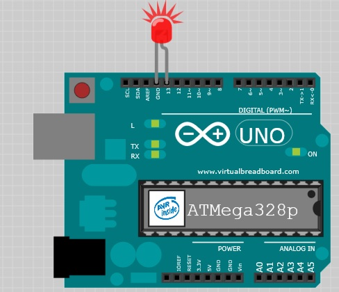

## Mengenal Arduino
Ardiono dibuat dari komponon kasar dan lunak.
Papan Arduino adalah sebuah PCB (Printed Circuit Board), suatu board yang mengkoneksikan komponen-komponen elektronik secara konduktif dengan jalur (track), pads, dan via dari lembaran tembaga yang dilaminasikan pada substrat non konduktif.

Komponen-komponen dari papan tersebut dibutuhkan agar *microcontroller* dapat berfungsi atau memperluas kemampuannya.

**Microcontroller* adalah sebuah komputerkecil yang didalamnya memiliki lintasan yang saling tersambung atau cip komputer. Microcontroller digunakan untuk memprogram dan mengatur elektornik. Papan Mincrocontroller memliki sebuah cip microcontroller dan penghubung lainnya yang berguna dan komponen yang membuat pengguna dapat menempelkan masukan atau keluarna. Contohnya *wiring board*, PIC, dan Basic Stamp.


## Mengenal Papan Arduino & Komponen dari Papan Arduino

 
### Otak dari Arduino : ATmega328P microcontroller chip

Cip microcontroller adalah otak dari papan Andruino. Cip ini juga dapat disebut dengan *Integrated Circuit* atau IC

### Header sockets
Soket dari microcotroller menghubungkan semua kaki tangan dari cip ATmega328 microcontroller ke soket yang lainnya. Merujuk pada *header socket* yang diatur di sekitar tepi papan dan diberi label untuk kemudahan penggunaan. Soket hitam ini dibagi menjadi tiga kelompok. **digital pins**, **analog input pins**, dan **power pins**. Ketiga *pins* tersebut mentransfer *voltaget*, bisa mentransfer keluar ataupun menerimanya sebagai nilai masukan.

> Mengapa pins ini sangat penting ?

Karena *pins* tersebut membuat kita dapat terhubung dengan cepat dan mudah ke sirkuit tambahan ketika kita membuat prototype dengan breadboard dan untuk mendesain papan tambahan (*shields*).

Proses yang sama ini dari mengirim dan menerima sinyal elektrik seperti yang kita dapati dalam komputer moderen. Namun karena komputer sangat kompleks dan "" dibandingkan dengan sebuah **Arduino** maka sangat sulit untuk secara langsung menghubungkan komputer yang terbiasa dengan digital sinyal (0s dan 1s) ke sirkuit elektronik yang berhubungan dengan rentang tegangan (ov sampai dengan 5v ATmega329P)

Yang membuat Arduino sangat spesial adalah, Arduino dapat menafsirkan (meng interpret) sinyal elektronik dan mengubahnya kedalam sinyal digital yang dapat dipahami oleh komputer. Dan juga dapat menulis sebuah program menggunakan perangkat lunak pada sebuah komputer dimana Arduino IDE mengkonversinya atau mengkompilenya ke sinyal elektrit yang dapat dipahami oleh sirkuit.


### Digital Pins
Berguna untuk mengirim dan menerima sinyal digital. Digital menyiratkan bahwa *pins* memliki dua **pernyataan** : `off` atau `on`. Pada istilah elektornik, **pernyataan** ini di terjemahkan ke sebuah nilai dari `0`atau `5` volts, tidak ada nilai diantaranya.

### Analog in Pins
Berguna untuk menerima nilai analog. Nialai analog didapatkan dari jarak nilai. Pada kasus ini jaraknya sama dengan jarak *Digital Pins*, antara `0V` ke `5V`, namun yang membedekan nilainya bisa diantara jarak nilai tersebut, `0.1, 0.2, 0.3, dan seterusnya.

### Bagaiamana dengan analog out pins ?
Jika dilihat pada papan **Arduino** tidak ada label yang bertuliskan **analog out*. Faktanya **analog out** ada namun tersembunyi diantara [digital pins](#Digital-Pins) yang ditandai dengan `PWM` menggunakan simbil `~`. `PWM` adalah *pulse-width modulation*, yang mana adalah sebuah tekhnik yang dapat kita gunakan untuk memberikan kesan output analog menggunakan digital pin. Pembahasan tentang `PWM` akan dibahasi nanti. Simbol `~` muncuk setelah digital pin `3,5,6,7,10 dan, 11` yang menunjukan kita memliki enam pin yang mampu `PWM`.

### Power Pins
Berguna untuk mendistribusikan tenaga ke masukan atau keluaran dimana tenaga dibutuhkan.

`vin` (*voltage in*) dan digunakan untuk menyuplai sebuah volatase yang setera dengan satu pasok yang disuplai oleh jack eksternal (12v). Kita juga dapat menggunakan pin ini untuk menyuplai tenaga ke **Arduino** dari sumber lain.

`GND` yang ditandai dengan *ground pins* penting untuk melengkapi sirkuit. Ada juga ground ke 3 dekat dengan pin 13 pada **digital pins**. Semua pin ini terhubung dan membagi `ground` yang sama.

Kita dapat menggunakan 5V atau 3.3V untuk memasok catu daya 5 volt atau 3,3 volt, masing-masing, untuk komponen atau sirkuit.

### USB Socket
Berguna untuk memberitahu *microcontroller* didalam papan Arduino apa yang harus dilakukan. Kita harus mengirimkan program kedalamnya. Papan Arduino menggunakan USB socket tersebut untuk daya dan untuk mengtransfer data. Menggunakan kabel USB sangat sempurna untuk aplikai yang membutuhkan tenaga sedikit dan ketika data dikirimkan ke komputer atau menerima data dari komputer.

### Power Socket
Socket ini berguna untuk memberikan tenaga ke **Arduino** yang bearasal dari luar. Suplai tenaga ini bisa berasal dari AC atau DV adaptor, batre atau solar panel.
Tegangan (volatase) yang direkomendasikan untuk papan UNO adalah antara 7v sampai dengan 12v. Jika kita mensuplai tegangan yang lebih rendah papan uno tidak akan bekerja secara maksimal dan jika kita memberikan tegangan terlalu tinggi bisa menyebabkan uno rusak.

### LEDs
Papan **arduino** memilki empat lampu LED yang ditandai dengan `L`, `TX`, `RX`, dan `ON`. LED adalah sebuah komponen yang mengeluarkan cahaya ketika arus elektrik melewatinya.

Ke-empat lampu LED digunakan untuk mengidikasikan sebuah aktivitas didalam papan, penjelasnya setiap lampu sebagai berikut;
1. `ON` akan berwarna hijau yang mengindikasikan **Arduino** memiliki daya.
2. `RX`dan `TX` memberitahu kita data sedang ditransfer (menerima atau mengirim data dari papan).
3. `L` adalah lampu LED yang terkoneksi dengan digital PIN no 13. Digunakan untuk menguji apakah papan bekerja sesuai dengan yang kita inginkan.

### Reset button
Berguna untuk mereset program didalam Arduino atau menghentikannya secara total dengan menekan dalam beberapa waktu. Mereset program juga dapata dilakukan dengan cara menyambungkan kabel antara `reset pin` dan `GND`.


## Membuat LED berkedip

``` c++
// the setup function runs once when you press reset or power the board
void setup() {
  // initialize digital pin LED_BUILTIN as an output.
  pinMode(LED_BUILTIN, OUTPUT);
}

// the loop function runs over and over again forever
void loop() {
  digitalWrite(LED_BUILTIN, HIGH);   // turn the LED on (HIGH is the voltage level)
  delay(100);                       // wait for a second
  digitalWrite(LED_BUILTIN, LOW);    // turn the LED off by making the voltage LOW
  delay(100);                       // wait for a second
}
```

### Fungsi Setup
`Setup` adalah fungsi pertama yang dibaca oleh program **Arduino**, dan fungsi tersebut hanya dijalankan satu kali saja. Tujuan untuk mempersiapkan perangkat **Arduino**, mengisi sebuah nilai atau properti kedalam papan arduino yang nilainya tidak akan berganti selama operasi berlanjut.

### PinMode
`Fungsi `pinMode` mengkonfigurasi pin tertentu untuk masukan (menerima data) atau keluaran (mengirim data). Fungsi ini membutuhkan dua buah parameter.
1. `pin`: Nomor dari pin yang kita ingin atur.
2. `mode`: berisi nilai `INPUT` atau `OUTPUT`.

```
pinMode(LED_BUILTIN, OUTPUT);
```
Berikut adalah implementasi penggunaan fungsi `pinMode` pada contoh **blinK**. `LED_BUILTIN` memberitahu sebuah fungsi kita ingin mengkontrol LED pada papan **Arduino** (yang tidandai dengan tanda **L**) dan menyetelnya mode pin tersebut ke `OUTPUT`.

### Loop
`Loop` adalah sebuah fungsi yang berjalan terus menerus hingga tombol *reset* ditekan atau papan **Arduino** kehilangan tenaga. Berikut adalah penggunaan fungsi `Loop` pada contoh ini.

``` c++
oid loop() {
 digitalWrite(LED_BUILTIN, HIGH); // turn the LED on (HIGH is the voltage level)
 delay(1000); // wait for a second
 digitalWrite(LED_BUILTIN, LOW); // turn the LED off by making the voltage LOW
 delay(1000); // wait for a second
}
```

### DigitalWrite 
fungsi ini berguna untuk mengirim nilai digital ke sebuah pin. Sebagaimana yang telah dibahas sebelumnya, pin digital hanya mengerti dua kondisi; `on` atau `off`. Namun didalam kelistrikan dapat disamakan dengan `HIGH` atau `LOW`.
Papan **Arduino** membutuhkan 5v untuk berjalan yang mana berasal dari sebuah USB atau suplai tenaga dari luar. Nilai `HIGHT` sama dengan `5v` dan `LOW` sama dengan `0V`. Fungsi ini membutuhkan dua parameter.
1. `pin`: Nama dari pin yang ingi diintegrasikan.
2. `value`: Nilainya dapat berupa `HIGHT` atau `LOW`.

Maka fungsi berikut `digitalWrite(LED_BUILTIN, HIGH); ` didalam bahasa inggri memberitahukan `kirim 5v ke papan **Arduino** yang ada LED didalamnya.

### Delay
Fungsi tersebut memberhentikan aktifias diluar rumahnya.

### Blinking Bighter
Lampu LED yang ditandi dengan huruf `L` sebenarnya tersambung sebelum sebelum mencapai pin nomor 13. Papan **Arduino** awalan kita wajib menyediakan lampu LED sendiri (tidak ada lampu LED di papan). Namun kare lampu LED sangat penting dan berguna untuk *debugging* dan *signaling*, sekarang lampu LED ditambahkan secara permanen untuk membatu kita.

Sekarang kita ingin menambahkan lampu LED eksternal kedalam papan Arduino. Jika kita lihat pada gambar lampu LED, kedua kakinya tidak sama, ada yang lebih panjang dan ada yang lebih pendek. Kaki yang lebih panjang dapat dikatakan anoda (+) dan kaki yang lebih pendek adalah `cathode atau nd`. Letakan anoda pada pin 13 dan cathode pada pin GND (ground).


Sebagaimana yang telah dibahas sebelumnya, variabel `LED_BUILTIN` adalah variabel yang telah didefinisikan diawal yang mengacu ke LED pada papan. Karena LED dikendalikan oleh pin no 13, sangat memungkikan untuk mengedalikan komponen lain dengan menghubungkan ke pin no 13. Suplai voltase oleh semua pin dapat terlalu tinggi untuk kebanyakan lampu LED. Untungnya fitur lain dari pin no 13 adalah pin bawaan dan pull-down resistor. Resistor ini menahan LED kita tetap pada tegangan volt yang stabil dan memastika lampu LED memliki umur yang pangjang dalam penggunaanya.


