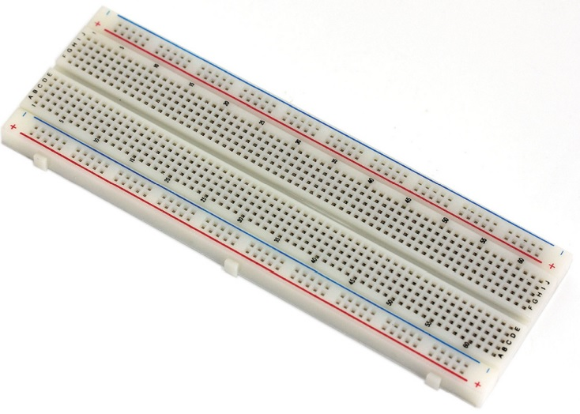

Pada bagian ini kita akan menambah pemahaman tentang prototiping dan bagaimana cara menggunakan alat prototiping pada Arduino. Alat prototipe dapat digunakan untuk membuat sirkuit sementara dalam penambahan komponen baru, menguji sirkuit dan membuat prototipe sederhana. Pada bagian ini kita akan mengenali beberapa perlengkapan dan tekhnik yang dibutuhkan untuk membuat sirkuit dan ide prototipe.

## Alat yang tepa untuk bekerja
Prototiping adalah tentang mengeksplorasi ide-ide, yang mana hal tersebut adalah inti dari Arduino. Meskipun teori sangatlah penting, namun seringkali belajar akan lebih cepat dan efektif dari pengalaman.

Pada seksi ini kita akan mengenali beberapa alat prototiping dan komponen yang dapat digunakan untuk membuat sebuah sirkuit.

1. Breadboard



2. Jump wires


3. Multimeter


## Pembahasan penting tentang listrik dan sirkuit
Pada bagian ini kita akan membahas ilmu dasar dari litrik dan sirkuit

### Mengenal Listrik
Listrik adalah sebuah bentuk energi yang dihasilkan dari keadaan partikel bermuatan (elektron dan proton), baik secara statis sebagai akumulasi muatan atau dinamis sebagai arus.

Definisi listri tersebut dideskripsikan listrik pada level atom (terkecil), yang mana akan lebih kompleks jika berhadapan dengan sirkuti pada Projek Arduino.

Untuk mengetaui ide dari arus listrik, lihat gambar dibawah ini.


Pada rangkaian ini terdapat sumber tenaga listrik berupa baterai. Tenaga disuplai dalam watt dan terdiri dari tegangan (dalam volt) dan arus (dalam amp). Tegangan dan arus disuplai ke rangkaian melalui ujung positif (+) dari baterai.

Kita menggunakan *switch* untuk mengatur tenagak ke sirukit (rangkaian). *Switch* dapat terbuka (*open*), yang mana akan memutus dan memberhentiikan arus listrik atau tertutup (*close*) yang mana akan menyambungkan arus listrik.

Tenaga dapat digunakan untuk beberapa komponen atau tujuan. Pada gambar tersebut, rangkaian menyalurkan tenaga untuk menyala sebuah lampu LED. Baterai sebagai sumber energi atau tenaga mensuplai 4.5V, yang mana lebih dari cukup untuk menyalakan lampu LED. Jika LED disuplai dengan tenaga sebanyak tersebut akan muncul resiko lampu LED akan rusak, maka sebab itu kita membutuhkan kompenen lain, yaitu **resistor** yang berguna untuk menahan tegangan sebelum arus mengaliri lampu LED. Dan jika tegangan lebih rendah dari pada yang dibutuhkan oleh lampu LED, maka lampu LED tidak akan terang secara sempurna.

Untu menyelesaikan rangkaian, **tenaga harus kembali ke ground pada titik negatif (-) dari batre.** Lampu LED menyerap arus (*current*) sebanyak yang dibutuhkan untuk menyalakan dirinya.

{==Dengan menyerap arus listrik==}, lampu LED juga menahan *flow*, memastika hanya aliran yang dibutuhkan yang diserap. Kecuali aliran digunakan atau ditahan oleh komponen lainnya. Rangkaian menyerap aliran yang tersedia denga cepat. Ini dikenal dengan *short circuit*. Contoh dari *short circuit* adalah  menghubungkan positif secara langsung ke negatif tanpa ada komponen diantaranya.

Prisip yang wajib dikuasai

- [x] Sirkuit atau rangkaian
- [x] Sirkuit membutuhkan daya atau tenaga sebelum mengembalikannya ke sumber daya.
- [x] Jika sirkut yang dibuat tidak menggunakan tenaga yang teralirkan, maka daya tidak akan tahu pergi kemana dan dan merusak sirkuit tersebut. 
- [x] Cara termudah untuk berinteraksi dengan sirkuit adalah dengan memutusnya. Dengan mengontrol kapan dan di mana kekuatannya, Anda memiliki kontrol instan atas output.

### Menggunakan persamaan untuk membangun sirkut atau rangakaian

|Entitas|Satuan|
|---|---|
|Power (P)| Watts|
|Voltage (V) tegangan|volts|
|Current (I) arus|ampers|
|Resistance (R) hambatan|ohms|

Kempat entitas tersebut dapat ditentukan nilainya dan dimasukan kedalam sebuah persamaan sehingga dapat membuat sirkuit menjadi lebih seimbang dan bekerja dengan baik. Selanjut kita akan mebahas dua persamaan yang paling sering digunakan. `ohm's laws` & `Joule's law`.

#### Ohm's Law


Apa gunanya *ohm's law* ini pada konteks **arduino** ?

Digital pin yang ada pada arduino dapat mensuplai hingga 5V, ini adalah suplai tenaga yang biasa kita gunakan. Sebuah lampu LED biasanya membutuhkan 2V dan sekitar 30 milli ampers (30mA atau 0.03A).

Jika kita memasang LED tersebut langsung pada power suplai maka akan terjadi koslet yang dapat menyebabkan lampu LED rusak. Untuk menghindari hal tersebut kita harus menambahkan resistor pada sirkuit tersebut.

Merujuk pada *ohm's law*

```
R = V / I
```

Namun kita harus memasukan dua *volatage* yang berbeda, *voltage* dari power suplai (supply voltage) dan *voltage* yang dibutuhkan dari lampu LED (forward voltage). *Forward voltage* adalah istilah yang sering ditemukan dilembar data, terutama ketika mengacu pada diodes, menunjukan jumlah tegangan yang direkomendasi yang dapat diterima oleh komponen kearah yang dimaksudkan untuk mengalir. Untuk LED, arahnya dari *anode* ke *cathode*, dengan *anode* terhubung ke positif dan *cathode* menjadi negatif.

Saat mengacu pada dioda non-pemancar cahaya , Anda menggunakan mereka untuk menahan aliran arus dalam arah yang berlawanan, dari katoda ke anoda. Dalam hal ini, istilahnya adalah tegangan balik, yang menunjukkan nilai dalam volt bahwa rangkaian harus melebihi arus yang mengalir melalui dioda.

Pada kasus ini tegangan masing-masing ditandai dengan Vsupply dan Vforward. Persamaan *Ohm's law* membutuhkan tegangan melintasi resitor yang mana seimbang dengan Vsupply dikurangi dengan LED Vforward. atau 
```
Vsupply - Vforward
```
Sehingga persamaanya menjadi
```
R = (Vsupply - Vforward) / I

R = (5v - 2v) / 0.03A = 100Ω
```
Hasil persamaan tersebut memberitahu kita bahwa kita membutuhkan 100-ohm resistor untuk menyalakan lampu LED. Berikut adalah ilustasi penggunaan resistor untuk menyalakan lampu LED.


#### Menghitung Power
untuk menghitung power yang dikonsumsi oleh sirkuit dalam satua *watss*, kita dapat mengkalikan *voltage* dan *current* dari sirkuit.
```
P = V * I

atau

P = (Vsupply - Vforward) * I

V = P / I

I = P / V

# Contoh lanjutan

P = (5V - 2V) * 0.03A = 0.09 Watts

```

Persamaan ini sangatlah berguna, karena ada beberapa komponene seperti lampu bohlam, hanya menampilkan nilai power dan voltage. Dan Perhitungan ini sangat berguna jika Anda mencoba (atau gagal) untuk menjalankan perangkat yang haus daya, seperti lampu atau motor, lepas dari pin Arduino Anda. Arduino bertenaga USB mampu memasok arus 500mA, tetapi Arduino Uno hanya dapat memasok maksimum 40mA per pin dan total 200mA dari semua pin yang digunakan, yang tidak banyak sama sekali.

### Diagram Sirkuit
Diagram sirkuit seperti peta dari sebuah perjalanan, menampilkan setiap koneksi dari komponen2 didalamnya.

#### Diagram Sirkuit Sederhana


### Resistor Color Chart
Resistor sangatlah dibutuhkan pada projek arduino. Resistor sangatlah kecil sehingga sulit untuk menempelkan nilai resistensi pada resistor. Untuk itu, resisotr diberikan 4 warna yang dapat kita gunakan untuk mengetahui berapa nilai resistensi dari resistor tersebut.
Berikut adalah bagan yang dapat kita gunakan untuk menghitung resistensi.


Contoh : 


