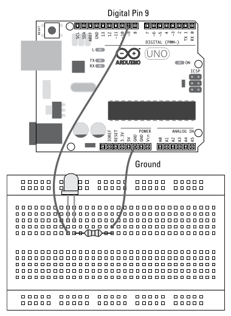

## Pulse-Width Modulation (PWM)
Pada bagian pertama kita telah menyinggung tentag *pulse-width modulation*, yaitu salah satu tekhnik yang membuat **arduino** yang kita kenal sebagai mesin digital (*digital device*) bertingkat sebagai mesin analog (*analog device*). Sehingga **arduino** kita dapat mengirim nilai analog menggunakan teknik ini. Dengan PWM anda dapat membuat lampu LED menyela redup dan terang dari pada hanya mematikan dan menyalakan lampu.


Beginilah cara kerjanya. Sebuah digital output selalu dalam kondisi mati atau menyala, `turn on` or `turn off`. Akan tetapi, digital output ini dapat berubah dari nyala dan mati serta kebalikannya dalam waktu yang sangat amat cepat (atas kehebatan dari silicon chips). Jika keluaran dari digital output menyala setengah dari waktu (_on half the time_) dan mati setengah dari waktu (_off half the time_) maka kondisi tersebut dapat di deskripsikan memiliki 50 _duty cycle_.

**Duty cycle** adalah periode waktu dimana output dalam keadaan aktif, bisa dalam bentuk prosentase - 20 persen, 30 persen, 40 persen dan seterusnya. Misalkan outputnya adalah lampu LED, duty cycle memliki efek khusus, karena LED berkedip sangat cepat melebihi kemampuan mata dalam menangkapnya, lampu LED tersebut dengan daya 50 persen duty cyle terlihat seperti setengah bersinar. 

Contoh lain adalah DC motor, 50 persen dari duty cycle akan berdampak pada kecepatan motor sebesar 60 persen. Dengan demikian, Pulse Widh Modultaion dapat mengatur kecepatan dari sebuah motor dengan memompanya (_pulsing_) dengan kecepatan yang sanga ceoat.

Jadi meskipun PWM adalah sebuah digitan function, pwm disebut sebagai analogWrite karena dari efek yang dirasakan itu pada komponen lain (modul).


## LED Fade Sketch
Pada saat ini insyaAllah kita akan membuat lampu led yang memudar dan menyalan dalam waktu tertentu. Ada beberapa alat yang dibutuhkan.

1.  Arduino Uno
2.  Lampu LED
3.  Beardboard
4.  Resistor
5.  Jump wires

Dibawah ini adalah layout sirkuit untuk membuat sketsan ini. Sirkuti dibawah ini simple, mirip dengan sketas blinking LED, bedanya, sketsa ini menggunakan analog output [PWM](#pulse-width-modulation-pwm) nomor 9. Maka dari itu perlu menggunakan resistor untuk mengatur jumlah arus (_current_).

!!! info
    Pin 13 pada papan Arduino sudah tertanam resistor.



Pada gambar diatas, jumpware yang panjang menghubungkan `pin 9` (Analog Output) degan beardboard yang menyabung juga dengan lampu LED. Selanjutnya, sirkuit diteruskan dengan menanam resistor[^1] lalu berlanjut dengan jumpwire kedua kearah pin ground `GND`.

[^1]: Pada sirkuti ini resistor dapat ditempatkan sebelum atau sesudah lampu LED.

???+ quote "Penggunaan resistor yang tepat"
    Kita harus tepat dalam menggunakan resistor pada cirkuti yang dibangun dengan tujuan agar arus yang diterima oleh komponen cukup, tidak kurang yang menyebabkan daya kerja komponen berkurang atau tidak lebih yang membuat komponen tersebut rusak karena arusnya yang terlalu besar. Anda harus dapat menentukan resistor mana yang tepat dengan menggunakan persamaan [ohm laws](02.%20Getting%20physical%20with%20arduino.md#ohms-law). Niali dari persamaan tersebut dapat anda gunakan untuk menetukan resistor mana yang dipakai. Penentua tersebut dapat dilihat pada gambar pada bagian catatan [Resistor Color Chart](02.%20Getting%20physical%20with%20arduino.md#resistor-color-chart) 

    Pada sirkuit yang dibangun ini, arduino menerima tegangan sebesar 5 volt dan daya yang dapat ditampung oleh LED sekitar 2.1 volt maka dibutuhkan resistor untuk melindungi komponen LED ini. Lampu LED membutuhkan arus (_current_) dengan nilai maksimal 25mA (25 milli ampers) dengan demikian kita dapat mengetahui jumlah hambatan yang seharusnya.

    $$
    R = \frac{(V_Supply - V_LED)}{I} = \frac{(5 - 2.1)}{0.025} = 116 ohms
    $$ 
    
    Jadi kita dapat menggunakan resistor dengan nilai terdekat yaitu 120 ohms, yaitu resistor dengan warna `brown red brown`. Jika anda tidak memilikinya anda juga dapat menggunakn resistor yang lebih tinggai. Resistor yang lebih tinggi tersebut semakin banyaj menahan daya (_voltage_) yg menyebabkan arus yg diterima LED lebih sedikit. Namun lampu LED anda tetap aman.

Sekarang pasang semua komponen yang dibutuhkan menggunakan jumpwire, setelah terpasang selanjutnya akan diupload script untuk menayala dan redupkan lampu LED.

!!! warning "Perhatian"
    Dalam memasang setiap komponen pada sirkui. Sangat disaranakan mengikuti standar yang disaranakan. Seperti penggunaan kabel jumpwire untuk power menggunakan warna merah dan ground menggunakan warna hitam. Atau terkadang dapat ditemui juga penghubung kabel power menggunakan warna putih dan ground menggunakan warna hitam. Ada tipe lainya juga yang insyaAllah akan ada dicatatan ini yaitu _signal wire_ yang di khusukan untuk kabel yang mengatur arus masuk dan keluar sinyal elektrik antara arduino dan komponen lainnya. Untuk signal wire menggunakan warna lain selain warna yang digunakan untuk power dan ground.    

Untuk script Led fade sudah tersedia pada Arduino IDE, anda dapat menuju ke menu `File -> Examples -> Basic -> Fade`

```{.C title="Script LED fade"}
/*
  Fade

  This example shows how to fade an LED on pin 9 using the analogWrite()
  function.

  The analogWrite() function uses PWM, so if you want to change the pin you're
  using, be sure to use another PWM capable pin. On most Arduino, the PWM pins
  are identified with a "~" sign, like ~3, ~5, ~6, ~9, ~10 and ~11.

  This example code is in the public domain.

  https://www.arduino.cc/en/Tutorial/BuiltInExamples/Fade
*/

int led = 9;           // the PWM pin the LED is attached to
int brightness = 0;    // how bright the LED is
int fadeAmount = 5;    // how many points to fade the LED by

// the setup routine runs once when you press reset:
void setup() {
  // declare pin 9 to be an output:
  pinMode(led, OUTPUT);
}

// the loop routine runs over and over again forever:
void loop() {
  // set the brightness of pin 9:
  analogWrite(led, brightness);

  // change the brightness for next time through the loop:
  brightness = brightness + fadeAmount;

  // reverse the direction of the fading at the ends of the fade:
  if (brightness <= 0 || brightness >= 255) {
    fadeAmount = -fadeAmount;
  }
  // wait for 30 milliseconds to see the dimming effect
  delay(30);
}
```

### Understanding LED fade sketch
Dibagian ini akan dibahas bagaimana lampu LED dapat menyala redup dan terang.

Pada kalimat yang dikomen pada script diatas dikatakan ada sebuah fungsi dengan nama `analogWrite()` yang menggunakan Puls-width modulation yang mana pada script ini menggunakan pin nomor 9 yang membuat lampu LED menyala dan meredup.

Setelah komen tersebut terdapat tiga deklarasi dan assignment pada variabel yang mana nantinya varibel ini akan digunakan.

``` C
...
int led = 9;           // the PWM pin the LED is attached to
int brightness = 0;    // how bright the LED is
int fadeAmount = 5;    // how many points to fade the LED by
...
```

Lalu selanjutnya pada fungsi [setup()](/docs/Technology/Catatan%20Arduino/01.%20What%20is%20arduino.md#fungsi-setup), pin nomor 9 di tetapkan menjadi pin keluaran (output) digital ouput.

``` C
// the setup routine runs once when you press reset:
void setup() {
  // declare pin 9 to be an output:
  pinMode(led, OUTPUT);
}
```

Setelah ditetapkan pin untuk digital ouput, maka selanjutnya dilakukan perulangan pada fungsi `#!C loop()` untuk mengeluarkan nilai analog dalam bentuk sinyal listrik melalui fungsi `#!C analogWrite()` yang membuat lampu menyela dengan kondisi dibawah nya yang merubah nilai dari variable `#!C brightness` yang juga menentukan tegangan (voltage) listrik yang dikeluarkan pada PIN 9 dalam bentuk sinyal analog. Perulang ini terus berlanjut hingga mesin arduion di matikan atau di reset.

``` C
// the loop routine runs over and over again forever:
void loop() {
// set the brightness of pin 9:
analogWrite(led, brightness);
// change the brightness for next time through the loop:
brightness = brightness + fadeAmount;
// reverse the direction of the fading at the ends of the fade:
if (brightness <= 0 || brightness >= 255) {
fadeAmount = -fadeAmount;
}
// wait for 30 milliseconds to see the dimming effect
delay(30);
}
```

fungsi `#!C analogWrite()` dapat mengirim nilai dalam rentan 0 - 255 ke PWM pin pada arduiono. Nilai 0 setara dengan 0v dan 255 setara dengan 5v dan nilai diataran 0 dan 255 senilai dengan proposional. Maka itulah lampu LED diatas nyala terang dan redup karena nilai variable `#!C brightness` yang dinamis dan menjadi parameter fungsi `#!C analogWrite`.

### Another fade sketch
Lihat script dibawah ini
```{.C title="Example -> analog -> fade"}
/*
  Fading

  This example shows how to fade an LED using the analogWrite() function.

  The circuit:
  - LED attached from digital pin 9 to ground through 220 ohm resistor.

  created 1 Nov 2008
  by David A. Mellis
  modified 30 Aug 2011
  by Tom Igoe

  This example code is in the public domain.

  https://www.arduino.cc/en/Tutorial/BuiltInExamples/Fading
*/

int ledPin = 9;    // LED connected to digital pin 9

void setup() {
  // nothing happens in setup
}

void loop() {
  // fade in from min to max in increments of 5 points:
  for (int fadeValue = 0 ; fadeValue <= 255; fadeValue += 5) {
    // sets the value (range from 0 to 255):
    analogWrite(ledPin, fadeValue);
    // wait for 30 milliseconds to see the dimming effect
    delay(30);
  }

  // fade out from max to min in increments of 5 points:
  for (int fadeValue = 255 ; fadeValue >= 0; fadeValue -= 5) {
    // sets the value (range from 0 to 255):
    analogWrite(ledPin, fadeValue);
    // wait for 30 milliseconds to see the dimming effect
    delay(30);
  }
}
```

Berbeda dengan script LED fade sebelumnya, script ini jauh lebih efesien. Didalam script ini menggunakan for loop didalam fungsi `#!C void loop()` dan pengguna varibel yang menentukan tingkat kecerahan berada didalam for loop itu sendiri.

## Button Sketch
```{.C title="Example -> digital -> button"}
/*
  Button

  Turns on and off a light emitting diode(LED) connected to digital pin 13,
  when pressing a pushbutton attached to pin 2.

  The circuit:
  - LED attached from pin 13 to ground through 220 ohm resistor
  - pushbutton attached to pin 2 from +5V
  - 10K resistor attached to pin 2 from ground

  - Note: on most Arduinos there is already an LED on the board
    attached to pin 13.

  created 2005
  by DojoDave <http://www.0j0.org>
  modified 30 Aug 2011
  by Tom Igoe

  This example code is in the public domain.

  https://www.arduino.cc/en/Tutorial/BuiltInExamples/Button
*/

// constants won't change. They're used here to set pin numbers:
const int buttonPin = 2;     // the number of the pushbutton pin
const int ledPin =  13;      // the number of the LED pin

// variables will change:
int buttonState = 0;         // variable for reading the pushbutton status

void setup() {
  // initialize the LED pin as an output:
  pinMode(ledPin, OUTPUT);
  // initialize the pushbutton pin as an input:
  pinMode(buttonPin, INPUT);
}

void loop() {
  // read the state of the pushbutton value:
  buttonState = digitalRead(buttonPin);

  // check if the pushbutton is pressed. If it is, the buttonState is HIGH:
  if (buttonState == HIGH) {
    // turn LED on:
    digitalWrite(ledPin, HIGH);
  } else {
    // turn LED off:
    digitalWrite(ledPin, LOW);
  }
}
```