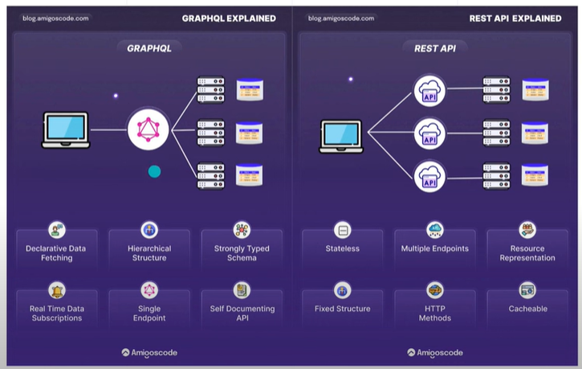
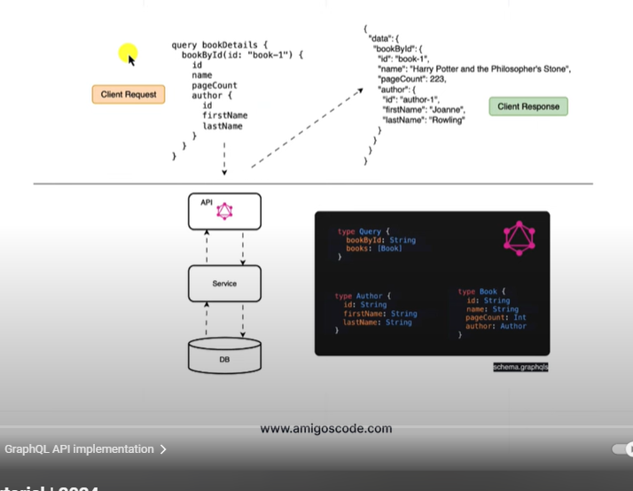
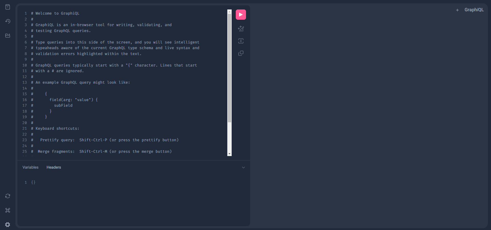
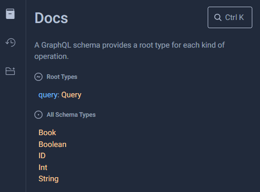
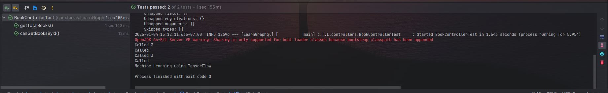

_Bismillah_ dengan menyebut nama Allah

## Pembukaan

Dari Abu Hurairah, Rasulullah -shallallahu ‘alaihi wa sallam- bersabda,

الْمُؤْمِنُ الْقَوِىُّ خَيْرٌ وَأَحَبُّ إِلَى اللَّهِ مِنَ الْمُؤْمِنِ الضَّعِيفِ وَفِى كُلٍّ خَيْرٌ احْرِصْ عَلَى مَا يَنْفَعُكَ وَاسْتَعِنْ بِاللَّهِ وَلاَ تَعْجِزْ وَإِنْ أَصَابَكَ شَىْءٌ فَلاَ تَقُلْ لَوْ أَنِّى فَعَلْتُ كَانَ كَذَا وَكَذَا. وَلَكِنْ قُلْ قَدَرُ اللَّهِ وَمَا شَاءَ فَعَلَ فَإِنَّ لَوْ تَفْتَحُ عَمَلَ الشَّيْطَانِ

“Mukmin yang kuat lebih baik dan lebih dicintai oleh Allah daripada mukmin yang lemah. Namun, keduanya tetap memiliki kebaikan. Bersemangatlah atas hal-hal yang bermanfaat bagimu. Minta tolonglah pada Allah, jangan engkau lemah. Jika engkau tertimpa suatu musibah, maka janganlah engkau katakan: ‘Seandainya aku lakukan demikian dan demikian.’ Akan tetapi hendaklah kau katakan: ‘Ini sudah jadi takdir Allah. Setiap apa yang telah Dia kehendaki pasti terjadi.’ Karena perkataan law (seandainya) dapat membuka pintu syaithon.”

(HR. Muslim)

??? quote "Amanah dan Kuat"

    **Kriteria-Kriteria Memilih Pekerja dan Pegawai**

    Landasan dalam memilih seorang pegawai atau pekerja hendaklah ia seorang yang kuat lagi amanah. Karena dengan kekuatan ia sanggup melaksanakan pekerjaan yang diembankan kepadanya, dan dengan amanah ia menunaikan sesuai dengan tugas dan tanggung jawabnya. Dengan amanah ia akan meletakkan perkara-perkara pada tempatnya. Dan dengan kekuatan ia sanggup menunaikan kewajibannya.

    Allah telah memberitakan tentang salah seorang putri penduduk Madyan bahwasanya ia berkata kepada bapaknya tatkala Musa mengambilkan air untuk keduanya.

    قَالَتْ إِحْدَاهُمَا يَا أَبَتِ اسْتَأْجِرْهُ ۖ إِنَّ خَيْرَ مَنِ اسْتَأْجَرْتَ الْقَوِيُّ الْأَمِينُ

    “Ya bapakku, ambillah ia sebagai orang yang bekerja kepada kita. Karena sesungguhnya orang yang paling baik yang kamu ambil untuk bekerja (pada kita) ialah orang yang kuat lagi dapat dipercaya” [Al-Qashash/28:26]

    Dan Allah berfirman tentang Ifrit dari bangsa Jin yang mengutarakan kesanggupannya kepada Sulaiman Alaihissalam untuk mendatangkan singgasana Balqis.

    قَالَ عِفْرِيتٌ مِّنَ الْجِنِّ أَنَا آتِيكَ بِهِ قَبْلَ أَن تَقُومَ مِن مَّقَامِكَ ۖ وَإِنِّي عَلَيْهِ لَقَوِيٌّ أَمِينٌ

    “Aku akan datang kepadamu dengan membawa singgasana itu kepadamu sebelum kamu berdiri dari tempat dudukmu ; sesungguhnya aku benar-benar kuat untuk membawanya lagi dapat dipercaya” [An-Naml/27:39]

    Maknanya, ia menggabungkan antara kemampuannya untuk membawa dan mendatangkannya serta menjaga apa yang dibawanya.

    Allah juga telah menceritakan tentang Yusuf Alaihissalam bahwasanya ia berkata kepada raja.

    قَالَ اجْعَلْنِي عَلَىٰ خَزَائِنِ الْأَرْضِ ۖ إِنِّي حَفِيظٌ عَلِيمٌ

    “Jadikanlahlah aku bendaharawan negara (Mesir). Sesungguhnya aku adalah orang yang pandai menjaga lagi berpengetahuan” [Yusuf/12:55]
    Referensi : https://almanhaj.or.id/13821-bagaimana-menjadi-pegawai-yang-amanah.html


Maka dari itu, selain kita menanamkan pada diri kita bahwa amanah itu adalah tanggung jawab yang berat dan menjadi salah satu faktor bahwa seorang pekerja tersebut baik maka kita juga perlu memperkuat diri kita dengan menambah ilmu-ilmu baru yang bermanfaat bagi kita.

Semoga Allah mudahkan ilmu ini bagi kita, Aamiin...


## Graphql x Spring Boot
Pada catatan kali ini saya bersumber dari [**Youtube**](https://www.youtube.com/watch?v=uNB2N_w_ypo) Untuk soruce code pada catatan ini dapat diclone di []()

## What is GraphQL

* Sebuah bahasa query dari _Application Programming Interface_
* Dikembangkan oleh Meta pada tahun 2012 dan pada tahun 2015 menjadi sumber daya terbuka (_Open Source_)

## Mengapa menggunakan GtaphQL

* Efesiensi pengambilan data
* Skema data yang kuat
* Tidak perlu lagi pembuatan versi API ketika ada perubahan pada sisi backend ({==karena engguna yang menentukan ingin mengambil field apa saja==})

## Graphql V REST

| Fitur | GraphQL | REST |
| :---- | :---- | :---- |
| _Date fetching_ | Client yang menentukan struktur  | server yang menentukan struktur |
| _Over fetching_ or  _under fetching_ | Client dapat menentukan data apa saja yang dapat dibutuhkan | Bisa over atau under tergantung balikan dari server |
| _Endpoint_ | Single endpoint | multiple endpoint |
| _Versioning_ | Tidak perlu versioning | Perlu ada-nya pem versian jika ada perubahan service, misalkan `api/v2/getdata` dan `aoi/v3/getdata` |
| _payload size_ | minimal payload | Terkadang mengirim data atau menerima data yang tidak diperlukan |






## Setup awalan grapHQL

Dibawah ini adalah depedency standar untuk menggunakan Spring dan GraphQL

!!! note "pom.xml"

    ```xml
    <dependency>
        <groupId>org.springframework.boot</groupId>
        <artifactId>spring-boot-starter-graphql</artifactId>
    </dependency>
    <dependency>
        <groupId>org.springframework.boot</groupId>
        <artifactId>spring-boot-starter-web</artifactId>
    </dependency>
    
    ```

## Ayo mulai

Dalam menggunakan graphQL kita harus membuat sebuah _schema_ yang mana representasi dari objek yang dapat kita ambil dari sebuah service. _Schema_ adalah sebuah file yang berisikan struktur yang dapat di query oleh client termasuk semua field dan sub field.

!!! success "Code github"
    Clone branch **Pertama** pada repository [https://github.com/muhammadfarras/Learn-Graphql](https://github.com/muhammadfarras/Learn-Graphql)

### Membuat Schema

Buat file dengan nama `schema.graphqls` pada path `/resources/graphql/schema.graphqls`

!!! note "Code"

    === "schema.graphqls"

        ```graphql

        type Query {
            books:[Book] ## will return list of type Book
        }

        type Book {
            id:ID
            name:String
            pageCount:Int
        }
        ```

### Buat object java

Selanjutnya buat sebuah object java (kotlin) yang memiliki struktur yg sama dengan schema yang telah kita buat sebelumnya

!!! note "Code"

    === "com.farras.LearnGraphql.model"

        ```kotlin

        data class Book(
                var id:Int, 
                var name:String, 
                var pageCount:Int
            )
        ```

### Membuat controller

Seperti REST API, Spring Boot menawarkan anotasi `@Controller` untuk mengimplementasi GraphQL. Spring Boot akan membaca anotasi `@Controller` dan akan meregister handler method didalamnya seperti `@QueryMapping` atau `@SchemaMapping` (kedua anotasi tersebut disebut dengan **DataFetcher/Resolver**)[^1].

[^1]: Sumber : [https://pankaj02.medium.com/spring-for-graphql-schemamapping-and-querymapping-3db89bae696a](https://pankaj02.medium.com/spring-for-graphql-schemamapping-and-querymapping-3db89bae696a)

DataFetcher atau Resolfer sendiri bertanggungjawab mengisi data untuk _field_ tunggal didalam schema GraphQL.

!!! note "Code"

    === "com/farras/LearnGraphql/controllers/BookController"

        ```kotlin
        @Controller
        class BookController {

            @QueryMapping
            fun books():List<Book>{
                return  Book.books
            }
        }
        ```

### Lets start the first testing
Jalankan spring boot lalu menuju ke url berikut `http://localhost:8080/graphiql`, selanjutnya akan tampil browers tool untuk menguji graphql kita.

??? info "Image"
    


sebagai acuan utama dalam belajar ada baiknya untuk merujuk ke sumber asli [GraphQL](https://graphql.org/learn/)

!!! note "Added Note"

    GraphQL menyedikan fitur documentatione explorer, disini kita dapat melihat schema dan filed dari setiap schema.

    


!!! quote "Code"

    === "Example 1"

        ```graphql
        {
            books {
                id
                name
                pageCount
            }
        }
        ```

        ```{.json title="Output"}
        {
            "data": {
                "books": [
                {
                    "id": "1",
                    "name": "Al Quran",
                    "pageCount": 656
                }
                ]
            }
        }
        ```

    === "Example 2"

        Jika kita memisahkan field yg sama menjadi beberapa bagian, GraphQL akan menggabungkannya menjadi satu response JSON


        ```graphql
        {
            books {
                id
            }
            books {
                name
                pageCount
            }
        }
        ```

        ```{.json title="Output"}
        {
            "data": {
                "books": [
                {
                    "id": "1",
                    "name": "Al Quran"
                },
                {
                    "id": "2",
                    "name": "Pytorch"
                },
                {
                    "id": "3",
                    "name": "Machine Learning using TensorFlow"
                }
                ]
            }
        }

        ```


## Another example
Selain mengambil seluruh data, kita juga dapat mendefinisikan **DataFetcher** untuk mengambil sebuah value dari sebuah request lalu mengambelikan value berdasarkan value yang diterima. 

!!! success "Code github"
    Clone branch **Kedua** pada repository [https://github.com/muhammadfarras/Learn-Graphql](https://github.com/muhammadfarras/Learn-Graphql)

### Menambah query pada schema
Sekarang kita akan mendefinisikan _query_ yang menerima parameter `id` dengan tipe integer dan mengembalikan type `Book`. 

!!! note "Code"

    === "schema.graphqls"

        ```graphql hl_lines="3"
        type Query {
            books:[Book] ## will return list of type Book
            booksById ## Menerima parameter id(integer) return value book
        }

        type Book {
            id:ID
            name:String
            pageCount:Int
        }
        ```

###  Setup the model
Selanjutnya kita buat dummy model untuk mengambil objek buku dengan filter id.

!!! note "Code"

    === "com.farras.LearnGraphql.model"

        ```kotlin hl_lines="8-12"
        data class Book(var id:Int,
           var name:String,
           var pageCount:Int){

            companion object {

                // ... Dihaus agar tidak menuhin catatan
                fun booksById(idBook:Int):Book?{
                    return books.stream().filter{it.id == idBook}
                        .findFirst()
                        .orElse(null)
                }
            }
        }
        ```
### Back to the controller
Mari kita panggil paramter yg diterima oleh data fetcher dan teruskan ke model yg sudah kita buat diatas. Untuk menerima argumen kita harus menambahkan anotasi `@Argument` pada parameter controller.

!!! note "Added Note"
    Additionally, if you keep the method name as same as the `field` name then you can omit the field from @SchemaMapping. {==Namun penggunaan `@QueryMapping` adalah yang paling disaranakan. Dimana kita tidak perlu mendifinisikan anotasi `typeName` atau `field`.==}

!!! note "Code"

    === "com/farras/LearnGraphql/controllers/BookController"

        ```kotlin hl_lines="4-8"
        @Controller
        class BookController {
            // .... 
            @SchemaMapping(typeName = "Query", field = "bookById")
            fun getBookById(@Argument id:Int):Book?{
                println("Called ${id}")
                return Book.booksById(id)
            }
        }
        ```


### Lets start the another testing
Jalankan spring boot lalu menuju ke url berikut `http://localhost:8080/graphiql`, 


!!! quote "Code"

    === "Example 1"

        ```graphql
        {
            books {
                id
                name
            }
            bookById(id:1){
                id
            }
        }
        ```

        ```{.json title="Output"}
        {
            "data": {
                "books": [
                {
                    "id": "1",
                    "name": "Al Quran"
                },
                {
                    "id": "2",
                    "name": "Pytorch"
                },
                {
                    "id": "3",
                    "name": "Machine Learning using TensorFlow"
                }
                ],
                "bookById": {
                "id": "1"
                }
            }
        }
        ```

    === "Example (Using alias)"

        Jika kita memanggil query menggunakan nama field yg sama, katakan kita ingin mengambil value menggunakan field `booksById` namun dengan parameter yg berbeda. Maka kita akan mendapatkan error _Validation error (FieldsConflict) : 'bookById' : fields have different arguments_. Untuk itu kita dapat menggunakan **Aliases** yaitu dengan syntax `[alias name]:field_name`. More detail dapat dibaca [disini](https://graphql.org/learn/queries/#aliases)

        ```graphql
        {
            books {
                id
                name
            }
            buku1: bookById(id: 1) {
                id
                name
            }
            buku2: bookById(id: 2) {
                id
                name
                pageCount
            }
        }
        ```

        ```{.json title="Output"}
        {
            "data": {
                "books": [
                {
                    "id": "1",
                    "name": "Al Quran"
                },
                {
                    "id": "2",
                    "name": "Pytorch"
                },
                {
                    "id": "3",
                    "name": "Machine Learning using TensorFlow"
                }
                ],
                "buku1": {
                "id": "1",
                "name": "Al Quran"
                },
                "buku2": {
                "id": "2",
                "name": "Pytorch",
                "pageCount": 450
                }
            }
        }
        ```

## Another, relation child and parents
Kita sudah memiliki type `Book`, buku pasti ada penulis-nya, maka kita perlu membuat sebuah Schema yang mengembalkan nilai autor dari buku yang diambil. Object dari `author` yang akan kita buat dinataranya ;

1. Id
2. Nama Penulis
3. Tempat Lahir
4. Tanggal Lahir

!!! success "Code github"
    Clone branch **Ketiga** pada repository [https://github.com/muhammadfarras/Learn-Graphql](https://github.com/muhammadfarras/Learn-Graphql)


### Lets create data modle for the Authors
Kita buat dummy data dan membuat function untuk mengambil author berdasarkan object Book

!!! note "Code"

    === "com/farras/LearnGraphql/model/Autor"

        ```kotlin
        data class Author(var id:Int, var name:String, var placeBirth:String, var dateBirth:String){

            companion object {
                val authors = Arrays.asList(
                    Author(1,"Allah Azza Waa Jalla","Unknown","Unknown"),
                    Author(2,"Muhammad Farras Ma'ruf","Jakarta","1995-12-27"),
                    Author(3,"Rumaisha Hilyah Ma'ruf","Unknown","2023-12-15")
                )

                fun authorByBook(book:Book){
                    authors.stream().filter { it -> it.id == book.id }
                        .findFirst()
                        .orElse(null)
                }
            }

        }
        ```

### Lets change the book model, added the author
Sekarang kita perlu memodifikasi model dari class `Book` agar sang author tampil saat ada client yang meng-query `Book`.

!!! note "Code"

    === "com/farras/LearnGraphql/model/Book"

        ```kotlin hl_lines="5"
        data class Book(
            var id: Int,
            var name: String,
            var pageCount: Int,
            var author: Int
        ) {//....}
        ```

### extend code the book controller
Kita perlu membuat sebuah **SchemaMapping** yg merujuk pada type `Book` dan **Field** pada `author`. {==Yang menjadi catatan ketika query nested adalah, object anakan tidak perlu menggunakan anotasi `@Argument` kembali... (Gua menghabiskan waktu mencari errornya ternyata pada sisi argument yang tidak perlu pada nested query)==}

!!! note "Code"

    === "com/farras/LearnGraphql/controllers/BookController"

        ```kotlin
        @Controller
        class BookController {
            // ......

            @SchemaMapping(typeName = "Book", field = "author")
            fun author(book: Book):Author?{
                println("Author of : ${book.name}")
                return Author.authorByBook(book)
            }
        }
        ```
### Builtd the schema
Jika kita masih bingung dalam penggunakans `schemaMapping`, kita pasti akan bertanya, kemana kita merujuk type dan field, jawabannya adalah pada schema. Type `Book` merujuk pada baris ke **6** dan field `author` merujuk pada baris ke **10**

!!! note "Code"

    === "schema.graphqls"

        ```graphql linenums="1" hl_lines="6 10"
        type Query {
            books:[Book] ## will return list of type Book
            bookById(id:Int):Book ## Menerima parameter id(integer) return value book
        }

        type Book {
            id:ID
            name:String
            pageCount:Int
            author:Author
        }

        type Author{
            id:ID,
            name:String,
            placeBirth:String,
            dateBirth:String
        }
        ```

### Lets start again and again
Jalankan spring boot lalu menuju ke url berikut `http://localhost:8080/graphiql`, 


!!! quote "Code"

    === "Example 1"

        ```graphql
        {
            books {
                id
                name
                pageCount
                author {
                id
                name
                placeBirth
                dateBirth
                }
            }
        }
        ```

        ```{.json title="Output"}
        {
            "data": {
                "books": [
                {
                    "id": "1",
                    "name": "Al Quran",
                    "pageCount": 656,
                    "author": {
                    "id": "1",
                    "name": "Allah Azza Waa Jalla",
                    "placeBirth": "Unknown",
                    "dateBirth": "Unknown"
                    }
                },
                {
                    "id": "2",
                    "name": "Pytorch",
                    "pageCount": 450,
                    "author": {
                    "id": "2",
                    "name": "Muhammad Farras Ma'ruf",
                    "placeBirth": "Jakarta",
                    "dateBirth": "1995-12-27"
                    }
                },
                {
                    "id": "3",
                    "name": "Machine Learning using TensorFlow",
                    "pageCount": 752,
                    "author": {
                    "id": "3",
                    "name": "Rumaisha Hilyah Ma'ruf",
                    "placeBirth": "Unknown",
                    "dateBirth": "2023-12-15"
                    }
                }
                ]
            }
        }
        ```

    === "Example 2"

        ```graphql
        {
            bookById(id:3) {
                id
                name
                pageCount
                author {
                id
                name
                placeBirth
                dateBirth
                }
            }
        }
        ```

        ```{.json title="Output"}
        {
            "data": {
                "bookById": {
                "id": "3",
                "name": "Machine Learning using TensorFlow",
                "pageCount": 752,
                "author": {
                    "id": "3",
                    "name": "Rumaisha Hilyah Ma'ruf",
                    "placeBirth": "Unknown",
                    "dateBirth": "2023-12-15"
                }
                }
            }
        }
        ```

## Test Step
Untuk membuat code test kita perlu melakuakn beberapa setup;

1. Kita perlu membuat schema khusus untuk test pada folder test.

    ```cmd
    └───test
    ├───java
    │   └───com
    │       └───farras
    │           └───LearnGraphql
    │               └───controllers
    └───resources
        └───graphql-test

    ```

2. Menggunakan anotasi `#!java @GraphQLTest` pada class name
3. Field injection interface `#!java GraphQlTester`

Viola sekarang kita dapat membuat test script


!!! note "Code"

    === "com/farras/LearnGraphql/controllers/BookControllerTest.kt"

        ```kotlin
        @GraphQlTest
        class BookControllerTest  {


            @Autowired
            private lateinit var graphqlTester:GraphQlTester

            @Test
            fun canGetBooksById() {
                /**
                * Test menghitung nama buku berdsarkan Id
                */

                val theBookName = "Machine Learning using TensorFlow"

                val theValueTester = graphqlTester.documentName("books")
                    .execute()
                    .path("getBooksById")
                    .entity(Book::class.java).get().name

                println(theValueTester)

                assertTrue(theValueTester == theBookName)
            }

            @Test
            fun getTotalBooks(){
                /**
                * Test menghitung jumlah buku
                */
                graphqlTester.documentName("books")
                    .execute().path("getAllBooks")
                    .entityList(Book::class.java)
                    .hasSize(3)
            }
        }
        
        ```
### Lets start the test script
Jalankan spring boot lalu menuju ke url berikut http://localhost:8080/graphiql, selanjutnya akan tampil browers tool untuk menguji graphql kita.

??? info "Image"

    

## Go to the real world
Pada catatan ini saat menguji query dan mendapatkan response kita menggunakan `GraphiQL`. GraphiQL[^2] sendiri adalah IDE (Integrated Development Environment) dari GraphQL. Kita menggunakan dengan mengakases `http://localhost:8080/graphiql?path=/graphql`.

Namun implementasinya kita tidak menggunakan URL tersebut untuk mengakases Gprahql, kita menggunakan endpoint dan payload yg kurang lebih sama saat kita menggunakan REST API. Pada catatan ini kita akan mengakses endpoint `http://localhost:8080/graphql` dan sekaligus payload yg kita kirimkan pada url atau pada body http (tergantung method yg kita gunakan, ex GET / POST).

[^2]: [https://www.gatsbyjs.com/docs/how-to/querying-data/running-queries-with-graphiql/](https://www.gatsbyjs.com/docs/how-to/querying-data/running-queries-with-graphiql/)

For more detail about this path of notes, we can go visit the official documentation [here](https://graphql.org/learn/serving-over-http/)

### Testing the snake Python

Ya, client pertama pada catatan ini adalah pyhon. Pertama2 kita akan setup `virtualenv` agar tidak ada bentrok depedency diantara env python....

```cmd
virtualenv  env-graphql
```

Setelah menjalankan scrip diatas maka akan muncul folder virtual env dengan nama **py-graphql**.

Selanjutnya kita tinggal aktifkan virtualenv. `.\py-graphql\Scripts\activate.bat`

#### Choosing Client Library for Client Python Graphql
Sebenarnya kita tidak perlu menggunakan library, pilihan ini hanyalah opsional. Akan tetapi kita perlu memikirkan request JSON body, HTTP header parameter yg harus dikirim seperti yg tertera pada official documentation Graphql. Jadi untuk kemudahan tersebut ada beberapa penyedia library client yg dapat kita gunakan mengikut bahasa apa yang kita gunakan. Daftar nya dapat diliha dimari [Client GraphQL Library](https://graphql.org/community/tools-and-libraries/?tags=client).

Karena kita menggunakan python, ada beberapa library, diantaranya;

1. [gql](https://graphql.org/community/tools-and-libraries/?tags=client)
2. [sgqlc](https://github.com/profusion/sgqlc)
3. [Ariadne Codegen]()


InsyaAllah pada catatan ini kita akan menggunakan **gql** karena yg paling luas komunitasnya. Link documentation nya dapat dilihat di [mari](https://gql.readthedocs.io/en/stable/)


#### Install the depedency

Pada dokumentasi kita bisa melihat bahwa kita dapat meng-install seluruh depedency transport yg diesediakan, namun karena kita hanya menggunakan transport HTTP kita hanya perlu install depedency yg diperlukan

```bash
pip install gql[aiohttp]
```

#### Lets code and run the snake

!!! quote "Code"

    ```python title="client\python\main.py"
    from gql import Client, gql
    from gql.transport.aiohttp import AIOHTTPTransport

    transport = AIOHTTPTransport(url='http://localhost:8080/graphql')

    client = Client(transport=transport, fetch_schema_from_transport=True)

    query = gql("""
    query {
        books{
            id
            name
            pageCount
            author {
                id
                name
                placeBirth
                dateBirth
            }
        }
    }
    """)

    result = client.execute(query)
    print(type(result))
    print("-" * 10, "Result", "-" * 10, sep="")
    print(result)

    print("-" * 12, "Result", "-" * 12, sep="")

    for a in result['books']:
        print(a)

    ```

    ```{.python title="Output"}
    python main.py ## Run python code main.py

    <class 'dict'>
    ----------Result----------
    {'books': [{'id': '1', 'name': 'Al Quran', 'pageCount': 656, 'author': {'id': '1', 'name': 'Allah Azza Waa Jalla', 'placeBirth': 'Unknown', 'dateBirth': 'Unknown'}}, {'id': '2', 'name': 'Pytorch', 'pageCount': 450, 'author': {'id': '2', 'name': "Muhammad Farras Ma'ruf", 'placeBirth': 'Jakarta', 'dateBirth': '1995-12-27'}}, {'id': '3', 'name': 'Machine Learning using TensorFlow', 'pageCount': 752, 'author': {'id': '3', 'name': "Rumaisha Hilyah Ma'ruf", 'placeBirth': 'Unknown', 'dateBirth': '2023-12-15'}}]}
    ------------Result------------
    {'id': '1', 'name': 'Al Quran', 'pageCount': 656, 'author': {'id': '1', 'name': 'Allah Azza Waa Jalla', 'placeBirth': 'Unknown', 'dateBirth': 'Unknown'}}
    {'id': '2', 'name': 'Pytorch', 'pageCount': 450, 'author': {'id': '2', 'name': "Muhammad Farras Ma'ruf", 'placeBirth': 'Jakarta', 'dateBirth': '1995-12-27'}}
    {'id': '3', 'name': 'Machine Learning using TensorFlow', 'pageCount': 752, 'author': {'id': '3', 'name': "Rumaisha Hilyah Ma'ruf", 'placeBirth': 'Unknown', 'dateBirth': '2023-12-15'}}
    ```
