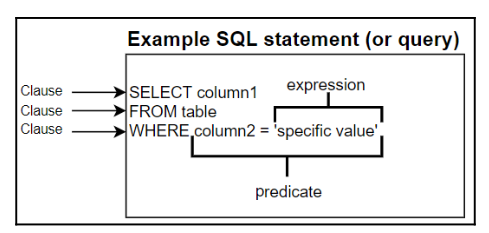
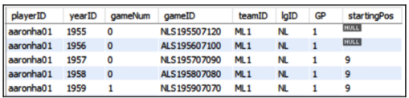
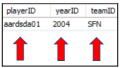

# Understanding RDBMS
## Element of SQL

## Understanding Database
Database (basis data) adalah sekumpulan data. Kita menyimpan basis data dalam bentuk *Relational Database Management System* (RDBMS). RDBMS adalah basis utama untuk database system terkini seperti MySQL, SQL Server, Oracle, PostgreSQL dan lain-lain.

### Table
Table adalah kumpulan dari data yang terikat yang disimpan dalam bentuk kolom-kolom dan baris-baris. Contoh gambar dibawah ini adalah gambaran dari tabel yang mengandung data tentang penampilan para pemain bintang pada olahraga baseball

Nilai **NULL** pada table adalah sebuah nilai yang kosong atau blank. Nilai tersebut tidak merepresentasikan sebuah string dari sebuah spasi kosong. 

### Fields
Fields adalah sebuah persimpangan atau titik temu dari baris dan kolom. Field ini bisa berbentuk dari berbagai mancam tipe data, termasuk `yearID`, `teamID` atau `playerID` field.

