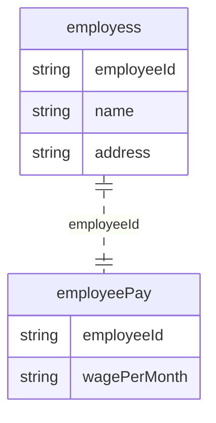
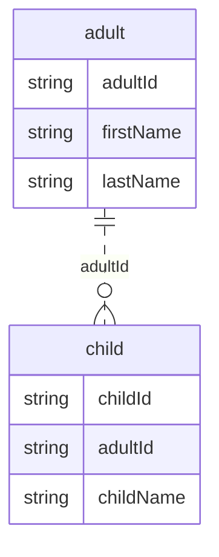
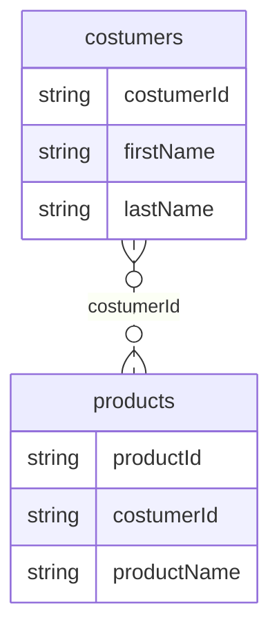
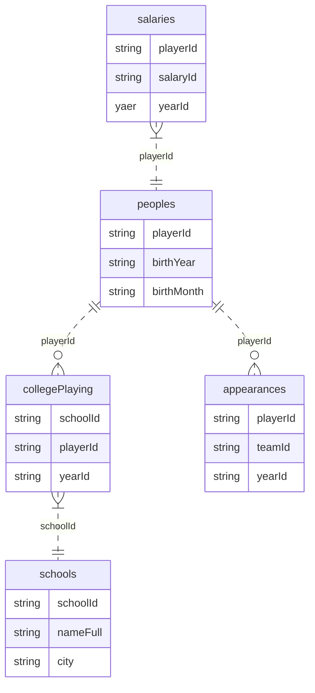

# Creating and Designing Database

## How To Craete Database
### Creates Schema
``` sql
CREATE SCHEMA `schema_name`;
```


## Understanding Table Relationship
Relational databases terdiri dari tabel-tabel yang saling berelasi satu dengan yang lainnya. Saat anda meng-query lebih dari satu tabel, anda dapat mengandakan relasi tersebut untuk meng-join tabel secara bersamaan. Ada tiga tipe relasi tabel: `one-to-one`, `one-to-many` dan `many-to-many`.

### Understanding One-to-One relationships
Dalam tipe hubungan ini, sebuah tabel hanya memiliki satu baris yang sesuai terhadap tabel lain. Tipe hubungan ini juga jarang dan digunakan. Biasanya, database administrator menggunakan ini untuk tujunan keamanan. Misalkan, anda memliki tabel employess, namun ingin membuat tabel terpisah untuk tabel employeePay karena hanya beberapa admin lain yang dapat mengakses tabel employeepay tersebut.



### Understanding One-to-Many Relationships
Dalam tipe hubungan ini, sebuah tabel dapat memiliki satu atau banyak baris yang cocok dengan tabel lain, atau bahkan tidak sama sekali.


### Understanding Many-to-Many Relaionships
Dalam tipe hubungan ini, sebuah tabel cocok dengan banyak baris pada tabel lain. Contohnya, tabel costumers dengan tabel products. Pelanggan dapat membeli lebih dari satu buah produk, sedangkan produk juga dapat dibeli oleh lebih dari satu pelanggan.


### Summary About Relationships


* People memliki hubungan one-to-many terhadap salaries
* People memiliki hubungan one-to-zero atau one-to-many terhadap collegeplaying
* People memiliki hubungan one-to-zero atau one-to-many terhadap apperances
* collegeplaying memiliki hubungan many-to-one terhadap schools

## Learning to Create Database
!!! warning
    Pastikan schema `baseball` sudah dibuat jika ingin mengikuti query yang sama persis dengan query yang disediakan dicatatan ini.

    Jika `baseball` belum dibuat gunakan query dibawah ini
    ``` sql
    CREATE SCHEMA `baseball`;
    ```

Simulasi yang digunakan pada catatan ini akan bersinggunan dengan dua buah tabel, `managers` dan `teams`, dibawah ini adalah sumber data yang akan dimasukan pada kedua tabel tersebut.

* [Managers](https://docs.google.com/spreadsheets/d/1DPlE6I0c6YbVTXauGGDbOyTG8tI7LeRzbJoDFQKAiHk/edit#gid=1669385613){target=_blank}
* [Teams](https://docs.google.com/spreadsheets/d/1pAPZBs4Z_SwDaxQXmoIFw_QF-9ErV5kxu6D7-983PSw/edit#gid=1023570446){target=_blank}

Sebelum membuat tabel,anda harus menginspeksi tabel tersebut sehingga mengetahui hubungan antara tabel Managers dengan Teams dan bagaimana memasang data integrity menggunakan keys dan constraints. Satu hal yang sangat membantu dalam memahai hubunga tersebut adalah dengan melihat perbedaan nilai dari setiap kolom yang ingin kita tambah pada tabel didalam database. Kita dapat memanfaatkan fitur Column Status dari *google spread sheet*.

!!! quote "Hasil inspeksi tabel Manager"
    Kolom yang akan digunakan adalah playerID, yearID, teamID, G, W, L & plyrMgr

    * Tidak ada kolom yang unik
    * playerID terdiri dari 8-9 alphanumeric, bahkan bisa terdiri dari 3 karakter saja (panjang karakternya signifikan).
    * Rentang nilai yearID 1964-2018
    * teamID terdiri dari 3 huruf
    * G, W dan L berisikan angka saja dengan rentang (0-166, 0-115 0-119)
    * plyrMgr terdiri dari nilai Y atau N

!!! quote "Hasil inspeksi tabel Team"
    
    Kolom yang akan digunakan adalah yearID, lgID, teamID, & Rank
    * Tidak ada kolom uang unik
    * Rentang nilai yearID 1871-2018
    * Rank memliki nilai minimum 1, dan maksimum 12
    * teamID terdiri dari 3 huruf
    * lgID terdiri dari 2 huruf
    
Berdasarkan hasil inspeksi terhadap tabel, kita dapat menentukan tipe data yang sesuai sehingga dapat mencapai performa yang terbaik pada database, tabel berikut menerangkan rangkuman nama kolom, tipe data yang digunakan atau termasuk Key atau Constraint

**Rangkuman inspeksi tabel Manager**

| Original Coloumn Name | Table column name | Data type | Key or Constraint |
| :-----| :-----| :-----| :----- |
| Tidak ada | managerkey | SMALLINT(5) | Primary Key Auto Incrament |
| playerID | playerid | VARCHAR(9) | Bagian dari `unique composite key`, `Not Null Constraint` |
| yearID | yearid | YEAR | Bagian dari `unique composite key`, `Not Null Constraint`, dan `Check Constraint` untuk rentang 1964-2018 |
| teamID | teamid | CHAR(3) | Bagian dari `unique composite key`, `Not Null Constraint`, dan `Foreign Key` untuk tabel pada kolom teamID |
| G | games | TINYINT | Not Null Constraint | `Check Constraint` untuk rentang nilai 0-165 |
| W | wins | TINYINT | Not Null Constraint | `Check Constraint` untuk rentang nilai 0-165 |
| L | losses | TINYINT | Not Null Constraint | `Check Constraint` untuk rentang nilai 0-165 |
| plyrMgr | alsoplayer | CHAR(1) | `Not Null Constraint`, `Check Constraint` untuk nilai Y dan N |

**Rangkuman inspeksi tabel Team**

| Original Coloumn Name | Table column name | Data type | Key or Constraint |
| :-----| :-----| :-----| :----- |
| Tidak ada | teamkey | SMALLINT(5) | `Primary Key Auto Incrament` |
| yearID | yearid | YEAR | Bagian dari `unique composite key`, dan `Not Null Constraint` |
| lgID | leagueid | CHAR(2) | Bagian dari `unique composite key`, dan `Not Null Constraint` |
| teamID | teamid | CHAR(3) | Bagian dari `unique composite key`, dan `Not Null Constraint` |
| rank | teamrank | TINTYINT(2) | `Not Null Constraint`, dan `Check Constraint` untuk rentang nilai 0-12 |

!!! note "Natural and Surrogate Primary Key"
    Oke, mari kita membahas tentang pemilihan primary key. Terdapat dua jenis primary key, Natural Primary Key dan Surrogate Primary Key. Natural Key, anda menggunakan beberapa kolom unik dan data yang ada pada kolom tersebut keberadaanya diakui diluar dari database. Surrogate key, anda membuat sebuah kolom yang menampung nilai unik disetiap baris dan nilai tersebut tidak dianggap diluar database, Primary Key Autoincrement.

    Jika ada kolom yang jelas untuk primary key artinya, kolom tersebut benar-benar berisi nilai yang unik, maka gunakan kolom tersebut. Misalnya, kita dapat menggunakan obvious primary key jika salah satu dari tabel tersebut berisikan informasi tentang buku-buku. Setiap buku memliki nomor unik, ISBN. ISBN sebagai natural key adalah pilihan yang tepat. Namun jika dalam kondisi dimana tabel berisikan beberapa kolom yang unik (jika digabungkan) dan tidak ada nilai NULL maka buatlah composite primary key, akan tetapi lebih baik kita hanya memliki satu kolom sebagai nomor unik dari setiap baris. Untuk itu kita dapat membuat Surrogate Primary Key berdampingan dengan composite primary key sebagai nomor identitas setiap baris.

### Creating a Database Tabel using SQL Script
``` sql title="Membuat tabel teams"
CREATE TABLE baseball.`teams` (
`teamkey` smallint NOT NULL AUTO_INCREMENT,
`teamid` char(3) NOT NULL,
`yearid` YEAR NOT NULL,
`leagueid` char(2) NOT NULL,
`teamrank` TINYINT(2) NOT NULL,
PRIMARY KEY (`teamkey`),
UNIQUE KEY `teamkey_UNIQUE` (`teamkey`),
KEY `teamid_yearid_league_id_UNIQUE` (`teamid`,`yearid`,`leagueid`),
CONSTRAINT `check_teamrank` CHECK (((`teamrank` >=0) AND (`teamrank` <= 12))),
CONSTRAINT `check_year` CHECK (((`yearid` >= 1844) AND (`yearid` <= 2155)))
);
```

``` sql title="Membuat tabel managers"
CREATE TABLE baseball.`managers` (
`managerkey` SMALLINT NOT NULL AUTO_INCREMENT,
`playerid` VARCHAR(9) NOT NULL,
`yearid` YEAR(4) NOT NULL,
`teamid` CHAR(3) NOT NULL,
`games` TINYINT(3) NOT NULL,
`wins` TINYINT(3) NOT NULL,
`losess` TINYINT(3) NOT NULL,
`alsoplayer` CHAR(1) NOT NULL,
PRIMARY KEY (`managerkey`),
UNIQUE KEY `managerkey_UNIQUE` (`managerkey`),
UNIQUE KEY `playerid_yearid_teamid_UNIQUE` (`playerid`,`yearid`,`teamid`),
KEY `FK_teamid_idx` (`teamid`), --- (1)!

CONSTRAINT `FK_teamid` FOREIGN KEY (`teamid`) REFERENCES `teams`(`teamid`) 
ON DELETE RESTRICT ON UPDATE RESTRICT,

CONSTRAINT `check_alsoplayer` CHECK ((`alsoplayer`)in (_utf8mb4'Y',_utf8mb4'N')),
CONSTRAINT `check_games` CHECK (((`games` >= 0) AND (`games` <= 165))),
CONSTRAINT `check_wins` CHECK (((`wins` >= 0) AND (`wins` <= 165))),
CONSTRAINT `check_losess` CHECK (((`losess` >= 0) AND (`losess` <= 165))),
CONSTRAINT `check_manageryear` CHECK  (((`yearid` >= 1871) 
AND (`yearid` <= 2155)))
);
```

1.  Coba perhatikan keyword KEY pada syntax ini, KEY `FK_teamid_idx` (`teamid`), jika hal ini dispesifikasikan, maka MySql akan membuantya secara otomatis dengan Key_Name `FK_tables_name`.


## Understanding Indexes
Indexing adalah sebuah metode untuk mengoptimalkan perfoma dari database untuk meningkatkan kecepatan database saat di inquiry. Indexes ditempatkan pada kolom disebuah table. Tabel dapat memiliki lebih dari satu index, banyaknya index bervariasi tergantung tabel. ==Untuk membuat index secara benar, anda harus memahami bagaimana mempersingkat proses query hingga hasil nilai tersebut tampil ke pengguna==. Maka dari itu, sangat disarankan untuk menrencakanan pembuatan index sebelum memasukan data kedalam tabel. Karena, saat membuat index pada sebuah tabel akan lebih cepat prosesnya dibandingkan menambahkan index setelah ada data, bergantung sberapa besar data pada tabel tersebut, karena indexes bekerja dengan mengurutkan (sort) dan menambahkan pointer ke data.

### Understanding How Indexing Relates to Data Integrity
Saat membuat primary key, unique constraint, atau foreign key, MySQL menyimpannya sebagai sebuah indexes. Index ini secara tidak langsung berhubungan terhadap data integrity karena indexing berhubungan dengan Keys dan Constraint yang mana kedua hal itu menentukan data integrity.

#### Types of Indexs
Ada dua tipe dari index;

1. ^^Clustered^^, Index ini menyimpan data secara berurutan (tersortir), maka kolom manamun yang anda pilih sebagai clustered index, maka data akan disimpan secara berurut pada sebuah tabel. Data tersimpan secara fisik pada sebuah disk secara berurutan pada clustered index. Index ini dapat dikiaskan sebagai tree built diatas sebuah tabel. Key pada sebuah kolom yang ditaruh di clustered index menentukan urutan baris pada sebuah tabel. Dibawah ini adalah diagram yang menunjukan contoh bagaimana clustered index tersusun.


2. ^^Non-Clustered^^,  Index ini tidak menyortir data. Akan tetapi index ini menggunakan pointers ke data fisik (disk) untuk menemukan data ketika index digunakan saat meng-query data. Anda dapat membuat beberapa nonclustered index pada sebuah tabel, akan tetapi jangan terlalu banyak karena akan menyebabkan query melambat. Berikut adalah contoh diagram bagaiaman nonclustered index terstruktur.


Oke, agar lebih mengena, mari kita lihat dua tabel diatas yang telah kita buat, tabel `managers` dan players (ditampilkan hanya managers saja).

``` {.sql}
USE baseball;
SHOW INDEX FROM managers;
```

???+ abstract "Hasil query"
    ``` {.sql .no-copy}
    +----------+------------+-------------------------------+--------------+-------------+-----------+-------------+----------+--------+------+------------+---------+---------------+---------+------------+
    | Table    | Non_unique | Key_name                      | Seq_in_index | Column_name | Collation | Cardinality | Sub_part | Packed | Null | Index_type | Comment | Index_comment | Visible | Expression |
    +----------+------------+-------------------------------+--------------+-------------+-----------+-------------+----------+--------+------+------------+---------+---------------+---------+------------+
    | managers |          0 | PRIMARY                       |            1 | managerkey  | A         |           0 |     NULL |   NULL |      | BTREE      |         |               | YES     | NULL       |
    | managers |          0 | managerkey_UNIQUE             |            1 | managerkey  | A         |           0 |     NULL |   NULL |      | BTREE      |         |               | YES     | NULL       |
    | managers |          0 | playerid_yearid_teamid_UNIQUE |            1 | playerid    | A         |           0 |     NULL |   NULL |      | BTREE      |         |               | YES     | NULL       |
    | managers |          0 | playerid_yearid_teamid_UNIQUE |            2 | yearid      | A         |           0 |     NULL |   NULL |      | BTREE      |         |               | YES     | NULL       |
    | managers |          0 | playerid_yearid_teamid_UNIQUE |            3 | teamid      | A         |           0 |     NULL |   NULL |      | BTREE      |         |               | YES     | NULL       |
    | managers |          1 | FK_teamid                     |            1 | teamid      | A         |           0 |     NULL |   NULL |      | BTREE      |         |               | YES     | NULL       |
    +----------+------------+-------------------------------+--------------+-------------+-----------+-------------+----------+--------+------+------------+---------+---------------+---------+------------+
    ```

    * Primary Key (PRIMARY dan managerkey_UNIQUE) adalah clustered index, dan key tersebut akan didapati primary key field dalam urutan ascending pada sebuah tabel, dan kolom managerkey yang akan menjadi primary key-nya.
    * Unique Key (playerid_yearid_team_id_UNIQUE) adalah non-clustered index. Unique key ini akan memaksa keunikan sebuah kolom di key.
    * Foreign Key(FK_teamid) adalah non-clustered index, index ini akan mempercepat query ketika anda meng-query field yang ada didalam foreign-key.


### Understanding how indexing impacts performance
Saat anda menjalankan query, MySQL menentukan bagaimana mengambil data dari tabel. Jika tabel tersebut tidak memiliki index, maka query tersebut harus memindai semua baris pada tabel untuk menemukan data, sama seperti anda ketika ingin mencari rumus tertentu dari sebuah buku yang tidak memliki halaman index, anda harus membaca semua halaman satu demi satu. Hal itu akan memakan waktu, tergantung seberapa banyak halaman pada buku tersebut. Sama halnya dengan index pada sebuah tabel. Oke, mungkin anda tidak akan merasa query terlalu lama pada tabel memliki data yang sedikit. Namun jika tabel sudah menampung data yang sangat banyak maka query akan menjadi sangat lama. Ditambah jika ada pengguna lain didalam waktu yang sama meng-query tabel yang sama, maka bisa jadi salah satu query dari para pengguna tidak akan muncul hasilnya disebabkan ==query memblock query yang lainnya atau disebut dengan **deadlock**==.

Ketika anda menjalankan sebuah query terjadilah sebauh proses yang disebut dengan **locking**, dan locking ini tidak buruk karena umum dan pasti terjadi. Akan tetapi, dapat menjadi masalah jika ada query lain yang berbeda mengganggu satu sama lain yang menyebabkan terjadinya **blocking**.


Secara detail bahwa blocking terjadi ketika satu atau lebih query mencoba me-read atau write data yang sama. Terkadang, blocking terjadi dalam waktu yang sangat singkat, sehingga blocking ini tidak terlalu mengkhawatirkan. Akantetapi jika dua atau lebih query meminta data yang sama, lalu membuat locks yang tidak dapat diurai, maka MySQL akan mematikan (kill, lamanya tergantung MySQL mengembalikan data sesuai dengan query yang diberikan) proses query. Dan ini yang disebut dengan deadlock. MySQL harus mengembalikan data (roll back) sesuai query jika tidak berhasil meng-inserting, updating, atau deleting data agar data tetap pada kondisi yang konsisten (constent state).

Jika anda membuat index dan menggunakannya pada query, maka dapat mengurangi kemungkinan terjadinya blocking dan deadlocking karena index akan membuat query data menjadi lebih cepat.

!!! note "catatan penting yang menyangkut tentang indexing"

    * Indexing tidak mempercepat segala proses pada tabel didalam databse. Indexing tidak akan mempercepat prosesi write (inserting, updating dan deleting), akan tetapi hanya mempercepat proses reading.
    * Urutan kolom dalam index itu penting. Jika anda ingin menyortir query data hanya pada yearid, namun urutan index anda adalah managerid dan selanjutnya yearid maka query tidak akan meningkatkan performa. Jika anda ingin menyortir yearid, maka anda harus memeliki index pada yearid pada kolom pertama sebuah index.
    * Index dapat mengkonsumsi banyak penyimpanan. Clustered Index tidak terlalu menggunakan ruang disk karena clustered index sudah tersusun pada sebuah disk, akan tetapi, untuk nonclustered index dapat memakan ruang penyimpanan yang lebih banyak tergantung seberapa besar tabel dan banyak kolom didalam index.
    * Ketika menambahkan index pada kolom, perhatikanlah dan hati-hati jika memliki banyak kolom pada index. Misalkan, memasukan semua kolom pada tabel anda ke index tidak akan membuat nya lebih cepat, ditambah jika tabel anda memliki banyak kolom. Jika tabel anda hanya memliki beberap kolom, maka memasukan semua colom kedalam index mungkin bisa termasuk dikatakan implemetasi yang bagus.
    * Indexing kolom yang memiliki banyak nilai yang tidak unik (seragam) tidak memberikan peningkatan performa yang signifikan. Jika ada sedang memutuskan kolom mana yang harus diberi index, pilihlah kolom dengan tingka variasi datanya tinggi.

### Understanding naming conventions for indexes
Saat memberikan nama pada index, sangat penting untuk memberikan nama yang menggambarkan dengan jelas jenis index tersebut. Sebagaimana yang telah kita buat pada tabel managers. kita memberikan nama `managerkey_UNIQUE` yang jika dibaca kita mengetahui bahwa index tersebut unik untuk kolom managerkey.

 Umumnya, dan praktik yang dapat ditiru bila memberikan nama index dengan nama kolom dan ditambah dengan karakter awalan atau akhiran yang menjelaskan index macam apa itu. Berikut contoh saran nama index.

|Sample index name| What it contains|
|:---:|:----|
|`cix_firstname_lastname`| Clustered index of first and last names|
|`ix_firstname_lastname`| Nonclustered index of first and last names|
|`ncix_firstname_lastname`| Nonclustered index of first and last names|
|`idx_firstname_lastname`| Nonclustered index of first and last names|