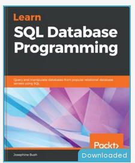

:material-progress-clock: **Masih dalam proses belajar, catatan ini masih dapat berkembang**

!!! warning

    Catatan ini sifatnya pribadi untuk umum, artinya siapa saja bisa baca. Namun saya tidak bertanggung jawab secara  penuh jika anda menggunakan apa yang ada pada catatan ini dan menjadi masalah

# Background
Empat bulan setelah saya bekerja disalah satu PT didaerah jakarta dan saat itu adalah waktunya penilaian saya yang nantinya menentukan apakah dijadikan pegawai tetap atau tidak. Hasil tersebu cukup memuaskan, dan Alhamdulillah saya lulus dan menjadi pegawai tetap. Pada form tersebut saya mendapatkan masukan dari atasan (`team leader`) untuk mendalami lagi tentang database, DDL (Data Definition Language) dan DML (Data Manipulation Langeuage).

Sejatinya, nasihat adalah bahan bakar untuk kita terus lebih baik. Maka dari itu memang tidak salah untuk kita coba mempelajari lebih dalam tentang database. Kali ini yang tertuang pada lembaran digital ini adalah salah satu database yang terkenal, yaitu **MySql**

---

عن أنس – رضي الله عنه – ، عن النَّبيّ – صلى الله عليه وسلم – ، قَالَ : ( لا يُؤمِنُ أحَدُكُمْ حَتَّى يُحِبَّ لأَخِيهِ مَا يُحبُّ لِنَفْسِهِ ) مُتَّفَقٌ عَلَيهِ .

Dari Anas *radhiyallahu ‘anhu*, ia berkata, “Tidaklah sempurna iman seseorang di antara kalian sampai ia mencintai saudaranya sebagaimana ia mencintai dirinya sendiri.”  (Muttafaqun ‘alaih. HR. Bukhari no. 13 dan Muslim no. 45)[^1]

## Resources

Sumber buku berjudul **Learn SQL Database Programming** yang ditulis oleh *Josephine Bush* dan dipublish oleh Packt Publishing.

Buku ini memliki 14 Chapter dan dibagi menjadi 5 sesi berikut;

1. Database Fundamental
2. Basic SQl Querying
3. Advanced SQL Querying
4. Presenting Your Finding
5. SQL Best Practice

## Why this books ?
Oke, pertama, saya sangat suka dengan kebanyakan struktur serta bahasa dari buku yang diterbitkan Packt (Walaupun terkadang tidak semuanya), sehingga mudah untuk dipahami dan tidak lompat sana dan lompat sini dari setiap chapter, terususun secara heirarki.

Termasuk dari buku ini, penjelasan dari penulis sangat detail ke tekhnis dengan bahasa yang mudah serta dilengkapi dengan contoh dan output dari setiap query yang dipampang pada buku ini. Selait itu, buku ini juga menyediakan resouce berupa query-query yang ada pada buku ini serta disediakan juga data untuk berlatih.

## Mana resource nya ?
Oke, kunjungi [github ini](https://github.com/PacktPublishing/learn-sql-database-programming)

[^1]: https://rumaysho.com/3648-nasehat-adalah-cinta.html
