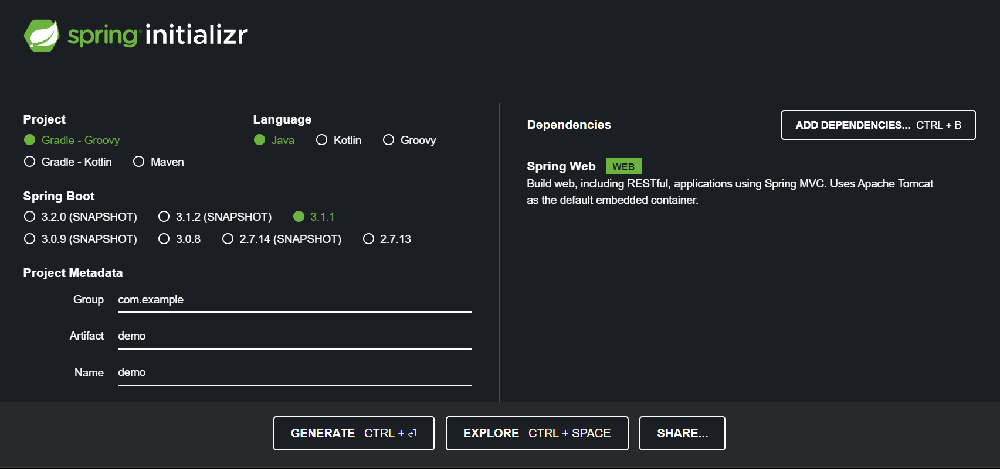
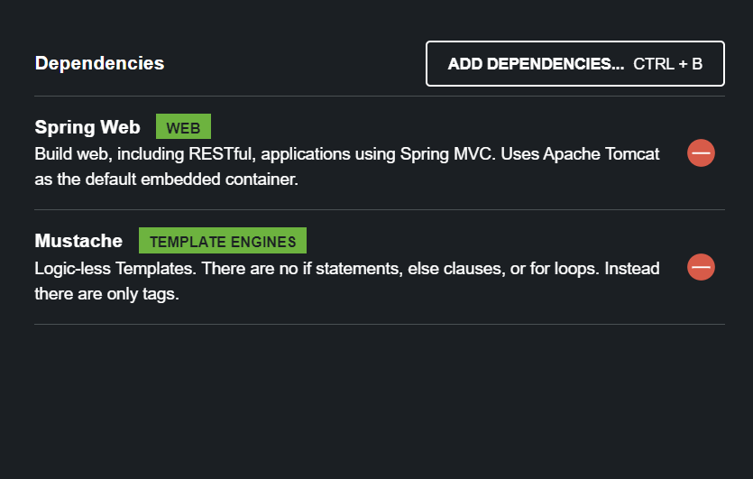

## Using `start.spring.io` to build apps
Banyak web stack diluarsana menggunakan banyak pustakan atau tools untuk membangun web application dan semuanya berisikan modul-modul yang saling berhubungan. Termasuk dengan Spring Boot, terdiri dari module-module.

Dahulu, sebelum lahirnya spring boot, setidaknya programmer dalam membangun sebuah web application mereka harus mencari sample maven di _stackoverflow_ atau beberapa blog yang menyediakan kumpulan modul yang sudah siap dipakai.

Namun setelah hadirnya Spring Boot, kita dapat memanfaatkan [start.spring.io](https://start.spring.io). Website tersebut dibuat dan dimaintain oleh **Spring Team**.

Sebelum membuat package, kita dapat memimilih yang disediakan, diantaranya;

1. Kita dapat memilih versi dari Spring Boot
2. Dapat memilih tool yang digunakan untuk membangun website, (_Gradle_ atau _Maven_)
3. Dapat memilih versi java (Minimum 17)
4. Dapat memilih module (Spring atau third party module lainnya) untuk digunakan pada project


!!! warning
    Saat memilih **Packaging**, Lebih baik memilih JAR files dari pada WAR files (hanya untuk beberapa aplikasi server) sebagai _packaging mechanism_.




:   `Setidaknya untuk bagian ini, ikuti pilihan dibawah ini`

| Choose | Value |
| :----- | :----- | 
|Project | Maven|
| Langauge | Java|
| Spring Boot | 3.08|
| Project Metadata | Bebas, disesuaikan|
|Depedencies |Spring Web|

Setelah memilih field yang tersedia maka secara otomatis web akan mendownload compress file  dengan ekstensi rar. Selanjutnya uncompress file tersebut lalu buka folder menggunakan IDE yang digunakan.

## Creating a Spring MVC web controller
Setelah membuat folder project tersebut menggunakan IDE (saya menggunakan Intellij). InsyaAllah pada bagian ini kita akan membuat **web controller**.

Jadi apa itu **web controller** ? itu adalah {==sebuah kumpulan kode yang dapat menerima HTTP _request_ dan dapat memberikan respone==}. Biasanya, respone yang diberikan oleh web controller adalah HTML namun web controller juga dapat memberikan respone dalam bentuk JSON (Java Script Object Notation). HTTP request yang diterima oleh web controller dapat bervariasi, umumnya menggunakan GET atau POST.

Bagain dari Spring yang membuat kita dapat mambangu web controller adalah **Spring MVC (Movel View Control)**. Spring MVC adalah Module dari spring framework yang membuat kita dapat membangun sebuah aplikasi web diatas *servlet-based containers* menggunakan paradigma MVC.

Jika kita melihat file `pom.xml` yang berada pada root project. Pada bagian dependecies kita dapat melihat depedency Spring MVC

=== "pom.xml"

    ```xml
    <dependency>
        <groupId>org.springframework.boot</groupId>
        <artifactId>spring-boot-starter-test</artifactId>
        <scope>test</scope>
    </dependency>
    ```

Dependency diatas membuat kita dapat menggunaka anotasi yang disedian oleh Spring MVC dan komponen lainnya, serta membuat kita dapat mendefinisikan web controller. Untuk membuat web controller pertama, mari kita buat sebuah class dengan nama `HomeController`

!!! quote "Code"

    === "HomeController.java"

        ```java
        @Controller
        public class HomeController {

            /**
             * Anotasi untuk pemetaan HTTP GET alamat / untuk memanggil method ini
             * @return
             */
            @GetMapping("/")
            public String index(Model model){
                return "index";
            }
        }
        ```
Deskripsi kode diatas sebagai berikut

*  `@controller`: Anotasi Spring MVC untuk berkomunikasi ke Spring Boot bahwa class ini adalah web controller. Jadi, ketika aplikasi dijalankan, Spring Boot akan secara otomatis mendeteksi class ini melalau **component scanning** dan akan membuat instance class tersebut. (Dengan demikian, kita tidak perlu membuat instance dari class tersebut, karena hal itu sudah ditangani oleh Spring Boot)

*   `@GetMapping("/")`: Anotasi Spring MVC untuk pemetaan HTTP GET pada alamat root **/**. Jika client mengirim request alamat root, maka Spring Boot akan memanggil method dengan anotasi ini.

*   `index`: Karena kita menggunakan anotasi `@Controller`, maka return nilai `index` akan menjadi nama dari template yang akan dirender.

!!! info
    Nama dari class atau method tidak terlalu penting, namun anda harus memberikan dengan nama yang menggambarkan fungsi dari class dan method tersebut. Yang paling penting adalah anotasi `@Controller`` dan`` @GetMapping` yang mana memberikan sinyal bahwa class ini adalah web controller dan method yang dipanggil saat menerima request.

Alhamdulillah, kita sudah membaut sebuah web controller, namun ada yang terlewat, yaitu template. Dimana baru saja kita lihat pada catatan ini, method yang menggunakan `@GetMapping` mengembalikan nama dari template yang akan dirender. Pada bagian selanjutnya kita akan menambahkan module yang berguna untuk menrender template.

## Leveraging template to create content
Kita akan menggunakan module **mustache**. Saat awal membuat project di spring.initializr, kita dapat memilih mustache sebagai template engine.



Namun bagaimana jika kita sudah membuat web controller selama 3 bulan, dan apakah kita harus membuat project dari awal ?

Tentu tidak, kita dapat menambahkan module tersebut pada exisiting project dengan cara menambahkan depdency pada file `pom.xml` pada root folder.


=== "pom.xml"

    ```xml hl_lines="11-14"
    <?xml version="1.0" encoding="UTF-8"?>
        <project xmlns="http://maven.apache.org/POM/4.0.0" xmlns:xsi="http://www.w3.org/2001/XMLSchema-instance"
            xsi:schemaLocation="http://maven.apache.org/POM/4.0.0 https://maven.apache.org/xsd/maven-4.0.0.xsd">
            ...
            <dependencies>
                <dependency>
                    <groupId>org.springframework.boot</groupId>
                    <artifactId>spring-boot-starter-web</artifactId>
                </dependency>

                <dependency>
                    <groupId>org.springframework.boot</groupId>
                    <artifactId>spring-boot-starter-mustache</artifactId>
                </dependency>
            </dependencies>
            ...

        </project>
    ```

Jika module telah ada pada project kita, kita dapat langsung membuat sebuah template. 

Bawaanya, Spring Boot akan membaca semua template yang ada pada folder `src/resources/templates`. Setiap template engine[^1] memiliki _suffix_ masing-masing. Untuk template **mustache** akhirannya adalah `.mustache`. Ketika method pada controller kita mengambilan nilai `index`, spring boot akan mentransform kedalam `src/resources/templates/index.mustache`, lalu mengambil file tersebut dan mengirimnya ke Template Engine.

[^1]: Selain mustahce ada, Thymeleaf, Apache Freemaker dan Groovy Template.


Selanjutnya mari kita buat file `index.mustache` pada `src/resources/templates/`.

!!! quote "Code"

    === "inde.mustache"

        ```html
        <!DOCTYPE html>
        <html lang="en">
        <head>
            <meta charset="UTF-8">
            <title>Title</title>
        </head>
        <body>
            <h3>Bismillah</h3>
            <p>
                Halo semuanya
            </p>
            </body>
        </html>
        ```

Selanjutnya kita jalankan aplikasi dan bukan alamat `localhost:8080`[^2]. Jika tidak ada error, insyaAllah kita dapat melihat tampilan web sedeharna. Alhamdulillah sekarang kita telah membuat web controller dan template hamalam HTML.

[^2]: `localhost` adalah alamat mesin anda, bisa juga berisi nilai `127.0.0.1`. Sedangkan untuk `8080` adalah port bawaan yang digunakan oleh Tomcat. (Spring boot menggunakan server tomcat)

!!! info "Folder Contoh"
    Kode dapat dilihat pada module `bagian_2_awal`

### Adding demo data to a template
Applikasi web sesungguhnya menyediakan data. Data tersebut bisa bersumber dari DataBase, file pada server atau semisalnya. Untuk contoh kali ini, kita akan membuat demo data yang nantinya akan kita tampilkan pada template. Dibawah ini adalah update dari file `HomeController.java`

!!! quote "Code"

    === "HomeController.java"

        ```java
        @Controller
        public class HomeController {

            // #1
            record Video(String name){};
            
            // #2
            List<Video> videos = List.of(
            new Video("Film 1"),
            new Video("Film 2"),
            new Video("Film 3")
            );

            /**
             * Anotasi untuk pemetaan HTTP GET alamat / untuk memanggil method ini
             * @return
             */
            @GetMapping("/")
            public String index(Model model){ // #3
                // #4
                model.addAttribute("videos",this.videos);
                return "index";
            }
        }
        ```

Pada kode diatas kita menambah beberapa baris kode;

1. Kita membuat sebuah class baru dengan nama `Video`.
2. Kita men-declare dan initiate property `videos` untuk class HomeController.
3. Kita menambahkan parameter Model dari pada method dengan anotasi @GetMapping
4. Kita menambahkan attribute menggunakan method `#!java model.addAttribute` dan memberikan nama dengan nilai `videos` dan data dari property `#!java this.videos`.

!!! info
    Java 17 menyediakan beberapa fitur yang sangat membantu kita dalam mengambangkan aplikasi menggunakan Spring Boot. Salah satunya dapat kita lihat pada contoh diatas. Dimana kita membuat sebuah Object Video hanya dengan satu baris kode menggunakan statement **record**


!!! tip
    Mengapa kita harus membuat `record` untuk meng- _encapsulation_ data dengan elemen tunggal ?
    ___
    Karena Mustache beroperasi menggunakan _attribute_ yang bernama. Kita dapat secara manual membuat JSON yang berisikan _name_ dan _value_, namun dengan adanya Java 17 kita dapat langsung dengan mudah menggunakan `record`. Ditambah, fitur tersebut memberikan type safety.

Untuk mengirim data ke template, kita membutuhkan objek yang dipahami oleh Spring MVC. Kita butuh holder untuk menyimpan data. Untuk itu, kita membutuhkan parameter `Model` pada method index. 

Spring MVC memiliki attribute opsional yang dapat kita gunakan untuk web method apapun, contoh ini kita menggunakan, `Model` yang berguna jika kita ingin mengirim data ke template enggine.

Pada `HomeController.java` kita juga telah membuat data dummy `#!java List<Video>.` dan mengirimnya menggunakan method attribute yang diberi nama **videos**. 

Untuk membaca data _videos_ yang dikirim ke template enggine menggunakan fungsi `#!java model.addAttribute()` kita perlu mengubah file `index.mustache` sebagai berikut,

!!! quote "Code"

    === "index.mustache"

        ```html hl_lines="4-8"
        <!DOCTYPE html>
        <html lang="en">
        ... <!-- dipersingkat -->
        <ul>
            {{#videos}}
                <li>{{name}}</li>
            {{/videos}}
        </ul>
        </body>
        </html>
        ```
Penjelasan kode yang di- _highlight_ diatas sebagai berikut;

*   `{{#videos}}`: **Directive** untuk mengambil attribute `videos` yang kita berikan pada object `#!java Model`. Karena yang kita berikan dalam bentuk data list maka mustache memperlebar sebanyak data yang ada pada list. _It will iterate over each entry of the `#!java List<Video>` collection stored in Model and create a separate HTML `#!html <li>` entry._

*   `{{name}}`: _Indicates we want the name field of the data construct. This lines up with our Video type’s name field. In other words, for each entry of `#!java List<Video>`, print out the name field between `#!html <li>` and `#!html </li>`._

*   `{{/videos}}`: _Indicates the end of the looping fragment._

!!! info "Folder Contoh"
    Kode dapat dilihat pada module `bagian_2`


### Building our app with a better design
Aplikasi terakhir yang kita buat masih sederhana. Secara gamblang kita membuat data model dan menyediakannya untuk ditampilkan pada template.

Namun terdapat masalah kedepannya, dimana design kode kita tidak dapat digunakan kembali (not reusable). Maka dari itu kita butuh controller kedua dimana ada beberapa alasan mengapa kita melakukan itu;

1.  Controller seharusnya tidak mengurusi definisi data. Karena tugas mereka hanyalah memberikan respone atas request lalau berinteraksi dengan service lain atau sistem, definisi ni harus berada pada tingkat bawah.

2.  Web controller yang menangani beban yang banyak (_serving data, manage data, calculate data, etc_) akan membuat kita kesuliat saat ada penyesuaian pada web. Maka dari itu, sangat disaranakan jika managemen data ditaruh pada tingkat yang lebih bawah.

Maka dari itu, kita akan memindahkan class `Video` ke file tersendiri, `Video.java`.


!!! quote "Code"

    === "Video.java"

        ```java
        record Video (String name) { }
        ```

Selanjutnya, kita akan memisahkan daftar objek Videos kedalam service yang terpisah. Kita akan membuat class baru dengan nama VideoService dengan isi sebagai berikut;

!!! quote "Code"

    === "VideoService.java"

        ```java
        @Service
        public class VideoService{
            private List<Video> videos = List.of(
                    new Video("Film 1"),
                    new Video("Film 2"),
                    new Video("Film 3")
            );

            public List<Video> getVideos(){
                return this.videos;
            }
        };
        ```
`@Service`: Anotasi yang menunjukan sebuah class yang harus diambil saat _component scanning_ dan ditambahkan pada _application context_.

Selanjutnya kita akan memodifikasi kode dari `HomeController` menjadi sebagai berikut;

!!! quote "Code"

    === "HomeController.java"

        ```java
        @Controller
        public class HomeController {
            private VideoService videoService;

            public HomeController(VideoService videoService){
                this.videoService = videoService; // Inject VideoService.
            };

            ... // Cut
        }
        ```

#### Injecting dependencies through constructor calls
Constructor injectiong adalah yang paling disukai oleh programmer untuk memberikan dependecies yang Spring bean butuhkan melalui constructor. Untuk itu, setiap kita membuat Java class yang diambil oleh Spring Boot sata componet scanning. Spring Boot secara ototmatis akan melihat apakah ada injection points, dan jika ada, maka Spring Boot akan melihat apllication contextnya dan menginject-nya. Metode tersebut disebut dengan **Autowiring**. Kita membiarkan Spring yang menangani pencarian dependencies dari Spring pada application context serta memasang depedencies tersebut.

Karena kita sudah meng-inject `VideoServive` kedalam `HomeController`, kita dapat mengupdate method `#!java index()` sebagai berikut;

!!! quote "Code"

    === "HomeController.java"

        ```java
        ...
        @GetMapping("/")
        public String index(Model model){
            model.addAttribute("videos", videoService.getVideos());
            return "index";
        }
        ```

!!! info "Folder Contoh"
    Kode dapat dilihat pada module `bagian_2_2`


### Changing the data through HTML forms
Pada bagian kali ini kita akan membuat sebuah web yang dapat menerima dan menampung data pada `#!java List<String>`. Pertama kita harus membuat perubahan pada `index.mustache` agar bisa menerima input dari user.

!!! quote "Code"

    === "index.mustache"

        ```html
        ...
        <form action="/new-video" method="post">
            <input type="text" name="name">
            <button type="submit">Submit</button>
        </form>
        ```

Jika kita melihat kode diatas, pada nilai di attribute _action_ dan _method_ artinya setelah user mengisi nilai masukan, user akan membuat request ke `HTTP POST /new-video`. Maka dari itu kita harus membuat mapping untuk memberikan respone atas request tersebut. Dibawah ini adalah update dari `HomeController.java`;

!!! quote "Code"

    === "HomeController.java"

        ```java hl_lines="14-18"
        @Controller
        public class HomeController {
            private VideoService videoService;

            public HomeController(VideoService videoService){
                this.videoService = videoService;
            };
            @GetMapping("/")
            public String index(Model model){
                model.addAttribute("videos", videoService.getVideos());
                return "index";
            }

            @PostMapping("/new-video")
            public String addVideo(@ModelAttribute Video newVideo){
                this.videoService.create(newVideo);
                return "redirect:/";
            }
        }
        ```
Dibawah ini adalah penjelasan dari kode yang kita highlight

*   `@PostMapping("/new-video")`: Anotasi untuk menerima POST /new-video dan mengarahakannya ke method ini.
*   `@ModelAttributes Video newVideo`: Anotasi untuk mem-parse, mengurai incoming HTML form kedalam Video Object
*   `videoService.create()`: Method yang akan kita buat setelah ini, fungsi ini untuk menambahkan nilai masukan ke `#!java List<String>`
*   `"redirect:/"`: Spring MVC directive yang mengirim ke browser HTTP 302 Found to URL */*. 302 redirect adalah standar yang digunakan untuk merujuk kembali ke url tertentu.

Sekarang kita harus membuat method dengan nama `#!java videoService.create(Video newVideo)`. Namun ada yang perlu diperhatikan, kita menggunakan `#!java List.of()` untuk membuat kumpulan video, yang mana menghasilkan **immutable lists**.Namun, karena Immutable list implement java List interface, yang mana memberikan kita akses method `#!java add()`. Namun jita kita menggunakan method tersebut, akan memunculkan exception `#!java UnsupportedOperationException`.

!!! quote "Code"

    === "Example.java"

        ```java hl_lines="14-18"
        @Service
        public class VideoService{

            private List<Video> videos = List.of(
                    new Video("Film 1"),
                    new Video("Film 2"),
                    new Video("Film 3")
            );

            public List<Video> getVideos(){
                return this.videos;
            }

            public Video create(Video addedVideo){
                ArrayList<Video> extend = new ArrayList<Video>(this.videos);
                extend.add(addedVideo);
                this.videos = List.copyOf(extend);
            }
        };
        ```

Holla, sekarang kita bisa mengirim data pada form.

!!! info "Folder Contoh"
    Kode dapat dilihat pada module `bagian_2_3`

## Creating JSON-based APIs
Salah satu yang membuat Spring Boot powerfull adalah, ketika kita menambahkan Spring web kesebuah project, module tersebut sekaligus menambahkan **Jackson** ke classpath. Jackson adalah pustaka untuk Serialization/Deserialization JSON ke Java Object atau sebaliknya.

Kali ini, isnyaAllah kita akan membuat REST API. Maka dari itu, kita harus membuat sebuah class baru pada package yang sama. Kita akan membuat class dengan nama `ApiController` dan diberi anotasi @RestController.

@RestController mirip dengan @Controller. Itu adalah {==anotasi yang memberikan sinyal ke Spring Boot bahwa class ini secara otomatis harus diambil saat component scanning dan dijadikan sebuah Spring bean==}. Bean ini akan didaftarkan pada application context dan juga dengan Spring MVC sebagai conroller class sehingga dapat merujuk ke web calls.

Namun ada tambahan property, anotasi tersebut merubah semua method dari _template-based_ ke _JSON-based_. Dalam kata lain, dari pada web method mengembalikkan nama dari template yang Spring MVC render melalaui template engine, anotasi tersebut akan mengembalikan serialize data menggunakan Jackson.

!!! quote "Code"

    === "APIVideos.java"

        ```java
        @RestController
        public class APIVideos {
            private VideoService videosService;

            public APIVideos(VideoService videos){
                this.videosService = videos;
            }

            @GetMapping("/API/videos")
            public List<Video> getAll(){
                return this.videosService.getVideos(); //#(1)!
            }
        }
        ```
        
        1.  Akan dirender otomatis dari `#!java List<Video>` kedalam JSON oleh Jackson

Method diatas akan mengambil list dari vide dan mengembalikan list tersebut, yang menyebabkan list tersebut dirender kedalam bentuk JSON Array oleh Jackson.

Sekarang coba kita gunakan [postman]() untuk mengirim request, maka hasil yang didapatkan sebagai berikut;

```json
[
    {
        "name": "Film 1"
    },
    {
        "name": "Film 2"
    },
    {
        "name": "Film 3"
    }
]
```

API yang hanya menghasilkan JSON tidak dikatan API yang sesungguhnya, API tersebut juga harus menerima nilai masukan dan melakukan sesuatu dibelakangnya dan memberikan respone balikan juga dalam bentuk JSON. Untuk itu kita harus membuat HTTP Post call pada class yang sama, `ApiController`.

Sekarang kita tambahkan method `#!java addVideo()` pada class `APIVideos`

!!! quote "Code"

    === "APIVideos.java"

        ```java hl_lines="14-17"
        @RestController
        public class APIVideos {
            private VideoService videosService;

            public APIVideos(VideoService videos){
                this.videosService = videos;
            }

            @GetMapping("/API/videos")
            public List<Video> getAll(){
                return this.videosService.getVideos();
            }

            @PostMapping(value = "/API/videos", consumes = {"*/*"})
            public Video addVideo (@RequestBody Video addVideo){
                return this.videosService.create(addVideo);
            }
        }
        ```

Kode diatas dijelaskan sebagai berikut;

* `@PostMapping`: Memetakan pemanggilan HTTP POST pada `/api/vidoes` ke method `#!java addVideo()`.

* `@RequestBody`: Anotasi Spring MVC yang berfungsi untuk menandakan bahwa request body yang masuk pada HTTP request harus di deserialisasi menggunakan Jacskon kedalam argumen `addVideo` sebagai objek Video.

* Selanjutnya kita mengembalikan nilai kembalian dari method `#!videosService.create()`, yang mana berisi judl video yang baru ditambahkan.

Selanjutnya kita buka aplikasi Postman lalu jalankan request ke HTTP Post `/API/videos`, dan memberikan body data JSON seperti dibawah ini

```json
{
    "name":"Mulia dengan manhaj salaf"
}
```

??? quote "Request and Respone"
    

!!! info "Folder Contoh"
    Kode dapat dilihat pada module `bagian_2_4`

## Hooking in Node.js to a Spring Boot web app
Sudah menjadi _"standard defacto"_ bahwasanya JavaScript wajib digunakan pada aplikasi web modern. Banyak front-end menggunakan JavaScript, salah satu framework yang akan kita gunakan, **React**. Namun, untuk menggunakan framework tersebut kita harus masuk ke dunia **Node.js**. _Alhamdulilah_ -nnya, ada plugin Maven yang menjembatani kita antara Spring Boot dengan Node.js, plugin tersebut disebut dengan **Maven Frontend Plugin**. Plugin ini {==menggabungkan Node.js dengan siklus hidup Maven, sehingga membuat kita dapat secara benar melibatkan Node.js seperti saat kita ingin mengunduh packages hingga menggabungkan kode JavaScript menjadi satu kesatuan dengan aplikasi java kita (Spring Boot)==}.

Tentu, compiling dan bundling JavaScript Payload akan sia-sia jika tidak ada cara bagi Spring Boot untuk membuatnya Online. Alhamdulillahnya, Spring Boot memiliki solusi. Apapun yang ada di path `src/main/resources/static` secara otomatis akan diambil dan akan dijadikan sebagai alamat basis dari aplikasi web ketika digabungkan. Artinya, kita hanya perlu mengarahkan tool bundling dari Node.js untuk menaruhnya hasil dari compile react ke alamat tersebut.

Bismillah, pada catatan ini akan dipaparkan bagimana meng-install plugin, Node.js, npm, react.js dan integrasi dengan SpringBoot API yang telah dibuat pada bagian [Creating JSON based API](#creating-json-based-apis)

Pertama kita mulai dengan `front-end-maven-plugin`. Pada file `pom.xml` yang berada pada dasar direktori kita perlu menambahkan element plugin dan informasi terkait plugin tersebut. Masukan konfigurasi dibawah ini pada file tersebut. 

!!! info
    Element `plugins` sama seperti dengen `depdencies`, dimana kita dapat menginstall lebih dari satu depedency dan plugin.

!!! quote "Install front-end-maven-plugin"

    === "pom.xml"

        ```xml
        <plugin>
                <groupId>com.github.eirslett</groupId>
                <artifactId>frontend-maven-plugin</artifactId>
                <version>1.12.1</version>  
                <executions>
                    <execution>
                        <goals>
                            <goal>install-node-and-npm</goal>
                        </goals>
                    </execution>
                <executions>
                <configuration>
                    <nodeVersion>v18.17.0</nodeVersion>
                </configuration>
        </plugin>
        ```
Penjelasan:

1.  Kita menambahkan kordinat versi *1.12.1* untuk `frontend-maven-plugins`.
2.  Untuk saat ini pada plugin kita hanya memiliki satu buah _execution_ yaitu *install-node-and-npm*.
3.  Pada element `configuration` kita membuat spesifikasi untuk versi Node.js, *V18.17.0*

!!! note
    Plugins akan melakukan tugasnya saat fase **generate-resouces**

!!! warning
    Proses _setup_ pada catatan ini dipecah-pecah agar kita dapat memahami setiap konfigurasi yang kita tuliskan pada `pom.xml`. Namun sebenarnya kita dapat menuliskan setup sekaligus dalam proses jalannya maven.

Perlu diketahui, proses yang dijalankan maven adalah mengunduh Node.js, npm (Node Package Manager), dan npx (Node Package Execution) pada project root didalam folder **node**.

!!! info "Tips"
    Node.js and all its tools and modules can be considered intermediate build artifacts. There’s no need to commit them to version control. So, be sure to add the node folder as well as the intermediate node_modules folder to your list of items to not commit (for example, add node and node_modules to the project’s .gitignore file).

### Bundling JavaScript with Node.js
Sekarang kita sudah memiliki tools, npm. Namun kita belum memiliki module. Sebelum kita menulis kode Node.js, pertama kita harus menginstall Node.js Package Bundler yaitu **pickles**. Kita akan menggunakan npm. Bukalah _CMD_ atau terminal pada root folder dan jalankan command dibawah ini.

```bash
node/npm install --ignore-script --save-dev parcel
```

Perintah diatas akan menggunakan Node.js yang terinstall lokal hanya pada project tersebut dan memerintahkan npm untuk membuat file `package.json`. Opsi `--save-dev` memberi sinyal bahwa module tersebut sebagai module yang hanya digunakan untuk pengembangan dan bukan package yang digunakan oleh applikasi kita.

Sekarang kita memliki `package.json` untuk project, selanjutnya kita harus mengaitkannya kedalam _frontend-maven-plugin_. Untuk itu kita harus menamhkan element `<execution>` dibawah ini pada file `pom.xml`.

!!! quote "Install front-end-maven-plugin"

    === "pom.xml"

        ```xml hl_lines="5-10"
        <plugin>
                ... 
                <executions>
                    ...
                    <execution>
                        <id>npm install</id>
                        <goals>
                            <goal>npm</goal>
                        </goals>
                    </execution>
                <executions>
                ...
        </plugin>
        ```

Fragement tersebut akan mengkonfigurasi `frontend-maven-plugin` untuk menjalankan perintah `#!bash npm install`, yaitu sebuah perintah yang akan membangun JavaScript bundle.

Sebelum kita menambahkan module JavaScript, kita harus menambahkan mengkonfigurasi pada `package.json` agar _build_ berjalan dengan benar. Edit `package.json` dan pindahkan perintah dibawah ini pada element `#!xml executions`.


!!! quote "Konfigurasi "

    === "package.json"

        ```javaScript
        ...,
        {
            "source": "src/main/javascript/index.js",
            "targets": {
                "default": {
                "distDir": "target/classes/static"
                }
            },
        ...
        }
        
        ```

Penjelasan penambahan diatas sebagai berikut;

*   `source` menandakan _entrypoint_ dari aplikasi JavaScript. Karena kita menggunakan module **parcel** maka tidak masalah dimana file ini berada. Namun, karena kita menggunakan Maven Based Project, kita dapat menempatkannya di `src/main/javascript/index.js`.
*   Sebagai target definition, kita dapat mengkonfigurasi default target pada `distDir` dengan nilai `target/clasess/static`. **Parcel** mendukung building multiple target untuk browser yang berbeda, namun saat ini tidak perlukan. Dengan memasukan hasil pada target folder, setiap kita menjalankan _Maven clean cycle_, bundel yang telah di compile akan dibersihkan.

Karena npm adalah tool dari Node.js untuk men-download dan meng-install packages, `npx` adalah tool dari Node.js untuk menajalankan perintah. Dengan menambahkan `#!xml <execution>` entry pada `frontend-maven-plugin` kita dapat menjalankan _Parcel's build command_.

!!! quote "Konfigurasi "

    === "package.json"

        ```javaScript
        ...
        <execution>
            <id>npx run</id>
            <goals>
                <goal>npx</goal>
            </goals>    
            <phase>generate-resources</phase>
            <configuration>
                <arguments>parcel build</arguments>
            </configuration>
        </execution>
        ...
        ```

langkah tambahan diatas akan menjalankan _npx parcel build_.

### Creating a React.js Apps
Pertama kita harus meng-install module React.js menggunakan perintah `npm`.

```
node/npm install --save react react-dom
```

Perintah diatas akan memperbarui konten dari file `package.json` dengan tambahan module `react` dan `react-dom`. Sekarang buatlah file `index.js` dan letakan pada alamat `src/main/javascript`


!!! quote "Code"

    === "index.js"

        ```javascript
        import reactDom from "react-dom"
        import { App } from "./App"
        const app = document.getElementById("app")
        reactDom.render(<App/>, app)
        ```

Berikut adalah penjelasan dari kode diatas;

1.  Baris pertama kita meng `#!js import` module **react-dom**. Module penting dalam membangun aplikasi React.
2.  Selanjutnya kita mengimport UI (User Interface) class yang kita buat nantinya.
3.  Baris ke-3 kita mengambil Data Object Model element HTML menggunakan `#!js getElementById()`.
4.  Baris terakhir kita me-render `#!js <App/>` component.

{==React beroperasi dari perspektif paling atas ke paling bawah (top-down persepctive). Kita me-render top-level component, lalu selanjutnya component tersebut, akan merender component didalamnya (nested) dan terus berlanjut hingga component yang paling bawah.==}

React juga menggunakan Document Object Model (DOM) dimana kita tidak menetapkan node sesungguhnya untuk dirender, namun kita menggunakan virtual nodes. React akan memperhitungkan perubahan yang terjadi dari kondisi saat ini dan men-generate perubahan yang terjadi.

Diatas kita memanggil module **App**, maka dari itu sekarang kita akan membuat file App.js pada alamat `src/main/javascript`

!!! quote "Code"

    === "App.js (Langsung meng-export function)"

        ```js
        import React from 'react'
        import ListOfVideos from './ListOfVideos'
        import NewVideo from './NewVideo'
        import Footer from './Footer'

        export function App(){
            return (
                <div>
                    <ListOfVideos/>
                    <NewVideo/>
                </div>
            )
        }
        ```

    === "App.js (Export class untuh, harus `#!js extends` React.Component)"

        ```js
        import React from 'react'
        import ListOfVideos from './ListOfVideos'
        import NewVideo from './NewVideo'
        import Footer from './Footer'


        class App extends React.Component {

            render(){
                return (
                    <div>
                        <ListOfVideos/>
                        <NewVideo/>
                        <Footer/>
                    </div>
                )
            }

        }

        export default render
        ```

        !!! warning
            Jika anda menggunakan opsi ini, maka pada top-level saat mengimport menggunakan open and close bracket. Pada kasusu ini pada file `#!js src/main/javascript/App.js.` `import { App } from ./App`.

Penjelasan kode diatas `App.js (Langsung meng-export function)`;

1.  Kita mengimport module `react` untuk membangun komponen
2.  Kita meng-import class ListOfVideos, AddVideo dan Footer (insyaAllah akan kita buat nantinya)

Pada titik ini, kita memiliki fungsi `#!js App()` yang di export secara umum. Karena fungsi tersebut mengembalikan element HTML, ini menjadi sinya untuk Parcel bahwasanya kita menggunakan JavaScript XML (JSX), yang mana mengandung beberapa komponen React untuk dirender.

Pertama yang kita replikasikan dari applikasi yang menggunakan murni mustache adalah template yang menampilkan semua data video yang bersumber dari backend. Untuk men-generate HTML yang berisikan daftar tak terurut di React kita akan membuat class ListOfVideos dengan membuat file `ListOfVideos` pada `src/main/javascript/App.js`

!!! quote "Code"

    === "ListOfVideos.js"

        ```js linenums="1"
        import React from "react"

        class ListOfVideos extends React.Component {
            
            // constructor creates a state field to maintain an internal state.
            constructor (properties){
                super(properties)
                this.state = { data: [] }
            }

            /*
            componentDidMount() is the function called by React right after this component is
            inserted into the DOM and rendered.
            */
            async componentDidMount () {
                /* It uses vanilla JavaScript’s fetch() function to retrieve
                data from the JSON API we created earlier in this chapter

                Because that function returns a
                promise, we can use the ES6 await function to wait for results and then update the internal
                state using React
                */        
                let json = await fetch("/API/videos").then(r => r.json())
                this.setState({data: json})

                /* 
                For this method to work with the rest
                of things properly, we must mark it async. It’s also important to understand that anytime
                setState() is invoked, React will re-render the component.
                */
            }

            render() {
                /*
                The sizzle is in the render() method where we actually lay out HTML elements (or more
                React components). This code uses the internal state and maps over the array of data, converting
                each piece of JSON into an HTML line item. No elements? No line items!
                */
                return (
                    <div>
                        {
                            this.state.data.map (data =>
                                <li>{data.name}</li>
                            )
                        }
                    </div>
                )
            }
        }

        export default ListOfVideos
        ```

Pada kode diatas kita diperkenalkan dengan **properties** dan **state**. Properties biasanya berisikan informasi yang disisipkan dari luar komponen kedalam React Component. Sedangkan State di-maintain dari dalam komponen. Sangat memungkinkan untuk menginisialisasi State dari Properties atau yang kita gunakan pada kode datas, komponen itu sendiri dapat memberikan data kepada state sebagaimana funcion `#!js componentDidMount` lakukan.

Yang perlu dipahami adalah, properties adalah immutable didalam React Component (nilainya tidak dapat berubah) sedangkan state dapat berubah-ubah didalam React Component.

Kita sudah membuat component untuk menampilkan daftar video. Sekarang kita akan membuat component untuk membuat form serta proses yang dilakukan ketika user mengisi video baru yang ingin ditambahkan pada field yang tersedia dan menekan tombol untuk menyimpan judeul video baru. Untuk itu pertama kita harus membuat class NewVideo dengan membuat file **NewVideo.js** pada alamat `src/main/javascript`.

!!! quote "Code"

    === "NewVideo.js"

        ```js linenums="1"
        import React from "react"

        class NewVideo extends React.Component {
            constructor (props){
                super(props)
                this.state = {name: ""} // Inisiasi Properties
                this.handleChangeState = this.handleChange.bind (this) // State berisikan fungsi yang di bind
                this.handleSubmitState = this.handleSubmit.bind (this)
            }


            // Function untuk menangani onChange
            handleChange(event){
                // Merubah nilai state dari properties (event)
                this.setState({name: event.target.value})
            }

            async handleSubmit(event){
                // Menonaktifkan behavior dari input submit
                event.preventDefault() 

                // Mengambil dari endpoint /API/videos 
                await fetch ("/API/videos", {
                    method: "POST",
                    headers: {
                        "Content-Type": "application/json"
                    },
                    body: JSON.stringify({name: this.state.name})
                }).then(response  => window.location.href="/react")
            }


            // Render HTML
            render(){
                return(
                    <div>
                        <form onSubmit={this.handleSubmitState}>
                            <input type = "text"
                                value = {this.state.name}
                                onChange={this.handleChangeState}
                            ></input>


                            <input type="submit"/>
                        </form>
                    </div>
                )
            }
        }

        export default NewVideo
        ```

!!! info
    Aspek lain dari kode diatas adalah `async/wait` modifiers yang digunakan untuk menangani fungsi `#!js handleSubmit()`. Umumnya JavaScript function mengembalikan nilai [standard promises](https://promisesaplus.com/), seperti fungsi bawaan `#!js fetch`. Untuk mempermudah penggunakan APIs, ES6 memperkenalkan keyword `#!js await` yang membuat kita dapat mengindikasi sebuah fungsi bahwa kita menginginkan fungsi tersebut menunggu hasilnya terpenui lalu di return. {==Namun untuk mendukung penggunaan `#!js await`, kita harus memberikan flag `#!js async` pada function==}

Untuk memuat Applikasi React, kita harus memisahkan Mustache template. Buat `react.mustache` didalam `src/main/resources/templates` dan berikan nilai HTML seperti dibawah

!!! quote "Code"

    === "react.mustache"

        ```html
        <!-- <div id="app"/> is the element that the React component <App /> will be rendered at
        per the document.getElementById("app") from earlier in this section. -->
        <div id ="app"></div>

        <!-- The <script> tag will load our app through the index.js bundle Parcel will build. The
        type="module" argument indicates it’s an ES6 module.-->
        <script type="module" src="index.js"></script>
        ```
Langkah terakhir pada React App, kita harus memliki web controller method yang berbeda pada HomeController, buat method baru sebagai mapping dari Request URL ke Applikasi React.

!!! quote "Code"

    === "HomeController.java"

        ```java
            ...
            @GetMapping("/react")
            public String reactPage(){
                return "react";
            }
            ...
        ```

Alhamdulillah, dengan demikian jika User meminta request `GET /react` React App akan ditampilkan.

Dengan semua effort yang kita lakukan, dari memasang plugin `frontend-maven-plugin`, menginstall **npm**, memasang `#!html <execution>` untuk menajalankan **npx** agar mem-build React app. Apakah sepadan ? sedangkan hasilnya sama dengan kita hanya menggunakan Spring Boot saja ? **_Ya, effort nya sangat besar_**.

Namun React sangat berguna jika kita membutuhkan design UI yang kompleks. Contohnya, jika kita membutuhkan berbagai macam komponen yang secara opsional yang ingin dirender atau membutuhkan komponen yang berbeda yang ingin ditampilkan, dititik inilah React sangat berguna.

React memiliki **shadow DOM**. Kita tidak perlu dipusingkan dengan konsep mencari bagian dari DOM dan secara manual meng-update node-node tersebut. Akan tetapi, dengan React, kita hanya membuat kumpulan HTML component. Selanjutnya, jika ada internal state yang diperbarui, component akan dirender ulang. React akan memperhitungkan perubahan pada elemnt DOM aslinya dan secara otomatis meng-update sendiri.


!!! info "Folder Contoh"
    Kode dapat dilihat pada module `bagian_2_5`