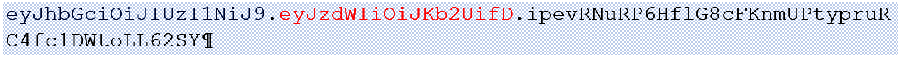

## Securing backend using JWT
Pada catatan sebelumnya, kita telah mebahas bagaomana cara menggunakan _basic aithentication_ dengan RESTfil web service. Methid ini tidak dapat digunakan ketika kita menggunakan frontend sendiri, seperti React. Maka dari itu kita akan menggunakan JWT authentication.

**JWT** adalah cara yang solid untuk mengimplementasi authentication pada web application yang modern. JWT sangant kecil dalam sisi ukuran dan dapat dikirim melalui Uniform Resource Locator (URL), pada parameter atau didalam POST header. JWT juga berisikan semua informasi yang dibutuhkan untuk user.

JWT terdiri dari 3 bagian yang dipisahkan oleh titik (_dots_) : `xxxxx.yyyyy.zzzzz`. Setiap bagian memiliki fungsinya masing-masing;

1. Bagian pertama (xxxxxx) adalah _header_ yang mendefinisikan tipe dari token dan _hashing algorithm_
2. Bagian kedua (yyyyy) adalah _payload_ yang pada umumnya dalam kasusu authentication berisikan informasi dari user
3. Bagian akhir (zzzzz) adalah _signature_ (penanda) yang digunakan untuk memverifikasi bahwa toke tidak diganti selama proses berlangsung.

Berikut adalah contoh jwt




!!! quote "Representasi sederhana dari penggunakan JWT pada proses authentication"

    

    {==Setelah user terautentikasi, setiap request yang user berikan harus selalu mengandung JWT yang diterima saat user terautentikasi==}

Untuk menggunakan JWT, insyaAllah kita akan menggunakan library [JJWT](https://github.com/jwtk/jjwt). Selanjutnya kita hanya perlu mendownload dengan cara menambahkan depedency pada pom.xml


!!! quote "Code"

    === "pom.xml"

        ```xml
        <dependencies>
            <dependency>
                <groupId>io.jsonwebtoken</groupId>
                <artifactId>jjwt-api</artifactId>
                <version>0.11.2</version>
            </dependency>
            <dependency>
                <groupId>io.jsonwebtoken</groupId>
                <artifactId>jjwt-impl</artifactId>
                <version>0.11.2</version>
                <scope>runtime</scope>
            </dependency>
            <dependency>
                <groupId>io.jsonwebtoken</groupId>
                <artifactId>jjwt-jackson</artifactId>
                <version>0.11.2</version>
                <scope>runtime</scope>
            </dependency>
        <dependencies>
        ```

---

> Karema penggunaan JWT pada buku bukan best practice. Maka dari itu saya menuliskan pada catatan ini dari seumber lain. Ada dua source pada catatan setelah ini, yaitu ada pada package **bagian4.3_jwt** dan **bagian4.3_jwt2**

[Source Github](https://github.com/bezkoder/spring-boot-spring-security-jwt-authentication/tree/master)

1. **bagian4.3_jwt** learn here  [This is the best](https://blog.tericcabrel.com/jwt-authentication-springboot-spring-security/)

2. **bagian4.3_jwt2** [This is the best 2](https://www.bezkoder.com/spring-boot-jwt-authentication/). Ini adalaha extends fitur dari nomor 1.


## Overview of Spring Boot JWT Authentication
InsyaAllah kita akan membangun Spring Boot apliaction yang dapat:

1. User dapat mendaftarkan akun baru, dan login menggunakna username dan password
2. Berdasarkan user role yang dimiliki oleh user berkaitan, sistem dapat mengauthentikasi atau membatasi akses berdasrakan role-nya masing2.


Dibawah ini adalah API yang akan disediakan oleh aplikasi

| Methods | Urls	| Actions |
| :----- | :----- | :----- |
|POST	| `/api/auth/signup`` | signup new account |
|POST	| `/api/auth/signin``	| login an account|
|GET	| `/api/test/all``	| retrieve public content|
|GET	| `/api/test/user``	| access User’s content|
|GET	| `/api/test/mod``	| access Moderator’s content|
|GET	| `/api/test/admin``	| access Admin’s content|


## Spring Boot Signup & Login with JWT Authentication Flow
Diagram dibawah ini menggambarkan flow bagaimana kita akan mengimplementasi Registrasi Anggota, login dan proses autorisasi.


## Spring Boot Server Architecture with Spring Security 


### Spring Security
– `WebSecurityConfig` is the crux of our security implementation. It configures cors, csrf, session management, rules for protected resources. We can also extend and customize the default configuration that contains the elements below.
(WebSecurityConfigurerAdapter is deprecated from Spring 2.7.0, you can check the source code for update. More details at:
WebSecurityConfigurerAdapter Deprecated in Spring Boot)

– `UserDetailsService` interface has a method to load User by username and returns a UserDetails object that Spring Security can use for authentication and validation.

– `UserDetails` contains necessary information (such as: username, password, authorities) to build an Authentication object.

– `UsernamePasswordAuthenticationToken` gets {username, password} from login Request, AuthenticationManager will use it to authenticate a login account.

– `AuthenticationManager` has a DaoAuthenticationProvider (with help of UserDetailsService & PasswordEncoder) to validate UsernamePasswordAuthenticationToken object. If successful, AuthenticationManager returns a fully populated Authentication object (including granted authorities).

– `OncePerRequestFilter` makes a single execution for each request to our API. It provides a doFilterInternal() method that we will implement parsing & validating JWT, loading User details (using UserDetailsService), checking Authorizaion (using UsernamePasswordAuthenticationToken).

– `AuthenticationEntryPoint` will catch authentication error.

### Repository
contains UserRepository & RoleRepository to work with Database, will be imported into Controller.

### Controller
Controller receives and handles request after it was filtered by OncePerRequestFilter.

– AuthController handles signup/login requests
– TestController has accessing protected resource methods with role based validations.


---

sample

!!! quote "Code"

    === "Example.java"

        ```java

        ```

        ```{.java title="Output"}
        
        ```

!!! quote "Code"

    === "Example.java"

        ```java

        ```

        ```{.java title="Output"}
        ```

    === "Example.java"

        ```java

        ```

        ```{.java title="Output"}

        ```

!!! quote "Code"

    ```java title=""

    ```

    === "Example 1"

        ```java

        ```

        ```{.java title="Output"}

        ```

    === "Example 2"

        ```java

        ```

        ```{.java title="Output"}

        ```