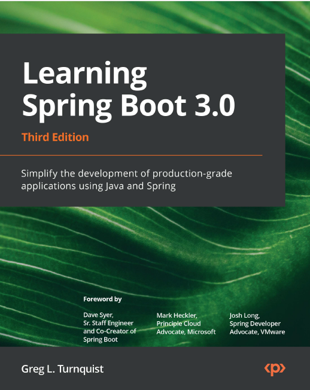

_Bismillah_, dengan menyebut nama Allah. Pada catatan ini akan berisi bagaimana membuat sebuah web menggunakan Framework _Spring Boot_ menggunakan bahasa pemprograman [Java](../../Programming%20Language/Java/01.%20Strings.md).

!!! info
    Untuk semua kode yang digunakan pada catatan ini dapat dilihat di [Kertas Pena Spring Boot](https://github.com/muhammadfarras/Kertas-Pena-Spring-Boot)

Untuk mengikuti catatan ini ada beberapa yang dibutuhkan, diantaranya;

1.  Java 17 (Minumum version)
2.  IDE, disaranakan menggunakan Intellij IDEA

Catatan ini diambil dari buku **Learning Spring Boot 3.0** karya Greg L. Turnquist

